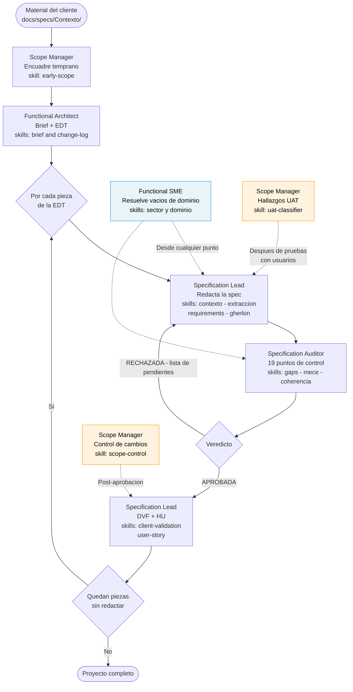

# Guía de uso — Capa BA (flujo del Analista Funcional)

**Audiencia:** management y analistas funcionales (AF). Sin jerga técnica de código.
**Fecha:** 2026-07-24 · **Referencia técnica completa:** ADR-006 «integración capa BA / analista funcional» y ADR-010 «refactor consolidador capa BA» — ambos en el repositorio del template ASDD, no se distribuyen

---

## 1. ¿Qué es la capa BA?

Es un **conjunto de 5 agentes de apoyo** para que un Analista Funcional pueda descomponer un alcance grande, redactar el contenido funcional de una especificación, controlar su calidad, resolver dudas de dominio, gestionar el alcance y validar con el negocio — de forma disciplinada y trazable, sin depender de memoria ni de plantillas sueltas.

Es una capa **opcional e independiente**: convive con el flujo ASDD normal del equipo (el que usa el agente `sofka-asdd-producto`), **no lo reemplaza**. Ambos caminos producen el mismo tipo de documento final (la especificación funcional); la diferencia es quién lo redacta y en qué contexto.

---

## 2. ¿Cuándo usarla vs. el flujo estándar del equipo?

| Usar la **capa BA** cuando… | Usar el **flujo ASDD del equipo** cuando… |
|---|---|
| El AF trabaja de forma personal / individual, fuera del ciclo del equipo | El feature ya está corriendo dentro del ciclo formal del equipo (con seguimiento por áreas: backend, frontend, QA, etc.) |
| El alcance es grande y hay que descomponerlo en piezas manejables antes de escribir | El alcance ya viene acotado y solo hace falta redactar la especificación |
| Se necesita un control de calidad exhaustivo (19 puntos de revisión) antes de mostrarle algo al negocio | Basta con el criterio estándar de aceptación del equipo |

**Regla práctica:** si el AF pide explícitamente "armá la EDT" o menciona el flujo BA por nombre, es la capa BA. Si el trabajo es parte del ciclo formal del proyecto orquestado por el equipo, es el flujo estándar. Ante la duda, se pregunta una sola vez cuál de los dos aplica — nunca se asume.

---

## 3. Cómo preparar el material antes de empezar

Antes de invocar cualquier agente, el AF deposita los documentos del cliente en:

```
docs/specs/Contexto/
```

Ahí van los archivos tal como los entrega el cliente: PDFs de requerimientos, actas de reunión, manuales de producto, regulaciones, documentos de referencia. Estos archivos **solo se leen, nunca se editan**. Los agentes los consumen como fuente; cualquier interpretación o formalización ocurre en los artefactos que ellos producen.

> Si la carpeta `docs/specs/` no existe todavía, el **Functional Architect** la crea y siembra la estructura base la primera vez que se invoca.

---
## 4. Dónde vive todo: mapa de archivos

La capa BA organiza sus artefactos bajo `docs/specs/` con una carpeta por cada pieza del mapa de trabajo:

```
docs/specs/
├── README.md                              ← guía de convenciones (creado por Architect)
├── Contexto/                              ← archivos del cliente (solo lectura)
├── edt-{proyecto}.md                      ← mapa completo del trabajo
├── brief-{proyecto}.md                    ← contexto y objetivo del proyecto
├── change-log.md                          ← bitácora BA (todas las decisiones)
│
└── {codigo}-{nombre}/                     ← una carpeta por pieza del mapa
    ├── {codigo}-index.md                  ← índice del nodo (punto de entrada)
    ├── {codigo}-funcional-{slug}.md       ← spec funcional (Specification Lead)
    ├── {codigo}-informe-auditoria.md      ← reporte de auditoría (Auditor)
    ├── {codigo}-informe-sme.md            ← dictamen de dominio (Functional SME)
    ├── {codigo}-dvf-{slug}.md             ← versión para firma del negocio
    └── {codigo}-hu-{slug}.md              ← Historia de Usuario para el equipo
```

**Ejemplo concreto** — proyecto "Renovación de Pólizas":

```
docs/specs/
├── Contexto/
│   └── requerimientos-renovacion-cliente.pdf
├── edt-renovacion-polizas.md
├── brief-renovacion-polizas.md
├── change-log.md
│
├── 1.1-renovacion-automatica/
│   ├── 1.1-index.md
│   ├── 1.1-funcional-renovacion-automatica.md
│   ├── 1.1-informe-auditoria.md
│   └── 1.1-dvf-renovacion-automatica.md
│
├── 1.2-renovacion-manual/
│   ├── 1.2-index.md
│   ├── 1.2-funcional-renovacion-manual.md
│   └── 1.2-informe-auditoria.md
│
└── 1.3-notificaciones/
    └── ...
```

**Artefactos transversales** (en la raíz de `docs/specs/`):

| Archivo | Quién lo crea | Para qué sirve |
|---|---|---|
| `edt-{proyecto}.md` | Functional Architect | Mapa completo del trabajo con todas las piezas y su orden |
| `brief-{proyecto}.md` | Functional Architect (skill `brief`) | Contexto, objetivo y restricciones del proyecto |
| `change-log.md` | Todos los agentes (skill `change-log`) | Historial de cada decisión tomada durante el ciclo |

**Artefactos por nodo** (dentro de la carpeta de cada pieza):

| Archivo | Quién lo crea | Para qué sirve |
|---|---|---|
| `{codigo}-index.md` | Specification Lead (skill `spec-index`) | Índice del nodo: estado de todos sus artefactos |
| `{codigo}-funcional-{slug}.md` | Specification Lead | La spec funcional: historia de usuario, reglas, flujo |
| `{codigo}-informe-auditoria.md` | Specification Auditor | Reporte de los 19 puntos de revisión con veredicto |
| `{codigo}-informe-sme.md` | Functional SME | Dictamen de dominio con nivel de certeza explícito |
| `{codigo}-dvf-{slug}.md` | Specification Lead (skill `client-validation`) | DVF: versión en lenguaje de negocio para firma del cliente |
| `{codigo}-hu-{slug}.md` | Specification Lead (skill `user-story`) | HU ágil trazable a la spec, lista para el backlog del equipo |

---

## 5. El flujo visual



**Cómo leer el diagrama:**

- **Línea continua** → flujo principal, de arriba hacia abajo.
- **Línea punteada** → agentes de soporte que entran según la necesidad, no en un paso fijo.
- **El ciclo Lead → Auditor → Lead** es normal: si la spec se rechaza, el Specification Lead la corrige y vuelve a auditarla.
- **El Functional SME** (azul) puede activarse desde cualquier punto donde aparezca una duda de dominio — no pertenece a un paso fijo.
- **El Scope Manager** (naranja) aparece tres veces: al inicio para encuadrar, al final para controlar cambios, y después de las pruebas con usuarios para clasificar hallazgos.

---
## 6. Los 5 agentes en detalle

### Agente 1 — Functional Architect: arma el mapa del trabajo

**Qué hace:** toma un alcance amplio (un módulo, un proceso completo) y lo parte en piezas manejables — como armar el índice de un libro antes de escribir los capítulos. Cada pieza final es del tamaño justo para redactarse sin agobiar ni quedar vacía. También construye el brief inicial del proyecto si aún no existe.

**Cómo se invoca:** `@sofka-asdd-ba-functional-architect` — se le entrega el alcance a descomponer (o el documento de referencia del proyecto depositado en `docs/specs/Contexto/`).

**Qué entrega:** el mapa completo del trabajo (EDT) con cada pieza numerada jerárquicamente (ej. `1.1.1`), su tamaño estimado y el orden recomendado de construcción.

**Dónde escribe:**

| Archivo | Qué es |
|---|---|
| `docs/specs/edt-{proyecto}.md` | El mapa del trabajo |
| `docs/specs/brief-{proyecto}.md` | El brief del proyecto (si no existe) |
| `docs/specs/README.md` | La guía de convenciones (primera vez) |
| `docs/specs/Contexto/` | La carpeta para los archivos del cliente |

**Skills disponibles:**

| Skill | Cuándo se activa | Para qué sirve |
|---|---|---|
| `brief` | Al arrancar, si no hay brief | Construye el brief inicial del proyecto: contexto, objetivo y restricciones conocidas. |
| `change-log` | Al tomar decisiones sobre la EDT | Registra en la bitácora qué cambió en el mapa del trabajo, cuándo y por qué. |
| `log-lessons-learned` | Al cerrar el ciclo del proyecto | Registra lo que aprendió el equipo para no repetir los mismos problemas en el próximo proyecto. |

---

### Agente 2 — Specification Lead: redacta el contenido de negocio

**Qué hace:** toma **una pieza a la vez** del mapa anterior y redacta el contenido funcional: la historia de usuario, quién puede hacer qué, el paso a paso del proceso, las reglas de negocio y qué preguntas quedan pendientes de resolver. También puede generar documentos adicionales a partir de la spec aprobada (DVF, HU, inventario de requerimientos).

**Cómo se invoca:** `@sofka-asdd-ba-specification-lead` — se le indica qué pieza del mapa redactar (ej. "redactá la pieza 2.1.3 — Renovación Manual").

**Qué entrega:** el contenido funcional dentro de la especificación del nodo, más los artefactos de salida que correspondan.

**Dónde escribe:**

| Archivo | Qué es |
|---|---|
| `docs/specs/{codigo}-{slug}/{codigo}-funcional-{slug}.md` | La spec funcional |
| `docs/specs/{codigo}-{slug}/{codigo}-index.md` | El índice del nodo |
| `docs/specs/{codigo}-{slug}/{codigo}-dvf-{slug}.md` | El DVF para firma del negocio |
| `docs/specs/{codigo}-{slug}/{codigo}-hu-{slug}.md` | La HU para el backlog del equipo |

**Skills disponibles:**

| Skill | Cuándo se activa | Para qué sirve |
|---|---|---|
| `contexto` | **Siempre primero — obligatorio** | Consolida todo el material disponible (brief, EDT, documentos fuente) antes de escribir una sola línea de la spec. |
| `extraccion` | Cuando el cliente entregó documentos adicionales (RFP, actas, BRD) | Procesa esos documentos y extrae la información relevante para la spec, sin perder nada. |
| `gherkin` | Para funcionalidades complejas | Produce un borrador de escenarios de prueba en lenguaje estructurado — para que QA empiece a prepararse. |
| `requirements` | Cuando se necesita un inventario formal | Levanta la lista completa de qué debe hacer el sistema y cómo debe comportarse (rendimiento, seguridad, disponibilidad). |
| `client-validation` | Después de que el Auditor aprueba la spec | Genera el Documento de Validación con el Cliente (DVF): la spec traducida a lenguaje de negocio, lista para que el cliente revise y firme. |
| `user-story` | Después de que el Auditor aprueba la spec | Genera la Historia de Usuario para el backlog del equipo, trazable a la spec funcional. |
| `spec-index` | Al crear la primera spec del nodo / al cambiar su estado | Crea o actualiza el índice del nodo — muestra el estado de todos sus artefactos. |
| `change-log` | Al crear la spec y en cada corrección | Registra en la bitácora el estado de la spec y los cambios que tuvo. |

---

### Agente 3 — Specification Auditor: audita con 19 puntos de control

**Qué hace:** evalúa la spec producida por el Specification Lead contra 19 puntos de revisión organizados en 5 bloques. No corrige ni reescribe — detecta qué falta y emite un veredicto. Si la spec se rechaza, el AF resuelve los pendientes y el Specification Lead la reconstruye.

**Cómo se invoca:** `@sofka-asdd-ba-specification-auditor` — se le entrega la ruta de la spec a auditar.

**Qué entrega:** un informe con el veredicto y los gaps encontrados, con campos editables para que el AF complete la información faltante.

**Dónde escribe:**

| Archivo | Qué es |
|---|---|
| `docs/specs/{codigo}-{slug}/{codigo}-informe-auditoria.md` | El informe de auditoría con veredicto y gaps |

**Skills disponibles:**

| Skill | Cuándo se activa | Para qué sirve |
|---|---|---|
| `gaps` | **Siempre primero — obligatorio** | Aplica los 19 filtros de revisión. Clasifica cada punto como DEFINIDO, IMPLÍCITO o PENDIENTE y calcula el riesgo global. |
| `mece` | Cuando pueden haber reglas que se solapan o quedan huecos entre ellas | Verifica que las reglas de negocio sean exclusivas (sin solapamiento) y exhaustivas (sin huecos). |
| `coherencia` | Cuando hay 2 o más specs del mismo proyecto | Detecta contradicciones entre specs — por ejemplo, un actor con permisos distintos en dos documentos. |

**Los 19 filtros en 5 bloques:**

| Bloque | Puntos | Qué detecta |
|---|---|---|
| A — Flujo y proceso | 1 a 4 | Caminos de devolución, herencia de roles, complejidad parametrizable, fallas de integración |
| B — Interfaz y experiencia | 5 a 8 | Notificaciones, bandejas de gestión, vista del actor externo, documentos que se generan |
| C — Cumplimiento y gobierno | 9 a 10 | Validaciones regulatorias, autosuficiencia operativa |
| D — Comportamiento funcional | 11 a 15 | Microinteracciones, datos iniciales, concurrencia, sesión, operaciones masivas |
| E — Ciclo de vida | 16 a 19 | Estados del proceso, adjuntos, idempotencia, compatibilidad con versiones anteriores |

**Veredictos posibles:**

| Veredicto | Cuándo ocurre | Qué sigue |
|---|---|---|
| APROBADA | Cero puntos pendientes ni críticos | La spec pasa a DVF y HU |
| APROBADA CON OBSERVACIONES | Solo puntos implícitos — sin críticos ni pendientes | Pasa con la lista de observaciones a confirmar |
| RECHAZADA | Cualquier punto crítico o pendiente sin respuesta | El AF resuelve y el Specification Lead reconstruye |

---

### Agente 4 — Functional SME: resuelve vacíos de dominio

**Qué hace:** responde preguntas de dominio — regulaciones del sector, procesos estándar, vocabulario específico — con honestidad explícita. Distingue con marcadores qué sabe con certeza, qué infiere, qué depende del cliente y qué directamente no sabe. No es un oráculo: cuando no tiene información, lo dice.

**Cuándo activar:** cuando el Specification Lead o el Auditor marcan algo con `[DOMINIO_INEXPERTO]` o `[VACÍO_DE_FUENTE]`. No pertenece a un paso fijo del flujo — puede entrar desde cualquier punto donde aparezca una duda de dominio.

**Cómo se invoca:** `@sofka-asdd-ba-functional-sme` — se le entrega la pregunta de dominio concreta.

**Dónde escribe (solo bajo demanda explícita del AF):**

| Archivo | Qué es |
|---|---|
| `docs/specs/{codigo}-{slug}/{codigo}-informe-sme.md` | Dictamen de dominio con nivel de certeza explícito en cada respuesta |

**Skills disponibles:**

| Skill | Cuándo se activa | Para qué sirve |
|---|---|---|
| `sector` | Para preguntas del sector (seguros, fintech, salud, retail...) | Responde desde el conocimiento sectorial: regulaciones, prácticas estándar y vocabulario regulado. |
| `dominio` | Para preguntas del dominio funcional específico del cliente | Responde desde el modelo funcional del cliente: reglas propias, terminología interna, flujos particulares. |

Los dos skills pueden combinarse en la misma sesión cuando la pregunta toca ambas dimensiones a la vez.

**Marcadores de certeza — qué significa cada uno:**

| Marcador | Qué significa |
|---|---|
| `[CERTEZA]` | Hecho verificado y documentado en fuentes del sector |
| `[INFERENCIA]` | Conclusión razonable, pero no confirmada en una fuente directa |
| `[ESPECÍFICO_CLIENTE]` | Depende de cómo lo define el cliente — validar con el interlocutor |
| `[NO_SÉ]` | Sin información disponible — requiere investigación real |
| `[RIESGO_REGULATORIO]` | Área que requiere revisión de expertos legales especializados |

---
### Agente 5 — Scope Manager: cuida el alcance durante todo el ciclo

**Qué hace:** vigila que el alcance no se desvíe en ningún momento. Trabaja en tres momentos distintos: antes de tener un mapa del trabajo (encuadre temprano), cuando llega un pedido de cambio después de que hay baseline aprobado, y después de una sesión de pruebas con usuarios (UAT).

**Cuándo activar:** en cualquiera de los tres momentos que se describen abajo. Es un agente transversal — no pertenece a una fase fija.

**Cómo se invoca:** `@sofka-asdd-ba-scope-manager`

**Dónde escribe:**

| Archivo | Qué es |
|---|---|
| `docs/specs/alcance-temprano-{proyecto}.md` | Análisis de alcance antes de tener la EDT aprobada |
| `docs/specs/{codigo}-{slug}/cambio-alcance-{N}-{feature}.md` | Análisis de una solicitud de cambio post-baseline |
| `docs/specs/{codigo}-{slug}/hallazgos-uat-{feature}.md` | Clasificación de hallazgos de una sesión UAT |

**Skills disponibles:**

| Skill | Cuándo se activa | Para qué sirve |
|---|---|---|
| `early-scope` | Antes de tener la EDT — en el encuadre inicial del proyecto | Delimita el alcance antes de invertir tiempo en specs. Define qué entra y qué queda fuera, antes de pasarle el trabajo al Functional Architect. |
| `scope-control` | Cuando ya hay baseline (EDT aprobada + spec aprobada o DVF firmado) y llega una solicitud de cambio | Analiza si el cambio es algo nuevo, un error de la spec o algo que ya estaba incluido. Recomienda INCLUIR, DIFERIR o RECHAZAR — la decisión final es del AF. |
| `uat-classifier` | Después de una sesión de pruebas con usuarios | Clasifica los hallazgos: qué es un error en lo construido, qué es un gap en la spec y qué es un cambio de alcance nuevo. Cada tipo se enruta a quien corresponde. |
| `change-log` | Al registrar una decisión sobre el alcance | Registra la decisión en la bitácora BA. |

> **Nota importante:** el Scope Manager no muta la spec por sí solo — recomienda y documenta, pero la decisión de incluir, diferir o rechazar es siempre del AF. Si se acepta un cambio que toca la spec, quien la actualiza es el Specification Lead.

---
## 7. Resumen de salidas por agente

| Agente | Archivo que produce | Dónde vive |
|---|---|---|
| Functional Architect | `edt-{proyecto}.md` | `docs/specs/` (raíz) |
| Functional Architect | `brief-{proyecto}.md` | `docs/specs/` (raíz) |
| Specification Lead | `{codigo}-funcional-{slug}.md` | `docs/specs/{codigo}-{slug}/` |
| Specification Lead | `{codigo}-dvf-{slug}.md` | `docs/specs/{codigo}-{slug}/` |
| Specification Lead | `{codigo}-hu-{slug}.md` | `docs/specs/{codigo}-{slug}/` |
| Specification Auditor | `{codigo}-informe-auditoria.md` | `docs/specs/{codigo}-{slug}/` |
| Functional SME | `{codigo}-informe-sme.md` | `docs/specs/{codigo}-{slug}/` |
| Scope Manager (encuadre) | `alcance-temprano-{proyecto}.md` | `docs/specs/` (raíz) |
| Scope Manager (cambios) | `cambio-alcance-{N}-{feature}.md` | `docs/specs/{codigo}-{slug}/` |
| Scope Manager (UAT) | `hallazgos-uat-{feature}.md` | `docs/specs/{codigo}-{slug}/` |
| Todos los agentes | `change-log.md` | `docs/specs/` (raíz) |

---
## 8. Ejemplo de un ciclo completo

A modo de ejemplo concreto, este es un ciclo típico usando el proyecto Gestión de Siniestros, con nombres reales de archivos en cada paso.

**Paso 1 — Preparar material.**  
El AF deposita `requerimientos-siniestros-cliente.pdf` en `docs/specs/Contexto/`.

**Paso 2 — Scope Manager, encuadre temprano** (`early-scope`).  
→ Produce: `docs/specs/alcance-temprano-siniestros.md`

**Paso 3 — Functional Architect, mapa del trabajo.**  
→ Produce: `docs/specs/edt-gestion-siniestros.md`  
→ Produce: `docs/specs/brief-gestion-siniestros.md`  
La EDT tiene 3 nodos hoja: `1.1 Apertura`, `1.2 Instrucción` y `1.3 Cierre`.

**Paso 4 — Specification Lead, nodo 1.1** (skills `contexto` → `extraccion` → redacción).  
→ Produce: `docs/specs/1.1-apertura/1.1-index.md`  
→ Produce: `docs/specs/1.1-apertura/1.1-funcional-apertura.md`

**Paso 5 — Specification Auditor, nodo 1.1** (skill `gaps`).  
→ Veredicto: RECHAZADA — falta definir el flujo de devolución por documentos incompletos.  
→ Produce: `docs/specs/1.1-apertura/1.1-informe-auditoria.md`

**Paso 6 — Functional SME, duda regulatoria** (skill `sector`).  
Un término en la spec no está claro desde lo regulatorio.  
→ Bajo demanda explícita del AF: `docs/specs/1.1-apertura/1.1-informe-sme.md`

**Paso 7 — Specification Lead, corrección.**  
El AF completa los gaps del informe de auditoría y el Lead corrige la spec.  
→ Modifica: `docs/specs/1.1-apertura/1.1-funcional-apertura.md`

**Paso 8 — Specification Auditor, segunda vuelta.**  
→ Veredicto: APROBADA.

**Paso 9 — Specification Lead, DVF y HU.**  
→ Produce: `docs/specs/1.1-apertura/1.1-dvf-apertura.md`  
→ Produce: `docs/specs/1.1-apertura/1.1-hu-apertura.md`

**Pasos 10 y 11** — Se repite el ciclo para los nodos 1.2 y 1.3.

**Paso 12 — Scope Manager, cambio post-aprobación** (`scope-control`).  
El cliente solicita agregar notificación por WhatsApp, que no estaba en la EDT.  
→ Produce: `docs/specs/1.1-apertura/cambio-alcance-1-apertura.md`  
→ Recomendación: DIFERIR — fuera del baseline actual.

---
## 9. Qué no hace la capa BA

Para evitar expectativas equivocadas:

- **No conecta con el equipo de desarrollo directamente.** Produce specs y HUs, pero la coordinación con el equipo técnico sigue por los canales habituales del proyecto.
- **No reemplaza la validación con el negocio.** El DVF requiere revisión y firma humana del cliente — el agente lo genera, pero la decisión es del negocio.
- **No toma decisiones de alcance.** El Scope Manager recomienda; la decisión final (incluir, diferir, rechazar) es siempre del AF o PO.
- **No corrige specs directamente.** El Specification Auditor emite veredicto; las correcciones las ejecuta el Specification Lead después de que el AF resuelve los gaps.
- **No genera código de implementación.** La capa BA es exclusivamente funcional — para la implementación técnica se invocan los agentes del flujo ASDD del equipo.
- **No inventa dominio.** El Functional SME indica explícitamente cuándo no tiene información — no adivina.
