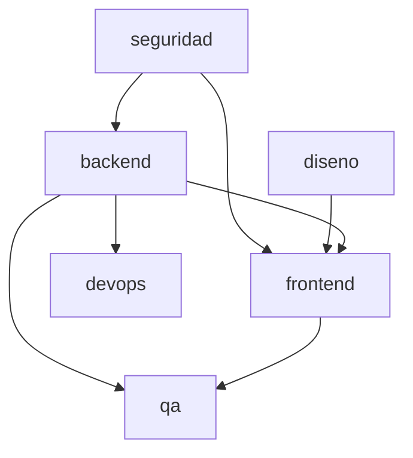

# spec-slice-rules — Reglas de proyección del super-spec en specs por área

> **Qué es este archivo.** Es la **Single Source of Truth operativa** del modelo
> spec-per-área (ADR-004). El skill de autoría (`asdd-producto` skill
> `funcional`) lo consume para **proyectar** el super-spec corporativo Guide
> (`spec-template.md`) en los `spec-{area}` que corresponden a cada feature.
>
> No es un template — es una **tabla de proyección** (Mapa de dominios §0 del
> super-spec → área ASDD) más las reglas de resolución de secciones divididas y
> el grafo de dependencias por defecto del INDEX.
>
> **Fidelidad:** este documento es una transcripción operativa del ADR-004
> (§4.4, §4.5, §4.6, §7.1). No reinterpreta ni agrega contenido nuevo. Ante
> cualquier ambigüedad, el ADR-004 es autoritativo.
>
> **Modelo de slicing adoptado (ADR-004 §4.2):** **Alt-C — Slice canónico +
> wrapper de contexto**. Cada `spec-{area}` muestra EXACTAMENTE las secciones
> del super-spec que le corresponden, con headings y redacción idénticos, más un
> wrapper de contexto (rol destino, prerequisito, dependencias, secciones
> cubiertas). El slicer no crea secciones nuevas.

---

## 1. Mapeo dominios (9) → áreas (7)

El super-spec corporativo tiene **9 dominios** en su Mapa de dominios (§0).
Este modelo los proyecta a **7 áreas ASDD**. La única partición de un dominio
Guide en dos áreas ocurre en `Developer`, que se reparte **por capa** (ver §3).
El resto es 1-a-1 o consolidación (UX+UI → `diseno`, Arquitectura+Developer-servidor → `backend`).

| Dominio Guide | Área ASDD | Contribuye a |
|---|---|---|
| Funcional | *(spec-funcional)* | Contenido base cross-área — **no genera** `spec-{area}` |
| Arquitectura | backend | Contrato técnico servidor, SLAs, ADRs de aplicación |
| Developer (capa servidor) | backend | API, dominio, DTOs, validación servidor, migraciones, publicación de eventos |
| Developer (capa presentación) | frontend | Código de presentación (componentes, hooks, estado UI, routers, validación cliente) consumiendo `spec-diseno` y `spec-backend` |
| UX | diseno | Wireframes mid-fi, flows, arquetipos, arquitectura de información |
| UI | diseno | Componentes hi-fi, design tokens, WCAG, integración Figma |
| QA | qa | Escenarios adicionales, cobertura, performance |
| DevOps | devops | SLOs, pipeline, observabilidad |
| Seguridad | seguridad | Auth, secretos, OWASP, compliance |
| Datos | data | Discovery, stakeholders, fuentes, restricciones |

**Nota:** el dominio `Funcional` **no produce** un `spec-{area}` — su contenido
vive en el `spec-funcional` (ver `spec-funcional-template.md`). Las 7 áreas que
sí generan `spec-{area}` son: **backend, frontend, diseno, devops, seguridad,
data, qa**.

---

## 2. Tabla de proyección por área

Por cada área, qué secciones del super-spec le corresponden (`secciones_super_spec`)
y cuáles consume **por referencia** sin duplicar contenido (`referencia_por_puntero`).
El dominio `Developer` se PARTE POR CAPA: capa servidor → backend, capa presentación → frontend.

```yaml
# proyección Mapa de dominios (§0 super-spec) → área ASDD
areas:
  backend:
    dominios_guide: [Arquitectura, "Developer (capa servidor)"]
    secciones_super_spec:
      - "5 (subsección Backend/Arquitectura — contrato técnico completo, integración técnica, mock/prod)"
      - "9 (columnas Developer capa servidor: validación servidor, backend enforcement, evento)"
      - "13 (subsección Arquitectura — compliance / trazabilidad regulatoria)"
    referencia_por_puntero:
      - "11 (dueño: spec-seguridad — backend agrega solo notas de implementación server-side; nunca redeclara el contrato)"
  diseno:
    dominios_guide: [UX, UI]
    secciones_super_spec:
      - "2 (subsección UX/UI — arquetipos y patrones de interacción por rol)"
      - "4 (máquina de estados — subsección UX/UI: intención visual y transiciones desde la perspectiva del usuario)"
      - "8 (íntegra — Vista Funcional UX + Vista UI: Prerequisitos UI, configuración UI, componentes hi-fi, design tokens, WCAG, Figma)"
      - "9 (subsección UX/UI — comportamiento de mensajes, tratamiento visual de errores HTTP, escenarios mock, jerarquía visual de validaciones)"
    consumido_por: [frontend]
  frontend:
    dominios_guide: ["Developer (capa presentación)"]
    secciones_super_spec:
      - "4 (máquina de estados — subsección Developer: implementación de estado UI, routers, transiciones en código)"
      - "8 (subsección Developer — wiring de componentes hi-fi contra APIs del backend, consumo de tokens y contrato visual de spec-diseno)"
      - "9 (subsección Developer capa presentación: tipo HTML de input, longitud enforced en cliente, regex de validación cliente, integración con validación servidor de spec-backend)"
    referencia_por_puntero:
      - "11 (dueño: spec-seguridad — frontend agrega solo notas de implementación cliente-side: manejo de token, storage seguro, mitigación XSS, CSP, sesión; nunca redeclara el contrato)"
    consume: [diseno, backend]
  devops:
    dominios_guide: [DevOps]
    secciones_super_spec:
      - "5 (subsección — SLA operacional / monitoreo)"
      - "7 (subsección — SLOs operacionales, observabilidad, pipeline, alertas)"
  seguridad:
    dominios_guide: [Seguridad]
    secciones_super_spec:
      - "11 (íntegra — dueño ÚNICO del contrato completo de seguridad: autenticación, autorización, gestión de secretos, ciclo de sesión/token, logging seguro, casos de abuso, integraciones salientes, OWASP Top 10, compliance)"
      - "13 (subsección — condicional a señal regulatoria HIPAA/PCI-DSS/SOX; copia por referencia de la subsección de compliance del spec-backend cuando aplica)"
    consumido_por: [backend, frontend]  # ambos referencian §11 por puntero, no duplican contenido
  data:
    dominios_guide: [Datos]
    secciones_super_spec:
      - "12 (íntegra — Dominio de Datos)"
  qa:
    dominios_guide: [QA]
    secciones_super_spec:
      - "7 (subsección — RNFs de calidad, cobertura, performance testing)"
      - "10 (íntegra — Criterios de Aceptación con escenarios Gherkin base + adicionales QA + criterios de done)"
```

---

## 3. Regla de reparto del dominio Developer — por CAPA

El super-spec corporativo tiene un único dominio `Developer` que este modelo
proyecta a DOS áreas ASDD según la **capa arquitectónica** de cada sección:

- **Developer (capa servidor) → `backend`.** Cubre API, dominio, DTOs, validación
  en servidor, migraciones, enforcement de reglas de negocio en backend,
  publicación de eventos.
- **Developer (capa presentación) → `frontend`.** Cubre implementación de
  componentes en código (React/framework), hooks, estado UI, routers, validación
  en cliente (tipos HTML, regex, longitud), consumo del contrato visual entregado
  por `spec-diseno` y del contrato de API entregado por `spec-backend`.

La partición evita que `spec-frontend` quede vacío tras mover UX+UI al área
`diseno`. `spec-frontend` es la guía de implementación de **código de presentación**
— el "código que renderiza y hace wiring" — no el diseño en sí.

---

## 4. Secciones divididas — regla de resolución por referencia

Del análisis del super-spec hay **8 secciones divididas**: aparecen en el slice de
MÁS DE UN área, o combinan contenido de `spec-funcional` con contenido específico
de un track. La regla común: todos los slices **citan por referencia** cuando existe
un ancla en `spec-funcional` o en el spec dueño del contrato, y **nunca duplican**
el contenido citado. Cada sección tiene un dueño explícito; las demás áreas la
consumen por puntero (`> Ver spec-{dueño} §N para {tema}`).

**Criterio de auditoría — completitud:** una sección es "dividida" si aparece
asignada a ≥2 áreas en §2 (`secciones_super_spec` + `referencia_por_puntero`) o si
su contenido funcional vive en `spec-funcional` y su implementación vive en al
menos un `spec-{area}`. Esta lista cubre el 100% de esos casos.

| # | Sección | Dueño(s) | Áreas que consumen por referencia | Regla |
|---|---|---|---|---|
| 1 | §2 Actores y Permisos | `spec-funcional` (Actores + matriz de permisos AF) · `spec-diseno` (arquetipos UX/UI por rol) | `spec-frontend` referencia `spec-diseno §2` | `> Ver spec-diseno §2 para los arquetipos aplicables` |
| 2 | §4 Máquina de Estados | `spec-funcional` (diagrama base + transiciones funcionales) · `spec-diseno` (intención visual UX/UI) · `spec-frontend` (implementación Developer capa presentación) | `spec-backend` puede añadir subsección Developer server-side si el estado se enforza en servidor | Cada área agrega SÓLO su subsección; nunca redeclara el diagrama base del funcional |
| 3 | §5 Integraciones y Dependencias Externas | `spec-backend` (contrato técnico, integración técnica, mock/prod) · `spec-devops` (SLA operacional / monitoreo de las integraciones) | — | `spec-devops` referencia `spec-backend §5` para la lista de integraciones y agrega sus propias métricas operacionales |
| 4 | §7 RNFs | `spec-funcional` (RNFs de negocio — capacidad, disponibilidad esperada, criticidad) · `spec-devops` (SLOs operacionales, observabilidad, pipeline, alertas) · `spec-qa` (RNFs de calidad, cobertura, performance testing) | — | Cada área declara SU subsección de §7. `spec-devops` y `spec-qa` referencian `spec-funcional §7` como ancla de RNF de negocio y agregan sus targets técnicos derivados |
| 5 | §8 Vista Funcional | `spec-funcional` (Mensajes al usuario / Datos por estado — AF) · `spec-diseno` (grueso: Prerequisitos UI, configuración UI, componentes hi-fi, tokens, WCAG, Figma) · `spec-frontend` (wiring Developer) | — | `spec-frontend` referencia `spec-diseno §8` para el contrato visual |
| 6 | §9 Validaciones de Campos | `spec-funcional` (tabla "Reglas de validación — AF" — ancla) | `spec-diseno` (comportamiento visual/UX) · `spec-frontend` (validación cliente) · `spec-backend` (validación servidor) | Cada slice: `> Ver spec-funcional §9 para la tabla AF` + solo sus subsecciones propias. **Nunca** duplicar la tabla del funcional |
| 7 | §11 Seguridad | **`spec-seguridad` (dueño ÚNICO del contrato completo)** — autenticación, autorización, gestión de secretos, ciclo de sesión/token, logging seguro, casos de abuso, integraciones salientes, OWASP Top 10, compliance | `spec-backend` (notas de implementación server-side) · `spec-frontend` (notas de implementación cliente-side: manejo de token, storage seguro, mitigación XSS, CSP) | Backend y frontend **NUNCA** redeclaran el contrato — solo agregan notas específicas de implementación bajo un puntero `> Ver spec-seguridad §11 para el contrato de seguridad`. Auth aparece **una sola vez** en el corpus del feature, como contrato en `spec-seguridad §11` |
| 8 | §13 Controles y Auditoría | `spec-funcional` (Eventos de negocio — AF) · `spec-backend` (**siempre** — subsección Arquitectura: compliance / trazabilidad regulatoria, evidencia técnica de controles) | `spec-seguridad` (**condicional** — solo si el Mapa marca señal regulatoria HIPAA/PCI-DSS/SOX; copia por referencia de la subsección de compliance del backend) | Backend §13 aparece **siempre** que exista área backend. Seguridad §13 se activa **solo** por señal regulatoria explícita — sin señal, el AF marca la fila `spec-seguridad §13 = n/a` |

**Anti-duplicación de auth:** con la regla de §11, cualquier mención a
autenticación, autorización o gestión de secretos que aparezca **redactada** (no
por referencia) en un slice distinto de `spec-seguridad` es un defecto de spec —
debe reescribirse como puntero. El auditor puede validar mecánicamente buscando
keywords (`OAuth`, `JWT`, `refresh token`, `roles`, `RBAC`, `secretos`) fuera del
`spec-seguridad` y confirmando que cada aparición esté precedida por un bloque
`> Ver spec-seguridad §11`.

---

## 5. Grafo de dependencias por defecto del INDEX

El grafo por defecto refleja qué área **necesita el output** de cuál antes de
arrancar su implementación en Construir. Se agrupa en **olas** de arranque:

```
Ola 1 (sin dependencias entrantes — arrancan en paralelo):  seguridad · diseno · backend · data
Ola 2 (dependen de la Ola 1):                                frontend · devops
Ola 3 (depende de backend + frontend):                       qa
```

**Aristas duras (el destino no pasa de `pending → in_progress` hasta que el origen esté `done`):**

| Arista | Justificación |
|---|---|
| `diseno → frontend` | `spec-frontend` consume el contrato visual (Figma, tokens, componentes hi-fi, WCAG) entregado por `spec-diseno`. |
| `backend → frontend` | `spec-frontend` consume APIs y DTOs definidos en `spec-backend`. |
| `seguridad → backend` | `spec-backend` referencia §11 (contrato de auth, secretos, sesión) — necesita el contrato de seguridad listo antes de codificar enforcement. |
| `seguridad → frontend` | `spec-frontend` referencia §11 (manejo cliente-side de token, storage, CSP). Igual razón que backend. |
| `backend → devops` | `spec-devops` toma como input el contrato técnico (§5) y las SLAs operacionales (§7) del backend para configurar pipeline, observabilidad y alertas. |
| `backend → qa` | `spec-qa` diseña casos contra el contrato API (endpoints, DTOs, códigos de error) del backend. |
| `frontend → qa` | `spec-qa` diseña casos E2E contra la UI implementada — necesita saber estados visuales, componentes, rutas del frontend. |

**`data` (independiente):** cuando aplica, `spec-data` se elabora en paralelo — no
bloquea ni es bloqueado por las otras áreas dentro de WF-002. El consumo aguas
abajo (Bronze/Silver/Gold) sale del scope del modelo spec-per-área y vive en el
flujo Data D0-D7.

**Diagrama Mermaid de referencia para el INDEX:**



**Dependencias suaves de contrato:** las aristas `seguridad → backend` y
`seguridad → frontend` son duras en WF-004 (Construir), pero en WF-002 (Analizar)
los tres slices se pueden **redactar en paralelo** — el sign-off cruzado se resuelve
en el Gate DOR.

**Anti-patrón bloqueado:** ninguna área "hereda" secciones automáticamente. Si el
Mapa de dominios dice `UX/UI Aplica = No` (ej. servicio backend puro sin frontend),
NO se crean `spec-diseno` ni `spec-frontend` — el INDEX marca ambas filas `n/a`
desde el arranque. Si alguna dependencia se marca `Aplica = No`, su arista
desaparece del grafo del INDEX.

---

## 6. Nota — `diseno` NO usa worktree

El área `diseno` **no ejecuta el protocolo de worktree (ORC-011)**. Sus agentes
(`asdd-ux` + `asdd-ui`) producen artefactos de **diseño** (Figma refs,
design tokens, specs de componentes, wireframes), no código de runtime que requiera
aislamiento en un worktree git. El reporte del área `diseno` incluye la ruta a los
entregables producidos y **no** devuelve los campos `WORKTREE COMMIT` / `Files` /
`Branch`.

**Simetría con backend:** `diseno` fusiona UX + UI de forma equivalente a como
`backend` fusiona Arquitectura + Developer(servidor) — ambas son áreas de "diseño y
contrato" cuyo output alimenta la implementación en código. Por eso `diseno` es un
"área" aunque su entregable no sea código: produce un **entregable consumible** (el
contrato visual) que `frontend` consume aguas abajo.

---

## 7. Convención de slug de área

Los slugs de área usan **kebab-case ASCII** (exigido por el helper de naming
`asdd-artifact-name.mjs`): `backend`, `frontend`, `diseno` (sin ñ ni tilde —
**no** `-diseño`), `devops`, `seguridad`, `data`, `qa`. El patrón de filename
resultante es `{run_id}-ANALYZE-{SEQ}-{feature}-{area}.md`. El INDEX usa el sufijo
`-index` y el spec-funcional el sufijo `-funcional`.
