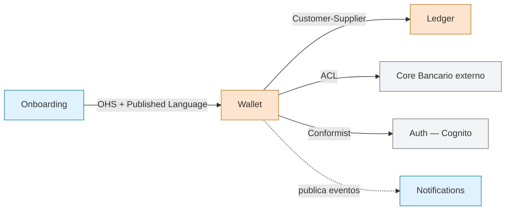

# Context Map — Wallet Digital (cliente fintech)

**Fecha:** 2026-03-12
**Autor:** Arquitecto + BA Wallet
**Estado:** Aceptado

## Diagrama

## Inventario

| Contexto | Subdomain | Equipo | Patrón |
|---|---|---|---|
| **Wallet** | Core | Squad Wallet | OHS hacia Onboarding; ACL hacia Core Bancario; Conformist con Cognito |
| **Ledger** | Core | Squad Ledger | Customer-Supplier (Wallet es cliente prioritario) |
| **Onboarding** | Supporting | Squad Cliente | Cliente del OHS de Wallet |
| **Notifications** | Supporting | Squad Comunicaciones | Consumidor de eventos `wallet.*` |
| **Core Bancario** | Generic externo | Proveedor | Legacy SOAP — ACL obligatorio |
| **Auth (Cognito)** | Generic externo | AWS managed | Conformist (esquema OIDC) |

## Decisiones clave

1. **Wallet y Ledger son ambos Core** — Wallet maneja el saldo del usuario final; Ledger maneja el libro contable contable doble entrada. Separarlos previene que la lógica de saldo del usuario contamine el modelo contable.
2. **ACL hacia Core Bancario** — el Core es legado SOAP con modelo distinto (cuentas contables vs accounts del wallet). El ACL traduce y aísla al Wallet de futuros cambios de contrato del Core.
3. **OHS desde Wallet hacia Onboarding** — Onboarding es el primer cliente, pero anticipamos un canal mobile y un BFF B2B en 6 meses. Publicar contrato OpenAPI estable evita N integraciones bilaterales.
4. **Notifications es coreografía** — escucha eventos `wallet.movement.created.v1`, `wallet.account.created.v1`. Sin acoplamiento sincrónico.
5. **Cognito como Conformist** — adoptamos OIDC tal cual. No vale la pena un ACL para un IdP estándar.

## Riesgos / Open questions

- ¿Wallet y Ledger podrían fusionarse? Decisión revisada en ADR-007: NO, por consistencia eventual aceptable entre saldo del usuario y libro contable.
- Core Bancario tiene latencia variable (P95 1.2s). El ACL incluye circuit breaker + caché de saldo de 30s.
