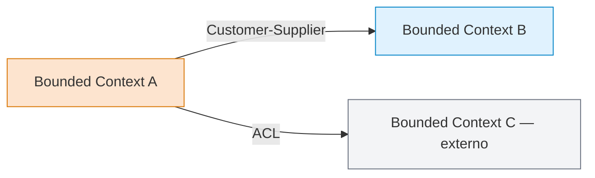

# Context Map — {Sistema / Producto}

**Fecha:** {YYYY-MM-DD}
**Autor:** {nombre}
**Estado:** Borrador | Aceptado

## Diagrama (Mermaid)

## Inventario de contextos

| Contexto | Subdomain | Equipo | Patrón frente a vecinos |
|---|---|---|---|
| {A} | Core | {team} | OHS / Customer-Supplier hacia {B} |
| {B} | Supporting | {team} | Customer hacia {A} |
| {C} | Generic (externo) | proveedor | Conformist con ACL desde {A} |

## Decisiones clave del mapa

1. {¿Por qué estos contextos y no otros?}
2. {¿Por qué este patrón en cada arista?}
3. {¿Qué riesgos asumimos al aceptar Conformist en X?}

## Cambios desde la última versión

- {YYYY-MM-DD: descripción}
