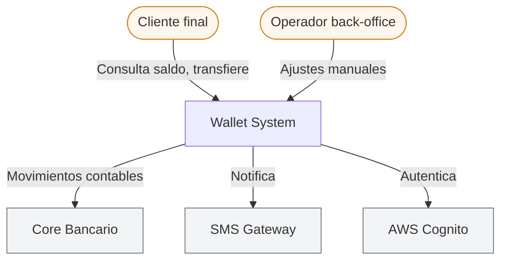
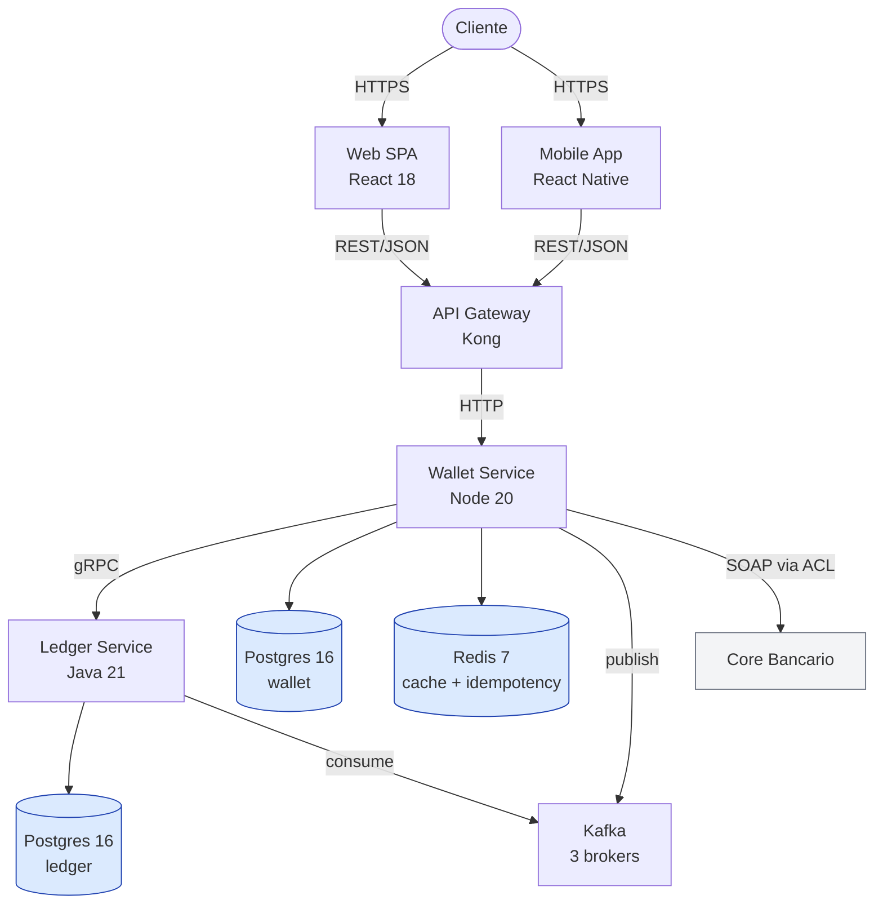
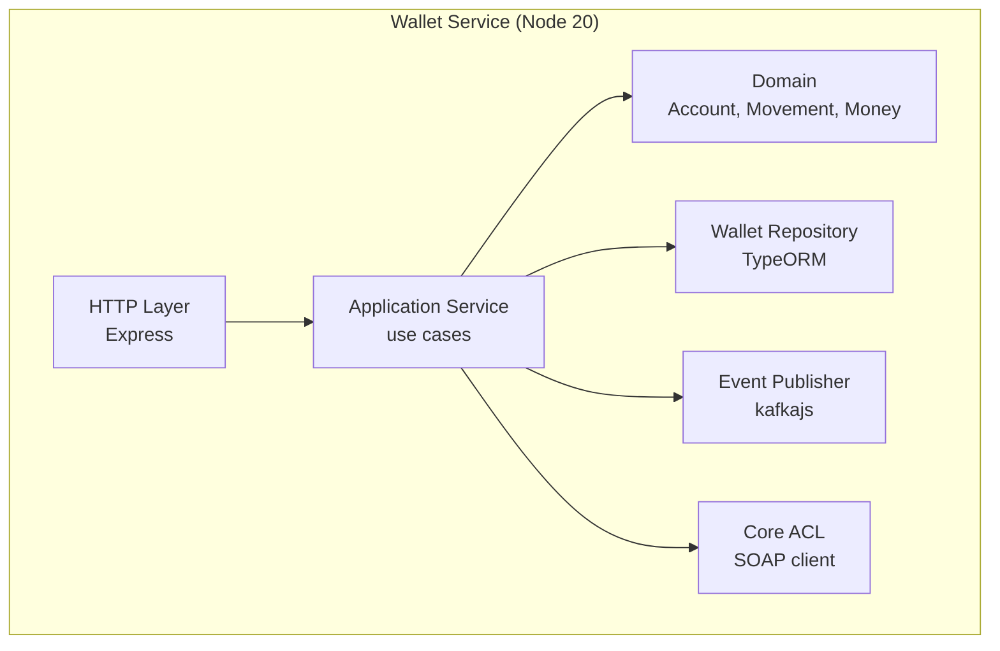

# C4 — Wallet System

**Fecha:** 2026-03-12
**Autor:** Arquitecto Wallet

## L1 — System Context

## L2 — Containers

## L3 — Wallet Service (interno)

## Notas y decisiones

- **ADR-001:** Postgres como BD principal por ACID y experiencia del equipo.
- **ADR-002:** Cognito como IdP — Conformist (sin ACL).
- **Core Bancario con ACL:** ACL aísla del modelo SOAP legacy. Ver `bounded-contexts.md` (wallet → core).
- **Kafka entre Wallet y Ledger:** consistencia eventual aceptable. Saldo del usuario y libro contable se concilian asincrónicamente.
- **Redis usado para 2 cosas:** caché de saldo (TTL 30s) e idempotencia de POST (TTL 24h).
