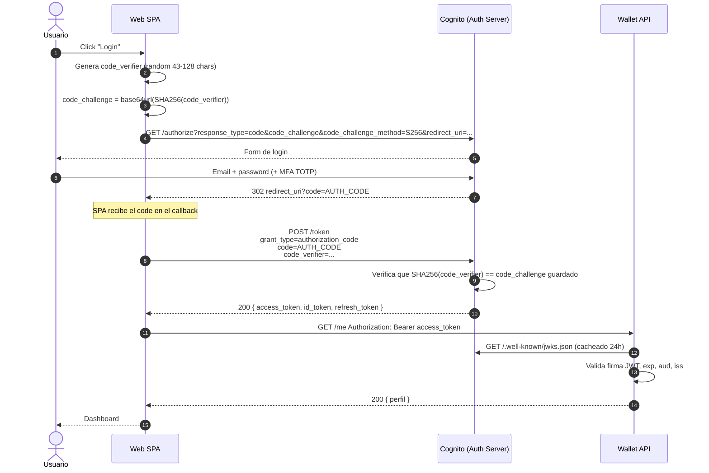
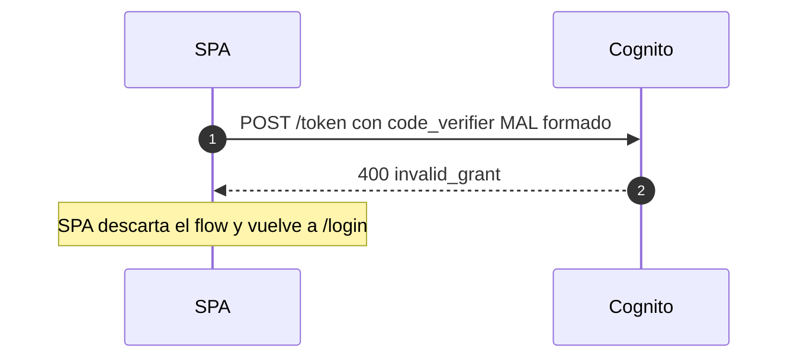
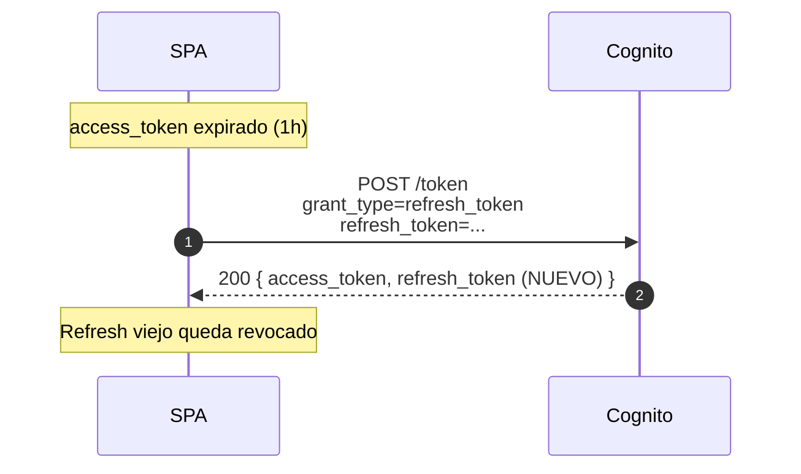

# Sequence — OAuth 2.1 Authorization Code with PKCE

**Contexto:** Login del portal de clientes (SPA → AWS Cognito).
**Requisitos:** OAuth 2.1, PKCE obligatorio (no client secret en el browser).

## Happy path

## Error: code_verifier inválido

## Refresh token rotation

## Decisiones reflejadas

- **PKCE obligatorio:** SPA es public client; sin client secret. PKCE protege contra interceptación del code.
- **No state cookie:** SPA mantiene `state` en sessionStorage para validar el callback (CSRF).
- **JWKS cacheado 24h** en API: evita golpear `/.well-known/jwks.json` en cada request.
- **Refresh rotation activado:** un refresh roto = compromiso → cliente deslogueado forzado.
