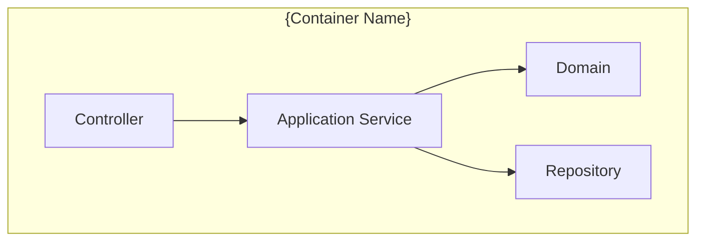

# C4 — {Sistema / Feature}

**Fecha:** {YYYY-MM-DD}
**Autor:** {nombre}

## L1 — System Context

```mermaid
graph TB
  classDef external fill:#f3f4f6,stroke:#6b7280
  classDef person fill:#fff7ed,stroke:#d97706

  user([{Actor humano}]):::person
  system[{Sistema documentado}]
  ext1[{Sistema externo 1}]:::external

  user -->|{interacción}| system
  system -->|{integración}| ext1
```

## L2 — Containers

```mermaid
graph TB
  classDef db fill:#dbeafe,stroke:#1e40af
  classDef external fill:#f3f4f6,stroke:#6b7280

  user([Usuario])
  spa[{Frontend}<br/>{stack}]
  api[{API}<br/>{stack}]
  svc[{Service}<br/>{stack}]
  db[({BD})]:::db
  ext[{Sistema externo}]:::external

  user --> spa
  spa --> api
  api --> svc
  svc --> db
  svc --> ext
```

## L3 — Components (opcional, para containers complejos)



## Notas

- {decisiones que se ven reflejadas en el diagrama}
- {trade-offs visibles}
- {relación con ADRs: ADR-{NNN}, ADR-{NNN}}
