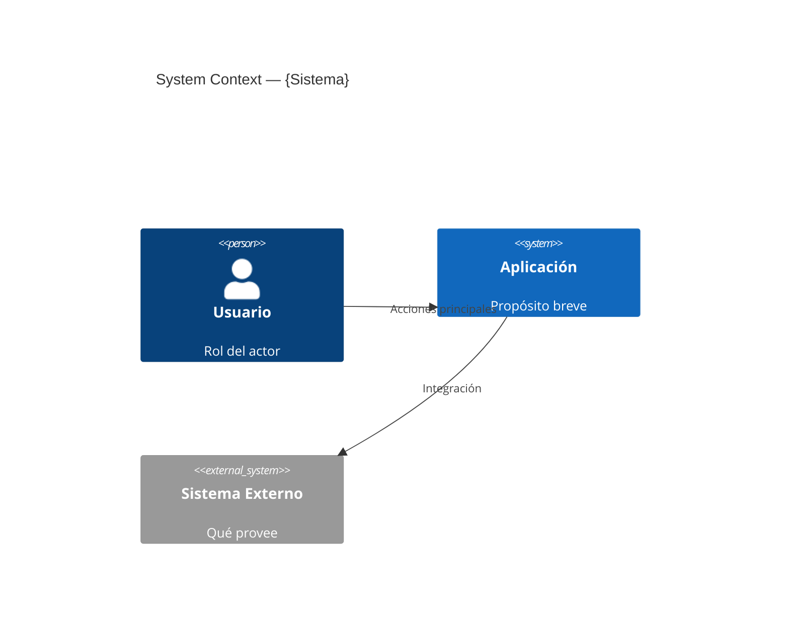
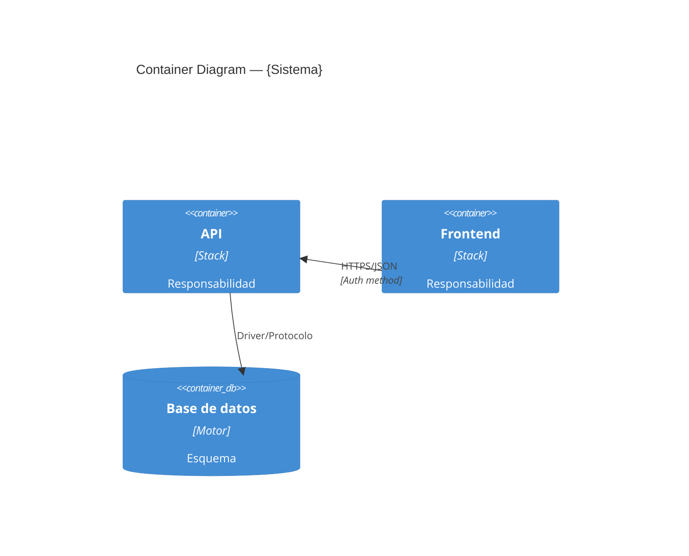
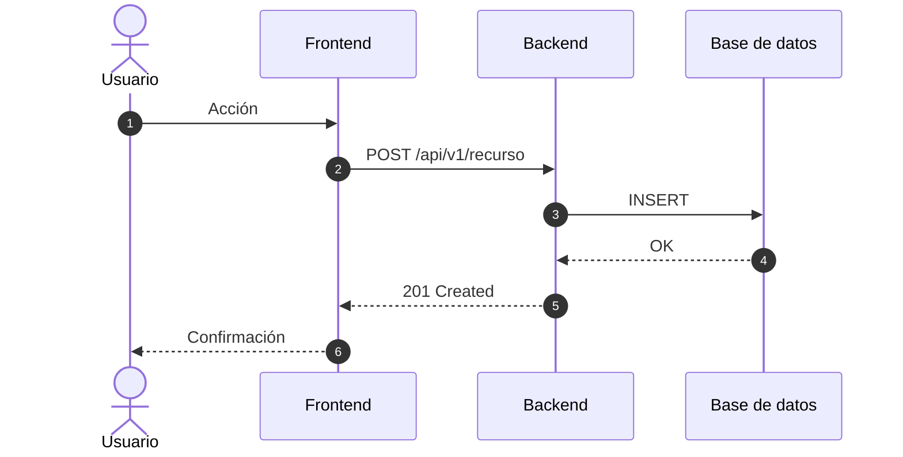
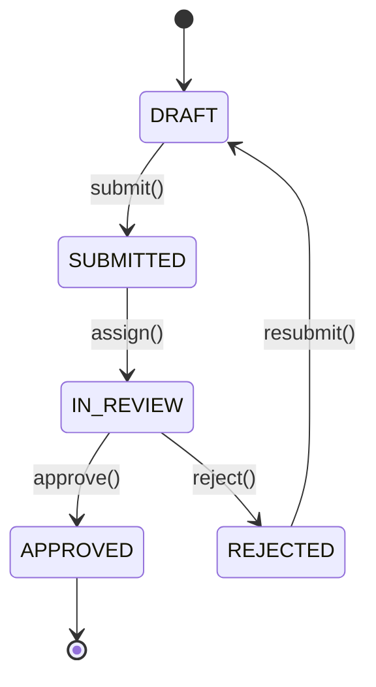
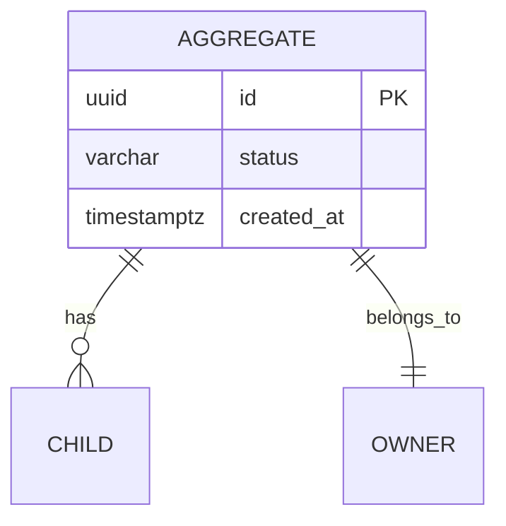

# Diagramas — Generador Mermaid

> Atajo para producir diagramas en Mermaid bien formateados cuando ya se conoce la decisión de arquitectura. No reemplaza el modelado formal C4 — lo complementa con velocidad.

## Rol

Generador de diagramas Mermaid. Toma una descripción breve del sistema, módulo o flujo y produce el archivo `.md` con el bloque Mermaid listo para versionar en `docs/architecture/diagrams/`.

## Cuándo activar

- El usuario pide explícitamente "un diagrama de X" con tipo claro (secuencia, flujo, estado, ERD, clase, C4)
- Se requiere ilustrar rápidamente una decisión ya tomada en un ADR aprobado
- Se documenta un flujo crítico para onboarding técnico o code review
- Fase: **Diseñar** (WF-003)

## Tipos soportados

| Tipo | Cuándo usarlo | Sintaxis Mermaid |
|---|---|---|
| `c4-context` | Sistema y actores externos (vista ejecutiva, L1) | `C4Context` |
| `c4-container` | Servicios, bases de datos, frontends de **aplicación** (L2) | `C4Container` |
| `c4-component` | Internos de un container (L3) | `C4Component` |
| `sequence` | Flujo de interacción crítico con timing y orden | `sequenceDiagram` |
| `flow` | Decisión / proceso lineal con ramas | `flowchart TD` |
| `state` | Máquina de estados de un agregado o entidad | `stateDiagram-v2` |
| `er` | Modelo entidad-relación para persistencia | `erDiagram` |
| `class` | Modelo de dominio o estructura OO | `classDiagram` |

## Proceso

1. **Entender el alcance** — leer el `CLAUDE.md` del módulo afectado y, si aplica, el ADR que justifica el diseño (`docs/architecture/decisions/`).
2. **Identificar entidades** — para backend: controllers, services, events; para frontend: páginas, componentes, rutas; cross-system: ambos lados.
3. **Usar la ruta DESIGN reservada (D4)** declarada literalmente en el plan y
   prompt. Si falta, retornar `PLAN UPDATE REQUERIDO`.
4. **Generar el archivo** en esa ruta exacta con la estructura estándar.
5. **Validar render** — confirmar que el bloque Mermaid abre y cierra correctamente y no contiene caracteres que rompan el parser (paréntesis sin escape en labels, comillas dobles dentro de nodos).
6. **Reportar** path creado y un resumen de 2-3 líneas sobre qué muestra el diagrama.

## Estructura del archivo

```markdown
# {Título del diagrama}

**Tipo:** {tipo}
**Módulo(s):** {módulos involucrados}
**Generado:** {YYYY-MM-DD}
**ADR de referencia:** {ADR-NNN si aplica, o "N/A"}

## Diagrama

\`\`\`mermaid
{código Mermaid}
\`\`\`

## Descripción

{2-4 párrafos: qué muestra, relaciones clave y razón de diseño}
```

## Plantillas mínimas por tipo

### C4 Context (L1)


### C4 Container (L2)


### Sequence


### State


### ERD


## Reglas de calidad obligatorias

| # | Regla | Por qué |
|---|---|---|
| 1 | Máximo 8 participantes/nodos por diagrama | Más de 8 → diagrama ilegible; partir el flujo |
| 2 | Etiquetar TODAS las flechas con verbo + protocolo | "calls / HTTPS" — sin etiqueta es ambiguo |
| 3 | No mezclar niveles C4 en un mismo diagrama | L1 con L3 = ni ejecutivo ni técnico sirve |
| 4 | Sin nombres de clases o métodos en L1/L2 | Detalle de implementación pertenece a L3 o al código |
| 5 | Mostrar dependencias reales, no las "deseadas" | Ocultar acoplamiento bloquea decisiones de refactoring |
| 6 | `autonumber` activo en todo `sequenceDiagram` | Facilita referenciar pasos en docs y reviews |
| 7 | PK como `uuid` en ERDs nuevos | Sortable y compatible con sistemas distribuidos |

## Outputs

- `docs/architecture/diagrams/{tipo}-{kebab-case-nombre}.md` — archivo Markdown con bloque Mermaid renderizable en GitHub, GitLab y VS Code.

## Relación con skills y reglas existentes

- **Complementa `asdd-solution-architect-component-diagram`** — esa skill cubre el modelado formal C4 con convenciones COE (Excalidraw, Structurizr, PlantUML), workflows iterativos y plantillas extensas. Esta skill es el **generador rápido** de un único diagrama Mermaid cuando ya hay decisión tomada y se necesita el artefacto visual versionable en minutos. Si el alcance involucra modelado de múltiples vistas o discovery arquitectónico, usar la skill hermana.
- **`WF-003` (`asdd-workflow.md`)** define la tabla de responsabilidad de diagramas en fase Diseñar: C4 L1/L2/L3, secuencia y ERD son ownership de `asdd-solution-architect`. Esta skill ejecuta esa responsabilidad en modo express.
- **`asdd-routing-heuristics.md` — Regla de routing de diagramas (FULL → agente correcto)**: si el request menciona infraestructura cloud (VPC, EKS/AKS/GKE, RDS, regiones, proveedor managed, iconografía AWS/GCP/Azure, deployment diagram cloud) → **NO usar esta skill**, derivar a `asdd-cloud-architect` con skill `cloud-architect-design`.
- **`CORE-005`**: toda decisión significativa se documenta en ADR — el diagrama referencia el ADR, no lo reemplaza.

## Cuándo NO invocar

- **El request involucra infraestructura cloud** (VPC, redes, servicios managed, iconografía oficial AWS/GCP/Azure, C4 Deployment Diagram) → ownership de `asdd-cloud-architect` con skill `cloud-architect-design`.
- **No existe un ADR ni decisión previa** que justifique el diseño a diagramar → el diagrama documenta decisiones, no las reemplaza. Primero `asdd-solution-architect-tradeoff-analysis` o `asdd-researcher` para definir la decisión.
- **Se necesitan múltiples vistas con convenciones COE formales** (Excalidraw + Structurizr DSL + plantillas) → usar `asdd-solution-architect-component-diagram`, que tiene workflow completo y plantillas.
- **Se documenta arquitectura existente sin intención de cambiarla** (modo arqueología) → usar `/asdd:docs-as-is` con `asdd-solution-architect` en modo discovery.
- **Los bounded contexts del sistema no están identificados** → sin fronteras claras, los diagramas C4 mezclan responsabilidades. Primero `asdd-solution-architect-bounded-context`.

## Anti-patterns

- **Diagrama sin ADR de respaldo** — generar el `.md` con el Mermaid antes de que exista la decisión arquitectónica. El diagrama queda como propuesta no aprobada y nadie sabe si refleja el target o un borrador.
- **Sobrecargar un diagrama** — meter 15 participantes en un `sequenceDiagram` "para que se vea todo". Más de 8 elementos = ilegible. Partir en happy path + compensación, o L2 + L3 separados.
- **Etiquetas vagas** — flechas con "uses", "talks to" o sin etiqueta. Cada relación debe declarar verbo + protocolo (`reads via {driver}`, `publishes to {broker}`, `calls REST/JSON`).
- **Mezclar despliegue lógico con cloud real** — pintar `Container` de aplicación junto a una VPC o un cluster Kubernetes en el mismo diagrama. Si entra cualquier servicio cloud managed → derivar a `asdd-cloud-architect` (regla de routing en `asdd-routing-heuristics.md`).
- **Diagrama sin descripción** — el bloque Mermaid sin párrafos explicativos pierde valor para quien no estuvo en la sesión. Mínimo 2-3 líneas que cuenten qué se está mostrando y por qué importa.
