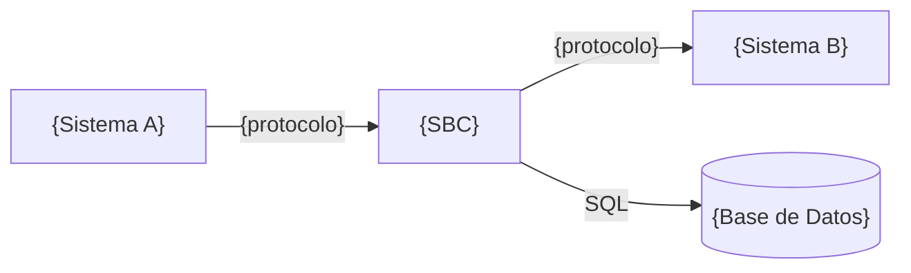

# DA_ADE43 — Dependencias de Arquitectura
**Solución:** {nombre-solucion} | **Versión:** {version} | **Fecha:** {YYYY-MM-DD}

## Dependencias del Sistema Bajo Consideración

### Dependencias Entrantes (quién depende del SBC)
| Sistema Dependiente | Tipo | Protocolo | Criticidad | Riesgo si SBC falla |
|---|---|---|---|---|
| {sistema A} | Síncrona/Asíncrona | REST/gRPC/Kafka | Alta/Media/Baja | {impacto} |

### Dependencias Salientes (de qué depende el SBC)
| Sistema Proveedor | Tipo | Protocolo | Criticidad | Alternativa si falla |
|---|---|---|---|---|
| {sistema B} | Síncrona/Asíncrona | REST/gRPC/MQ | Alta/Media/Baja | {fallback o circuit breaker} |

### Dependencias Compartidas (infra/plataforma)
| Recurso Compartido | Tipo | Consumidores | Riesgo de Contención |
|---|---|---|---|
| {ej. Base de datos compartida} | BD | {lista de sistemas} | {impacto en rendimiento} |

## Mapa de Dependencias

## Control de Cambios
| Versión | Descripción | Autor | Fecha |
|---|---|---|---|
| 0.1 | Versión inicial | {autor} | {fecha} |
