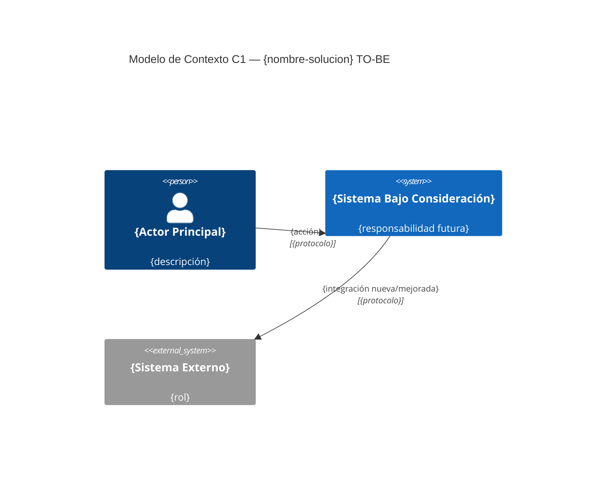
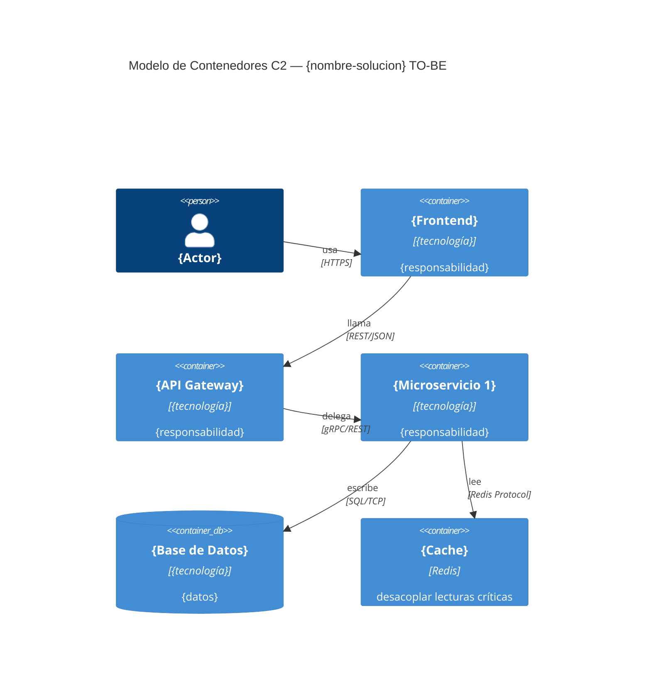
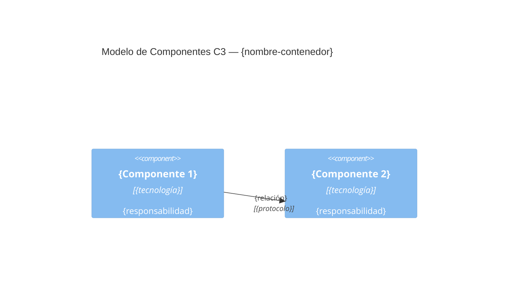

# DA_ADE44 — Arquitectura TO-BE
**Solución:** {nombre-solucion} | **Versión:** {version} | **Fecha:** {YYYY-MM-DD}
**Trazabilidad:** Responde a DA_ADE35 QAs: {lista de QAs que resuelve}

## 1. Modelo de Contexto C1

## 2. Modelo de Contenedores C2

## 3. Modelo de Componentes C3 (Contenedor crítico)
> Contenedor: {nombre del contenedor más crítico}

## 4. Cómo resuelve los Gaps AS-IS
| GAP AS-IS | Solución TO-BE | QA que cumple |
|---|---|---|
| GAP-01 | {patrón o componente que lo resuelve} | QA-01 |

## 5. Roadmap de Implementación
| Fase | Capacidades a construir | Hito | Fecha estimada |
|---|---|---|---|
| Fase 1 — MVP | {capacidades core} | {hito medible} | {YYYY-MM} |
| Fase 2 — Escala | {mejoras de rendimiento/disponibilidad} | {hito} | {YYYY-MM} |
| Fase 3 — Optimización | {capacidades avanzadas} | {hito} | {YYYY-MM} |

## Control de Cambios
| Versión | Descripción | Autor | Fecha |
|---|---|---|---|
| 0.1 | Versión inicial | {autor} | {fecha} |
