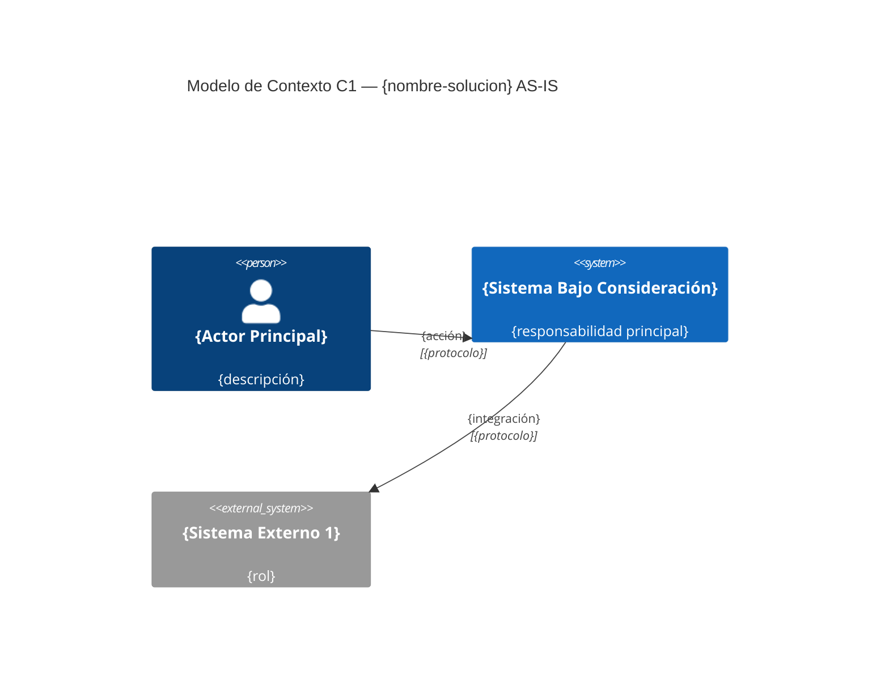
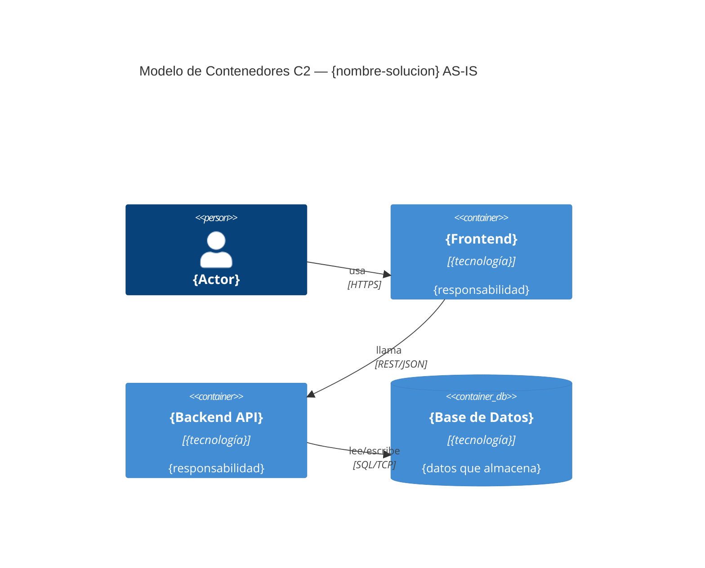

# DA_ADE45 — Arquitectura AS-IS
**Solución:** {nombre-solucion} | **Versión:** {version} | **Fecha:** {YYYY-MM-DD}

## 1. Modelo de Contexto C1
> Sistema Bajo Consideración (SBC): {nombre del sistema}

## 2. Modelo de Contenedores C2

## 3. Mapa de Capacidades de Negocio
| Capacidad | Soportada | Limitaciones Actuales |
|---|---|---|
| {ej. Gestión de pólizas} | Parcial | {ej. Solo consulta, no actualización en tiempo real} |
| {ej. Pagos automáticos} | No soportada | {gap que justifica el TO-BE} |

## 4. Identificación de Gaps y Limitaciones
| ID | Limitación | Impacto | QA Afectado |
|---|---|---|---|
| GAP-01 | {descripción técnica del problema} | {consecuencia en producción} | QA-01 |

## 5. Riesgos AS-IS
| ID | Riesgo | Severidad | Componente Afectado |
|---|---|---|---|
| RAS-01 | {ej. Tecnología obsoleta sin soporte} | Alta | {componente} |

## Control de Cambios
| Versión | Descripción | Autor | Fecha |
|---|---|---|---|
| 0.1 | Versión inicial | {autor} | {fecha} |
