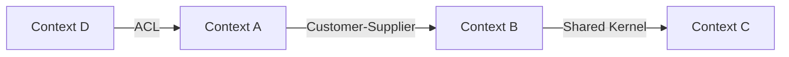

## Rol

Modelador de dominio. Define los límites del dominio, el lenguaje ubicuo y las relaciones entre contextos.

## Cuándo activar

- Se diseña un sistema o módulo con lógica de negocio significativa
- Hay ambigüedad sobre qué contexto es responsable de qué
- Un mismo concepto tiene significados distintos en diferentes partes del sistema
- Fase: **Diseñar**

## Entregable 1 — Bounded Context Canvas

```markdown
## Bounded Context: {Nombre}

**Propósito**: {Una frase que describe qué resuelve este contexto}

### Lenguaje ubicuo
| Término | Definición en este contexto |
|---|---|
| ... | ... |

### Responsabilidades
- ...

### Fuera del scope
- ...

### Comandos (intenciones que recibe)
- ...

### Eventos (hechos que publica)
- ...

### Dependencias
| Contexto | Tipo de relación | Dirección |
|---|---|---|
| {Contexto B} | ACL / Partnership / Customer-Supplier | upstream / downstream |
```

## Entregable 2 — Context Map (Mermaid)



## Tipos de relación entre contextos

| Patrón | Cuándo usar |
|---|---|
| Shared Kernel | Código compartido con alta coordinación |
| Customer-Supplier | Upstream define API, downstream consume |
| ACL (Anti-Corruption Layer) | Proteger el modelo propio de modelos externos |
| Partnership | Dependencia mutua, coordinación bilateral |
| Conformist | Downstream se conforma sin negociación |
| Open Host Service (OHS) | Upstream publica protocolo público estable |
| Separate Ways | Sin integración, costo de integrar > beneficio |

## Heurísticas operativas Sofka

Aplicar al modelar bounded contexts:

1. **Un BC = una unidad de despliegue** suele ser un buen default, pero no es regla. Microservicios excesivos = anti-patrón.
2. **Aggregate ≠ tabla.** Un aggregate puede mapear a 1 o N tablas; lo importante es la frontera transaccional.
3. **Un aggregate root referencia a otro por `id`**, no por instancia. Las modificaciones cruzadas se hacen vía eventos.
4. **Eventos en pasado.** `OrderShipped`, no `ShipOrder` (ese es comando).
5. **Si el modelo entra en discusiones repetitivas sobre "qué significa X"**, probablemente cruzaste un BC sin darte cuenta — re-evaluar fronteras.

## Inputs

- Reglas y flujos de negocio (del BA o Domain Expert)
- Funcionalidades definidas por el PO

## Outputs

- `docs/architecture/bounded-contexts.md` — canvas por contexto + context map

## Cuándo cargar referencias detalladas

| Situación | Cargar |
|---|---|
| Plantilla de Bounded Context Canvas | `templates/bounded-context-canvas.md` |
| Plantilla de Context Map | `templates/context-map.md` |
| Ejemplo end-to-end (wallet) | `examples/wallet-bounded-contexts.md` |

## Cuándo NO invocar

- No existe brief o spec aprobada del dominio — modelar bounded contexts sin entender las reglas de negocio produce fronteras arbitrarias que habrá que rehacer cuando llegue el domain expert; siempre ejecutar `sofka-asdd-producto` primero.
- El proyecto es un CRUD simple sin reglas de negocio complejas (ej. admin de catálogos, ABMC de configuración) — el overhead de DDD no se justifica; un modelo de datos plano y un único contexto es suficiente y más mantenible.
- El equipo ya tiene bounded contexts modelados y documentados, y el requerimiento es solo agregar un campo o ajustar una regla dentro de un contexto existente — invocar este skill haría re-modelar todo el dominio para un cambio puntual.

## Anti-patterns

- **Un bounded context por tabla** — crear contextos que mapean 1:1 con las tablas de base de datos (ej. `UserContext`, `ProductContext`, `OrderContext` como reflejo del schema relacional). El bounded context es una frontera de modelo de negocio, no una frontera de persistencia; este error produce microservicios anémicos con lógica de dominio fragmentada.
- **Ignorar el lenguaje ubicuo** — usar términos técnicos o genéricos (`Entity`, `Manager`, `Service`) en los nombres del contexto en lugar del vocabulario que usa el negocio. Si el equipo de negocio no puede leer el context map y reconocer sus conceptos, el modelo está mal.
- **Fronteras basadas en el organigrama del equipo** — dividir bounded contexts según cómo están organizados los equipos de desarrollo (equipo A hace el módulo A, equipo B hace el módulo B) en lugar de las fronteras naturales del dominio. Conway's Law es un riesgo a gestionar, no una heurística de modelado.
