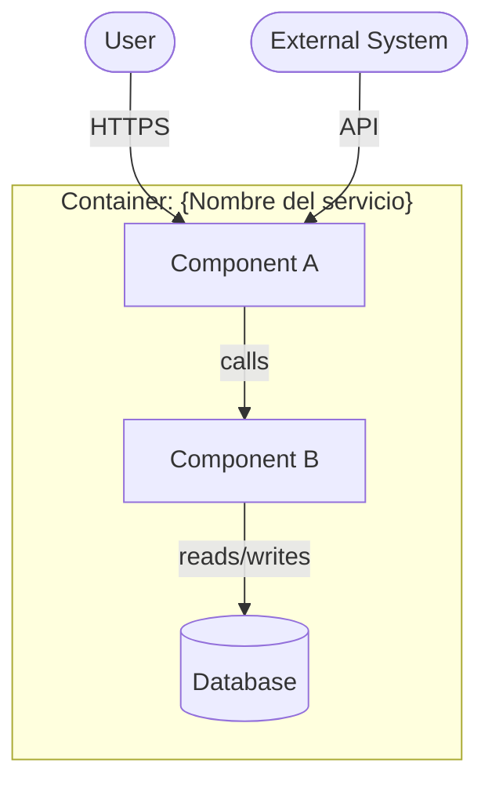

## Rol

Modelador de componentes. Produce diagramas de arquitectura en niveles C4 con
sintaxis Mermaid y otras vistas complementarias (secuencia, datos, despliegue).

## Cuándo activar

- Se necesita visualizar la estructura del sistema o un subsistema
- Se diseña una feature que requiere mostrar relaciones entre componentes
- Flujo crítico cruza ≥3 componentes (login, checkout, saga)
- Se debe documentar el modelo físico de datos para devs/DBAs
- Fase: **Diseñar**

## Niveles C4

| Nivel | Descripción | Cuándo usar |
|---|---|---|
| L1 Context | Sistema y actores externos | Vista ejecutiva, onboarding |
| L2 Container | Servicios, DBs, frontends | Diseño de solución |
| L3 Component | Internos de un container | Diseño técnico detallado |

## Formato (Mermaid)

## Tipos de vista soportados

| Vista | Cuándo usar | Scope |
|---|---|---|
| Componentes (C4 L1/L2/L3) | Estructura estática del sistema | Aplicación — actores, servicios, DBs, frontends |
| Secuencia | Flujo de interacción crítico (timing, orden) | Flujos de negocio entre componentes de aplicación |
| Datos (ERD / Event Storming / NoSQL) | Modelo de persistencia o flujo de eventos | Entidades del dominio, esquemas, contratos de eventos |
| Despliegue de aplicación | Mapeo lógico de containers a procesos/hosts, **sin servicios cloud** | Solo cuando no involucra decisiones de infraestructura cloud |

**Límite crítico — vista "Despliegue":** este skill modela únicamente el despliegue **lógico de aplicación** (qué proceso corre en qué tipo de nodo). Cuando el diagrama incluye servicios cloud reales (VPC, EKS/AKS/GKE, RDS, Load Balancers, regiones, zonas de disponibilidad), **no continuar — delegar a `cloud-architect-design`** con skill `C4 Deployment Diagram`.

## Herramienta de diagramación

- **Default Sofka:** Excalidraw — bocetos rápidos en sesión de discovery / arquitectura colaborativa.
- **Alternativas según fin:**
  - Mermaid — diagrama final que vive en `docs/` y debe versionarse (render nativo en GitHub/GitLab).
  - Structurizr DSL — modelado C4 formal con vistas múltiples desde un solo modelo.
  - PlantUML — text-as-code, render server-side.

**Plantilla rellenable:** `templates/c4-mermaid.md`.
**Ejemplos:** `examples/c4-wallet-system.md`, `examples/seq-oauth-pkce.md`, `examples/seq-saga-payment.md`.

### Convenciones COE para Excalidraw

1. **Una "scene" por nivel C4** — no mezclar L1 y L2 en el mismo canvas.
2. **Colores semánticos:** Azul = containers internos / Gris = sistemas externos / Naranja = actores humanos / Verde = bases de datos.
3. **Etiquetar las flechas** — verbo + protocolo (ej. "calls / HTTPS").
4. **Exportar a `.excalidraw` y `.png`** — `.excalidraw` para edición, `.png` para previews en MD.
5. **Path Sofka:** `docs/architecture/diagrams/{feature}-{nivel}.excalidraw`; la imagen junto al `.md` que la referencia.

**Workflow recomendado:** Boceto en Excalidraw durante la sesión → una vez aceptado, formalizar en Mermaid → mantener `.excalidraw` para iteraciones futuras.

**MCP nota:** si el agente tiene `mcp__excalidraw__*` habilitado, puede crear/leer/exportar canvases programáticamente.

### Convenciones COE para Structurizr DSL

1. **Un workspace por sistema** (no por dominio entero — un wallet, no "todas las apps de banca").
2. **Tags en containers** para colorear (`Database`, `External`, `Mobile`).
3. **ADRs en `docs/adrs/`** referenciados en el workspace (`!docs` y `!adrs`).
4. **Versionar el `.dsl`** en git, los renders se generan en CI.
5. **Una vista L1 + N vistas L2** (una por context) + L3 sólo donde aporta.

### Convenciones COE para Sequence Diagrams

1. **`autonumber`** siempre activo — facilita referenciar pasos en docs y reviews.
2. **`actor` para humanos**, `participant` para sistemas.
3. **Flecha sólida `->>`** llamadas síncronas; **flecha punteada `-->>`** responses.
4. **Notas con `note over X,Y: ...`** para condiciones, comentarios, postconditions.
5. **`alt / else / end`** para branches (ej. caché hit vs miss).
6. **`loop ... end`** para reintentos.
7. **`par ... and ... end`** para paralelismo.
8. **Activations** (`activate`/`deactivate`) cuando importa mostrar lifetime de invocación.

**Tips de legibilidad:** ≤8 participantes (más → partir el flujo); si saga con compensatoria, hacer un sequence aparte para "happy path" y otro para "compensación".

### Convenciones COE para Modelado de Datos (ERD)

1. **PK con `id` UUIDv7** (sortable). Evitar autoincrement en sistemas distribuidos.
2. **`created_at` / `updated_at`** como `timestamp` con timezone.
3. **Soft delete (`deleted_at`)** sólo si justificable; default es delete duro y archivo en outbox.
4. **Foreign keys con índice** — Postgres no lo crea automáticamente.
5. **Naming:** tablas en plural, columnas snake_case.

## Inputs

- Bounded contexts identificados
- Descripción de la feature o sistema a modelar
- Tecnologías y restricciones del stack

## Naming del artefacto (D4 — naming run-trazable)

Usar literalmente las rutas DESIGN reservadas en el plan. Si falta la ruta
principal o una complementaria, detenerse con `PLAN UPDATE REQUERIDO`.
Markdown, `.excalidraw`, `.png` y cualquier otro archivo complementario llevan
el mismo prefijo universal; cada uno tiene su propia reserva/SEQ.

## Outputs

- `docs/architecture/$ARTIFACT_NAME` (o fallback `{feature}-components.md`) con diagramas Mermaid por nivel C4
- `docs/architecture/diagrams/{feature}-{nivel}.excalidraw` (si Excalidraw)

## Cuándo cargar referencias detalladas

| Situación | Cargar |
|---|---|
| Plantilla C4 Mermaid rellenable | `templates/c4-mermaid.md` |
| Ejemplo C4 end-to-end (wallet) | `examples/c4-wallet-system.md` |
| Ejemplo sequence OAuth | `examples/seq-oauth-pkce.md` |
| Ejemplo sequence saga payment | `examples/seq-saga-payment.md` |

## Cuándo NO invocar

- No existe un ADR aprobado que justifique el diseño que se va a diagramar — el diagrama documenta decisiones tomadas, no las reemplaza; sin ADR previo, el diagrama es especulativo.
- El objetivo es documentar la arquitectura actual sin intención de cambiarla — usar `/sofka-asdd:docs-as-is` con `sofka-asdd-solution-architect` en modo discovery; este skill está orientado a diseño, no a arqueología.
- Los bounded contexts del sistema no están identificados — sin fronteras claras, el diagrama C4 L2 mezcla responsabilidades y genera confusión sobre qué pertenece a qué servicio.
- **El usuario solicita un diagrama de infraestructura cloud** (VPC, redes, proveedores, regiones, servicios managed) → este es territory del `sofka-asdd-cloud-architect` con skill `cloud-architect-design`.
- **El usuario solicita un C4 Deployment Diagram** → ownership exclusivo de `cloud-architect-design`; no producir este tipo de diagrama desde este skill.

## Anti-patterns

- **Detalle de implementación en nivel alto** — incluir en un diagrama C4 L1 o L2 detalles como nombres de clases, métodos específicos o configuraciones internas. Esos detalles pertenecen al L3 o al código; su presencia en diagramas de alto nivel los hace ilegibles y difíciles de mantener.
- **Mezcla de niveles C4** — combinar en un mismo diagrama elementos de L1 (sistema completo + actores) con elementos de L3 (componentes internos). El resultado es un diagrama que no sirve para ninguna audiencia — ni ejecutiva ni técnica.
- **Dependencias omitidas** — modelar componentes sin mostrar sus relaciones de dependencia, o mostrar solo las relaciones "deseadas" y no las reales. Un diagrama que oculta dependencias circulares o tight coupling da una falsa imagen de la arquitectura y bloquea las decisiones de refactoring.
