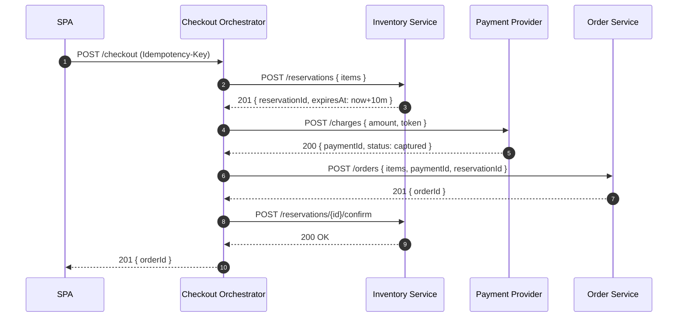
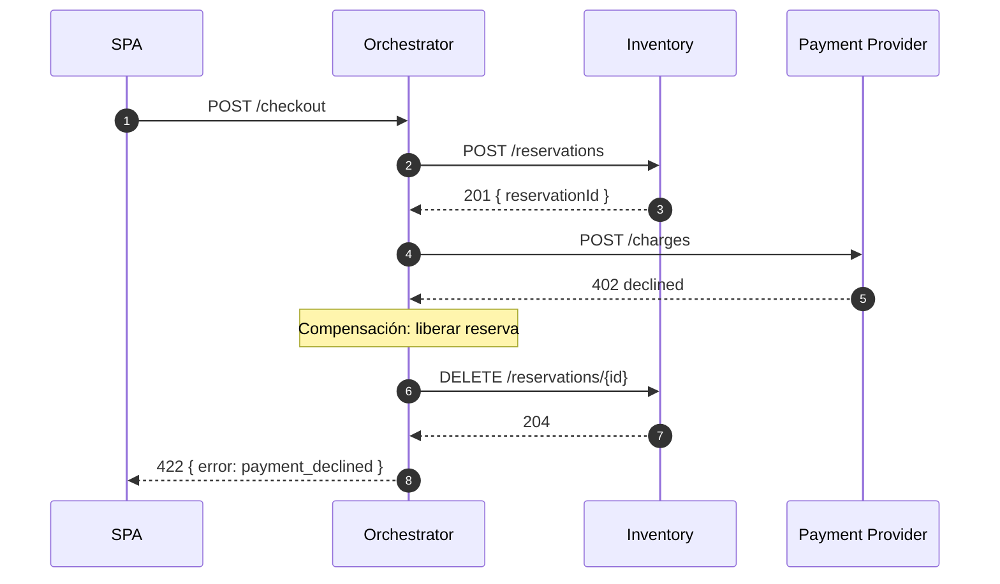
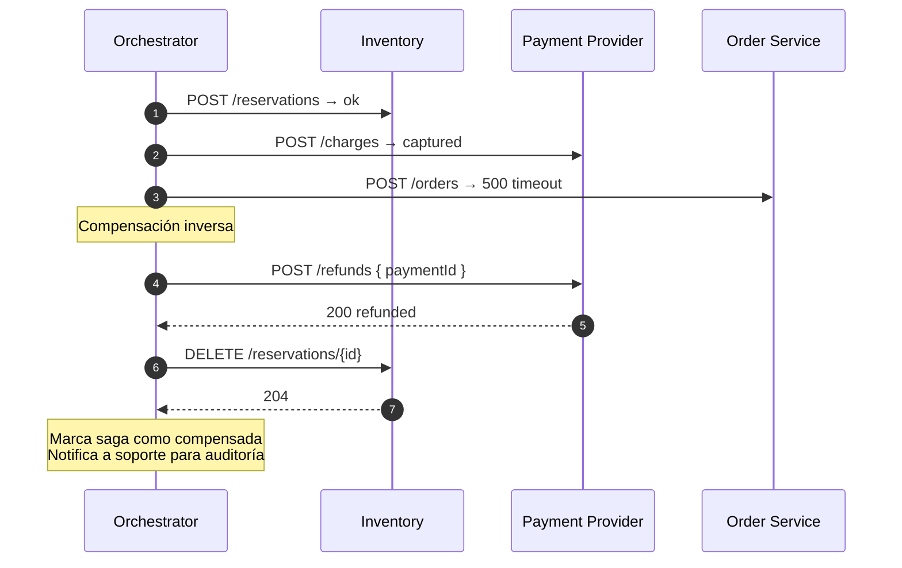

# Sequence — Saga orquestada para pago de checkout

**Contexto:** Checkout de e-commerce. Pago involucra reserva de inventario,
cobro al proveedor de pagos y emisión de la orden. Si cualquier paso falla,
se debe compensar lo ya hecho.

**Patrón:** Saga orquestada (un orquestador conoce todos los pasos).

## Happy path

## Error en payment — compensación

## Error en order_service — compensación parcial

## Decisiones reflejadas

- **Idempotency-Key obligatorio** en `/checkout` — protege contra retries del cliente.
- **Reservas con TTL** (10 min) — si el orquestador muere a mitad de saga, las reservas expiran solas.
- **Compensaciones por API explícitas** (DELETE reservation, POST refund) — más simple que event-driven choreography.
- **Estado de saga persistido** (no mostrado): el orquestador escribe en `saga_log` cada paso para poder reanudar tras un crash. Ver `sofka-asdd-architect-patterns/reference/data-patterns.md` sección Sagas.
- **Refund automático** solo cuando hay error técnico downstream del pago. Errores de negocio (fraud detection) usan flujo distinto.
