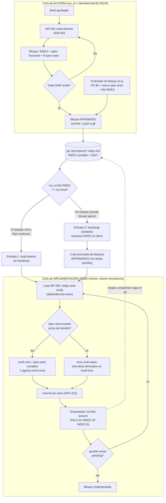

# ADR-008 — Ciclo dual autoría↔implementación: INDEX portable como SSoT único, work-units de implementación y extensión de bloque

> **Ubicación canónica.** Este ADR vive en `docs/adoption/` junto a los demás ADRs consumer-facing distribuidos por el CLI (ADR-002, ADR-004, ADR-006, ADR-007). Ver la nota de distribución en ADR-004 para el porqué de esta ruta y no `docs/architecture/decisions/`.

- **Estado:** Propuesta
- **Fecha:** 2026-07-09
- **Revisión 2026-07-09 (rev-1):** Ajuste dirigido tras aprobación de Andrés para incorporar (i) el principio de resume reconciliado contra git, validado empíricamente en el repo `humanatech-guideai-convenios` (nuevo §9); (ii) decisión de ownership/naming del skill de reconciliación (nuevo §10); (iii) adopción del sub-tipado del CR propuesto por el AF en §8/P4 (nueva decisión (f) en §3, refleja en §2.e). Refuerzo de evidencia en la recomendación (a). Estado sigue `Propuesta`.
- **Deciders:** _(pendiente — requiere aprobación explícita del maintainer del template)_
- **Autor:** asdd-solution-architect
- **Skill activo:** tradeoff-analysis (fase Diseñar)
- **Relacionados:** ADR-004 (modelo spec-per-área — este ADR lo **extiende, no lo reemplaza**), ORC-007 en `.claude/references/rules/asdd-checkpoint-resume.md`, WF-004 en `.claude/references/rules/asdd-workflow-build.md`, ORC-011 en `.claude/references/rules/asdd-orchestration-worktree.md`, SPG-001 y SPG-004 en `.claude/references/rules/asdd-spec-guard.md`, `.asdd/asdd-run.schema.json`, `.claude/commands/asdd/resume.md`, `asdd-tech-lead-sdd-traceability` (skill).
- **Ship en:** MINOR — extiende el flujo interno del template (autoría/implementación) sin romper el contrato del código de negocio del consumidor. Requiere migración de commands, un skill nuevo y un hook.

---

## 1. Contexto

### 1.1 El supuesto implícito que se rompe

El modelo ASDD actual (ADR-004) asume que **quien crea las specs es quien las implementa**, en **un** workspace, dentro de **un** run (`.asdd-run.json`, `1 run = 1 feature = 1 workspace`). Ese supuesto se sostiene en el equipo chico de flujo continuo, pero se rompe en cuanto autoría e implementación se separan en el tiempo, en personas o en workspaces. Andrés levantó cinco inquietudes que, analizadas juntas, **convergen en una sola pieza de diseño**: la separación del ciclo de autoría del ciclo de implementación.

Las cinco inquietudes:

| # | Inquietud | Naturaleza |
|---|---|---|
| **I1** | spec-per-área (ADR-004) **se queda** — es el marco base, no negociable | Restricción dura |
| **I2** | **Extensión de bloque**: agregar un `spec-{area}` nuevo a un bloque ya generado (INDEX + funcional + N slices) tiempo después, reflejándolo en el INDEX y en el §0 del funcional, **sin regenerar el bloque** | Capacidad faltante |
| **I3** | **Handoff BA→dev entre workspaces**: un BA autora y APRUEBA specs en su workspace (con su `run_id`); un dev recibe el bloque ya hecho (potencialmente 100 specs) por git, en otro workspace, **sin ese `run_id` en su `.asdd-run.json`**. Debe descubrirlos, implementarlos uno a uno y actualizar su estado a medida que avanza | Capacidad faltante |
| **I4** | **Dual-mode obligatorio**: soportar ambos extremos sin migrar todo a uno — equipo grande (BA autora, dev implementa) y equipo chico (un dev crea brief+specs+ADRs e implementa él mismo, flujo continuo actual). Ninguno debe degradarse | Restricción dura |
| **I5** | **Granularidad (requisito de Pipe)**: "ninguna spec debe definir algo cuya implementación dure >30 min", pensando el dev como IA (Sonnet 5 / Opus 4.8), no humano | Requisito de calidad |

### 1.2 Por qué convergen

I2, I3 e I4 son tres vistas del mismo fenómeno: **el `run_id` hoy identifica un workspace-momento, no un cuerpo de trabajo**. Si el `run_id` identificara el **bloque de specs** (el cuerpo de trabajo autorado), los tres escenarios se vuelven el mismo mecanismo:

- **Equipo chico** = caso **degenerado** del portafolio. El bloque se creó recién en el mismo workspace: el `run_id` de autoría y el de implementación coinciden, `.asdd-run.json` ya apunta al INDEX, y el flujo continúa sin fricción.
- **Equipo grande** = el bloque llegó por git desde otro workspace: `run_id` ajeno, sin `.asdd-run.json` local para ese bloque. El dev lo **descubre leyendo el INDEX en disco**.

En ambos casos el driver es idéntico: **"un INDEX aprobado con áreas en estado `pending`"**. Un mecanismo INDEX-driven, dos puntos de entrada.

I5 no es un gate de tamaño — es una **estrella polar**. El tiempo es la unidad equivocada (no verificable en autoría, no determinista entre modelos) y el nivel equivocado (el `spec-{area}` es estructural; picarlo recrea la incoherencia que ADR-004 §9 evitó al retirar el ceiling #3650). El reframe correcto: la restricción de Pipe **valida** que ~150 líneas por `spec-{area}` ya es el orden de magnitud adecuado para una ejecución de agente, y el límite real se expresa con **proxies medibles en planeación** (líneas de cambio, archivos, slice vertical), no con minutos.

### 1.3 Estado actual verificado (base factual, no re-explorada)

- Re-ejecutar `/asdd:analyze` sobre un feature `complete` **no extiende** el bloque: crea uno nuevo con `run_id` nuevo. No existe lógica "detectar bloque existente + extender".
- El bloqueo "status=complete → Write bloqueado" **ya fue removido** (Bug A A7 en `artifact-name-guard.mjs` → `exit 0`, solo advertencia). No es el muro.
- `.asdd-run.json` (`.asdd/asdd-run.schema.json`) es **1 run = 1 feature = 1 workspace**: campos top-level `run_id`/`feature`(singular)/`status`/`phases{6}`/`artifact_seq`. **Sin array de bloques, sin backlog.** No puede representar "100 specs pendientes". `phases.build.index_ref` = puntero a **un** INDEX.
- El **INDEX ya es portable y autocontenido**: viaja en git con las specs, tiene estado por área (`pending`/`in_progress`/`done`/`blocked`/`n/a`) + historial append-only. Regla R-INDEX-5: solo el orquestador lo escribe (ADR-004).
- El estado de avance está **duplicado** hoy: en el INDEX y en `.asdd-run.json.phases.build.completed_steps`, sin sincronización.
- `.asdd-run.json` y `docs/specs/` están **ambos trackeados en git** → un archivo de estado de sesión compartido entre devs = conflictos de merge.
- **No existe bootstrap**: el orquestador no sabe escanear `docs/specs/` para descubrir bloques ajenos. `/asdd:build` asume que el INDEX salió de un `analyze` con **tu** `run_id`.
- `run_id` va **embebido en el filename**: `{run_id}-ANALYZE-{SEQ}-{feature}-{area}.md`.
- ADR-004 §9 **retiró a propósito** el ceiling #3650 (>300 líneas / >5 CU / >1 Aggregate) por "fricción vestigial". ASDD **no tiene** concepto de esfuerzo/tamaño ni artefacto de tasks/work-units (eso es del SDD genérico: Review Workload Forecast, budget de 400 líneas, work-unit-commits — no existe en ASDD). Unidad implementable mínima hoy = el `spec-{area}` completo (~150 líneas), implementado end-to-end por 1 agente en el loop WF-004.

### 1.4 Restricción dura de diseño

El **modo continuo del equipo chico no debe volverse más burocrático**. Sigue siendo el happy path sin fricción; la capa de portafolio se activa **solo cuando hace falta** (cuando el INDEX descubierto no corresponde al run local).

---

## 2. Decisión

Adoptar un **modelo de ciclo dual** que separa la **autoría** de specs de su **implementación**, unificado por el **INDEX como Single Source of Truth portable y único** del progreso. Cinco componentes:

### 2.a Separación autoría ↔ implementación

Se definen dos ciclos con identidad propia:

- **Ciclo de autoría** — produce el bloque (INDEX + spec-funcional + N `spec-{area}`) siguiendo WF-002 (ADR-004). El `run_id` **identifica el bloque autorado**, no el workspace. Es el "cuerpo de trabajo".
- **Ciclo de implementación** — un modelo de **intake/portafolio**: descubrir bloques **APROBADOS** (Gate DOR verde) con áreas en estado `pending`, encolarlos priorizados, y correr el loop de build WF-004 contra el INDEX (propio o ajeno). El avance se escribe **solo en el INDEX**.

`.asdd-run.json` queda **degradado a conveniencia efímera del ciclo de autoría en vuelo** y de la orquestación local de fases. Deja de ser fuente de verdad del progreso de implementación.

### 2.b INDEX como SSoT portable y único

El INDEX es el **único** registro autoritativo del progreso de implementación por área. Es autocontenido, versionado en git, y viaja con las specs. Se elimina la duplicación con `.asdd-run.json.phases.build.completed_steps` (esa duplicación es el mismo modo de fallo del hallazgo #3 de ADR-004: un hecho con dos escritores). R-INDEX-5 se mantiene: **solo el orquestador escribe el INDEX**.

### 2.c Capa de work-units de implementación con proxies de tamaño

Se agrega la capa faltante **entre el `spec-{area}` y el loop de build**, viviendo **exclusivamente en el ciclo de implementación** (nunca en autoría):

- El **work-unit por defecto = un `spec-{area}` completo** (unidad implementable mínima, 1 agente end-to-end, ~150 líneas).
- Cuando un `spec-{area}` excede el **techo blando** de proxies, **no se pica el spec** (eso recrea el ceiling que ADR-004 mató). Se marca en el INDEX como **área multi-wave**: el loop de build la procesa en varias pasadas, cada pasada = un **sub-slice de implementación derivado en build-time**.
- La fragmentación es de **implementación (build)**, no de **autoría (spec)**. El work-unit se **deriva** del `spec-{area}` + el estado del INDEX; **nunca se persiste como artefacto de autoría nuevo**.
- Proxies de tamaño (semáforo de planeación, en orden de prioridad): **(1) slice vertical único** (una área, un feature acotado); **(2) nº de archivos/módulos tocados**; **(3) líneas de cambio estimadas** (techo blando calibrado en **400 líneas**, tomado del SDD genérico — ver 2.e). "30 min de IA" es la estrella polar que justifica que ~150 líneas ya es el orden correcto, no un gate.

### 2.d Mecanismo de descubrimiento / portafolio (INDEX-driven, dos entradas)

Un único mecanismo con dos puntos de entrada:

1. **Bootstrap de portafolio** — escanea `docs/specs/*-index.md`, lee cada INDEX, y arma una **cola priorizada de bloques APROBADOS con áreas `pending`**. Es idempotente y read-only sobre disco.
2. El orquestador toma el siguiente bloque de la cola y corre el loop WF-004: elige áreas `ready` (dependencias en `done`), delega al agente dueño, aplica ORC-011, y **escribe el avance solo en el INDEX**.

Las dos entradas al **mismo** mecanismo:
- **Continuo (chico)**: el bloque se creó en el mismo workspace → `run_id` coincide con el `.asdd-run.json` en vuelo → build arranca inmediato **sin bootstrap** (la capa portafolio no se activa: happy path intacto, cumpliendo §1.4).
- **Portafolio (grande)**: el bloque llegó por git → `run_id` ajeno, sin `.asdd-run.json` local → el bootstrap lo descubre por el INDEX en disco.

**Regla de activación de la capa portafolio:** solo se activa cuando el INDEX objetivo **no corresponde** al run local (o no hay run local para él). Mientras el `run_id` del INDEX coincida con el `.asdd-run.json` en vuelo, el flujo continuo opera exactamente como hoy.

### 2.e Extensión de bloque

Flujo nuevo para **agregar un `spec-{area}` a un bloque existente** sin regenerarlo:

1. **Actualizar §0 Mapa de dominios** del spec-funcional: marcar el dominio `Aplica = Sí`. Si el funcional está `APROBADA` → **vía CR** (SPG-001: registrar en §15, incrementar versión).
2. **Autorar el `spec-{area}` nuevo** con el `run_id` **del bloque** (no del momento de extensión), verificable contra el INDEX existente en disco.
3. **Actualizar el INDEX**: agregar la fila del área con estado `pending` + recalcular el grafo de dependencias. Solo el orquestador (R-INDEX-5).

El bloque no se regenera; se extiende quirúrgicamente.

### 2.f Cómo dual-mode y equipo-chico-continuo caen del mismo diseño

El equipo chico es el **caso degenerado** donde el ciclo de autoría y el de implementación coinciden en workspace y `run_id`. No hay bootstrap, no hay descubrimiento, no hay `run_id` ajeno: el `.asdd-run.json` en vuelo ya apunta al INDEX recién creado y el build arranca. El equipo grande activa exactamente las mismas rutas de código (loop WF-004 dirigido por INDEX), pero el punto de entrada es el bootstrap de portafolio porque el `run_id` es ajeno. **Un solo mecanismo, cero ramas de código divergentes por tamaño de equipo** — la única diferencia es si la capa portafolio se activa o no, y eso lo decide una comparación de `run_id`, no una configuración de modo.

---

## 3. Matriz de trade-offs y recomendaciones sobre las decisiones abiertas

Cada decisión abierta se evalúa con alternativas concretas y una recomendación fundamentada. Los pesos siguen la guía COE (crítico 25-35%, importante 15-20%).

### Decisión (a) — ¿`.asdd-run.json` se vuelve portafolio o se lo jubila del ciclo de implementación?

| Criterio | Peso | Alt-A1: array de bloques/runs en `.asdd-run.json` | Alt-A2: jubilar del ciclo de impl., derivar portafolio de los INDEX en disco |
|---|---|---|---|
| Evita dual-SSoT | 30% | 2 — re-introduce el hecho "progreso" en dos lugares | 5 — INDEX es el único SSoT |
| Portabilidad entre workspaces | 25% | 2 — el archivo es local, un array local no ayuda al dev ajeno | 5 — los INDEX ya viajan en git |
| Simplicidad (empezar simple) | 20% | 2 — schema complejo, migración | 4 — glob + read, sin estado nuevo |
| Resiliencia a merge | 15% | 1 — array compartido = conflicto garantizado | 5 — sin estado compartido |
| Costo de implementación | 10% | 2 | 4 |
| **Total ponderado** | | **1.9** | **4.75** |

**Recomendación (a): Alt-A2 — jubilar `.asdd-run.json` del ciclo de implementación.** El portafolio se **deriva** leyendo los INDEX en disco (`glob docs/specs/*-index.md`), no se materializa como estado. Margen >20% → decisión robusta. Un array de runs re-introduce el dual-SSoT que el hallazgo #3 de ADR-004 ya condenó. `.asdd-run.json` sobrevive solo como conveniencia del ciclo de autoría en vuelo y orquestación local de fases.

**Evidencia empírica que refuerza (a) — prior art `humanatech-guideai-convenios`.** La exploración del repo Humana confirmó, en un proyecto real y en producción, que **no usa un state file confiable-por-sí-mismo** para retomar trabajo. Su mecanismo de resume localiza el documento del feature y lo **cruza contra el estado real de git** (`git log origin/develop..HEAD`, `git diff --name-only`), infiere qué se implementó según qué archivos aparecen en el diff, y produce un checklist visual (✅ hecho · 🔄 en progreso · ⬜ pendiente · ❌ bloqueado) más una línea `PRÓXIMO PASO`. Adicionalmente aplica una **matriz de trazabilidad con doble verificación** (implementador + tech-lead). El **principio validado** en ese repo es exactamente el de esta decisión: **la verdad vive en git y en los artefactos versionados; el estado se reconcilia de ahí — no se confía en un state file**. Dos elementos del enfoque Humana **NO se copian** porque chocan con este ADR: (i) su documento no se commitea (fuera de git → menos portable, opuesto a que el INDEX viaje en el mismo repo), y (ii) es monolítico por feature (opuesto a spec-per-área ADR-004). El principio sí se adopta y se materializa en §9.

### Decisión (b) — ¿`.asdd-run.json` sigue trackeado en git?

| Criterio | Peso | Alt-B1: mantener trackeado (+ merge driver) | Alt-B2: sacarlo de git (`.gitignore`) |
|---|---|---|---|
| Evita conflictos entre devs | 35% | 2 — merge driver es frágil y hay que mantenerlo | 5 — no viaja, no colisiona |
| Coherencia con "estado local" | 25% | 2 — un archivo de sesión no debería viajar | 5 — encaja con su rol degradado (a) |
| No contaminar workspace con `run_id` ajeno | 20% | 2 | 5 |
| Recuperación cross-sesión | 15% | 4 — persiste en repo | 3 — persiste local; INDEX cubre lo compartido |
| Costo de migración | 5% | 3 | 4 |
| **Total ponderado** | | **2.30** | **4.70** |

**Recomendación (b): Alt-B2 — sacar `.asdd-run.json` de git y agregarlo a `.gitignore`.** Es estado de sesión local por workspace; hoy trackeado genera conflictos y arrastra `run_id` ajenos al workspace del dev. Los INDEX (portables, autocontenidos) siguen en git y cargan el estado compartido. **Riesgo a verificar en implementación** (no en este ADR): confirmar que ningún hook o command dependa de que `.asdd-run.json` esté commiteado — si lo hubiera, es un acoplamiento a corregir en el mismo PR.

### Decisión (c) — ¿Cómo se relaja el `artifact-name-guard` para implementar bloques con `run_id` ajeno sin abrir un hueco de seguridad?

| Criterio | Peso | Alt-C1: desactivar el guard en build | Alt-C2: modo "extend/foreign" verificable contra INDEX en disco | Alt-C3: exigir alinear `.asdd-run.json` local al `run_id` ajeno |
|---|---|---|---|---|
| No abre hueco de seguridad | 35% | 1 — cualquier run_id pasa | 5 — el ancla es un artefacto versionado real | 4 |
| Soporta `run_id` ajeno | 25% | 5 | 5 | 3 — obliga a falsear el run local |
| Simplicidad conceptual | 20% | 4 | 4 | 2 — mezcla identidad de autoría con la local |
| No requiere tocar specs por Write | 15% | 5 | 5 — Edit ya libre; Write solo en extensión | 4 |
| Auditabilidad | 5% | 1 | 5 | 3 |
| **Total ponderado** | | **3.00** | **4.75** | **3.25** |

**Recomendación (c): Alt-C2 — relajación acotada y verificable.** Clave: la implementación **no crea specs nuevos** (los edita → `Edit` ya está permitido desde Bug A A7) y el INDEX lo escribe el orquestador vía `Edit`. El único caso que crea un archivo con `run_id` ajeno es la **extensión de bloque** (2.e). Para ese caso, el guard reconoce un modo donde **un `run_id` en el filename se acepta si existe un INDEX en disco que lo declara** — el ancla de confianza es un artefacto versionado real, no input libre. Sin INDEX que respalde ese `run_id` → el guard mantiene `exit 2`. No se abre hueco porque no hay `run_id` arbitrario aceptado: solo los ya presentes en un INDEX del repo.

### Decisión (d) — Nivel del work-unit y proxy de tamaño (sin re-introducir el ceiling)

| Criterio | Peso | Alt-D1: artefacto tasks/work-units persistente por spec | Alt-D2: work-unit derivado en build = `spec-{area}`, multi-wave si excede proxy |
|---|---|---|---|
| No recrea el ceiling de ADR-004 §9 | 30% | 1 — vuelve a picar por cuantía en autoría | 5 — fragmenta en build, no en spec |
| No duplica estado/artefactos | 25% | 2 — nuevo artefacto que sincronizar | 5 — derivado, no persistido |
| Medible en planeación | 20% | 4 | 4 — proxies (slice/archivos/líneas) |
| Encaja con loop WF-004 + ORC-011 | 15% | 3 | 5 — cada wave = un commit de área |
| Simplicidad | 10% | 2 | 4 |
| **Total ponderado** | | **2.15** | **4.75** |

**Recomendación (d): Alt-D2.** El work-unit **no subdivide el spec-{area}** en autoría. Por defecto work-unit = `spec-{area}` completo. Cuando excede el techo blando (proxy), el INDEX marca el área como **multi-wave** y el loop de build la procesa en pasadas, cada pasada un sub-slice derivado en build-time. Proxy en orden: slice vertical único → nº de archivos/módulos → líneas de cambio estimadas (400). El work-unit se **deriva** de `spec-{area}` + estado del INDEX; jamás se persiste como artefacto de autoría. Esto respeta la muerte del ceiling: la unidad de **autoría** sigue siendo estructural por área; la cuantía solo modula la **ejecución**.

### Decisión (e) — ¿Reusar conceptos del SDD genérico o versión propia ASDD?

| Criterio | Peso | Alt-E1: importar maquinaria SDD (tasks artifact + Review Workload Forecast) | Alt-E2: versión propia ASDD con préstamo conceptual selectivo |
|---|---|---|---|
| Coherencia con ADR-004 (spec-per-área) | 35% | 1 — SDD asume pipeline proposal→tasks→apply que ASDD reemplazó | 5 — encaja con INDEX + loop WF-004 |
| Reusa lo bueno sin re-inventar números | 25% | 3 | 5 — toma el umbral 400 + work-unit-commit |
| No agrega artefactos redundantes | 20% | 2 — tasks duplica el spec-{area} | 5 |
| Familiaridad del equipo | 10% | 4 — ya conocen SDD | 3 |
| Costo de mantenimiento | 10% | 2 | 4 |
| **Total ponderado** | | **2.15** | **4.70** |

**Recomendación (e): Alt-E2 — versión propia ASDD con préstamo conceptual selectivo.** Tomar prestados **dos conceptos calibrados** del SDD genérico: (1) el **umbral de 400 líneas** como techo blando del proxy (no re-inventar el número); (2) el **work-unit-commit** (un commit por sub-slice implementable), que encaja natural con el loop WF-004 y ORC-011 (commit por área). **No** importar el artefacto `tasks` ni el `Review Workload Forecast` como piezas formales — chocan con spec-per-área y re-introducen un nivel cuantitativo en autoría. Préstamo conceptual, no importación estructural.

### Decisión (f) — Sub-tipado del CR al extender un funcional `APROBADA`

El AF propuso en §8/P4 dos pesos de CR con alcance de re-aprobación diferenciado (registro vs contenido). Hoy SPG-001 trata todo CR uniforme, sin distinción de alcance.

| Criterio | Peso | Alt-F1: CR uniforme (status quo SPG-001) | Alt-F2: adoptar sub-tipado del AF ("CR de registro (track)" vs "CR de contenido") |
|---|---|---|---|
| Preserva SPG-004 ("sin excepciones") | 30% | 5 — ningún cambio queda sin CR | 5 — ambos sub-tipos son CR obligatorio con entrada en §15 y versión incrementada |
| Alcance de re-aprobación proporcional al cambio | 25% | 2 — obliga a re-aprobar negocio aunque el negocio no cambió | 5 — solo re-aprueba negocio si cambió negocio |
| No fragmenta la trazabilidad | 20% | 4 | 5 — la trazabilidad es única (§15); solo cambia el sign-off |
| Coherencia con "run_id identifica el bloque" (2.a) | 15% | 3 — un track consumidor que no toca RN queda tratado como cambio de negocio | 5 — separa la identidad del bloque (que preserva) de la aprobación del contenido (que no aplica) |
| Costo de documentación | 10% | 5 — nada nuevo | 3 — requiere documentar el sub-tipo en SPG-001 / §15 del template |
| **Total ponderado** | | **3.65** | **4.70** |

**Recomendación (f): Alt-F2 — adoptar el sub-tipado del AF.** El registro del CR sigue siendo **obligatorio y uniforme** (respeta SPG-004): toda extensión de un funcional `APROBADA` genera una fila en §15 con versión incrementada. Lo que se **diferencia** es el **alcance de sign-off**:

| Sub-tipo | Cuándo aplica | Sign-off requerido |
|---|---|---|
| **CR de registro (track)** | La extensión solo agrega un track de implementación consumidor: se marca §0 Mapa `Aplica = Sí` + fila nueva en INDEX. **No** introduce ni modifica RN, Flujo, Actores, máquina de estados, RNF de negocio, User Story ni Fuera de alcance. | Owner de la spec (AF). No requiere re-aprobación de stakeholders de negocio (el negocio no cambió). |
| **CR de contenido** | La extensión introduce o modifica RN, Flujo, Actores, máquina de estados, RNF de negocio, User Story o Fuera de alcance. | Re-aprobación de los stakeholders de negocio de las secciones afectadas, según la matriz del §0 DOR. |

**Reglas invariantes que sostienen la decisión (heredadas de §8):**

1. IDs de RN son **append-only e inmutables en significado**. Un CR de contenido que agrega RN usa correlativos nuevos (`RN-NNN`); un CR de contenido que modifica una RN aprobada marca el cambio inline con `[CR-NNN]`.
2. Un CR de registro **no puede** tocar RN, Flujo, ni ninguna sección de negocio — si lo hace, se re-clasifica como CR de contenido antes de aprobar. La clasificación no la decide el implementador; la valida el AF/owner de la spec al aceptar el CR.
3. Ambos sub-tipos son visibles y auditables en §15 con la columna "sub-tipo" y en la bitácora del proyecto.

**Fallback seguro:** si la implementación de este ADR se difiere o el maintainer decide no documentar el sub-tipo en SPG-001, aplica **CR uniforme** (Alt-F1) — no se abre hueco de gobernanza porque el registro sigue siendo obligatorio. La adopción de F2 es un refinamiento de gobernanza, no un pre-requisito para el resto de las decisiones (a)–(e). Esta decisión matiza **el paso 1 de §2.e**: donde antes decía "vía CR (SPG-001)" ahora se lee "vía CR (SPG-001), sub-tipo según §3(f)".

---

## 4. Diagrama del ciclo autoría↔implementación



---

## 5. Impacto (lista de componentes a tocar en la implementación futura)

Este ADR **no implementa** — enumera lo que la implementación tocaría:

| Componente | Cambio |
|---|---|
| `.asdd/asdd-run.schema.json` | Degradar rol: documentar que **no** es portafolio y que `phases.build.completed_steps` deja de ser SSoT de progreso (el INDEX lo es). Marcar el archivo como local/no-portable. |
| `.gitignore` | Agregar `.asdd-run.json` (decisión b). Verificar dependencias de hooks antes. |
| `.claude/commands/asdd/build.md` | Bootstrap INDEX-driven: descubrir bloques (propios y ajenos), cola priorizada, activar capa portafolio solo cuando `run_id` ajeno. Avance solo al INDEX. |
| `.claude/commands/asdd/analyze.md` | Flujo de **extensión de bloque**: detectar INDEX existente + agregar área sin regenerar. |
| Nuevo command (opcional) | `/asdd:intake` o `/asdd:extend` si no se prefiere sobrecargar `build`/`analyze`. |
| `.claude/hooks/asdd-pre-tool-use-artifact-name-guard.mjs` | Relajación acotada (decisión c): aceptar `run_id` en filename si existe un INDEX en disco que lo declara; mantener `exit 2` en cualquier otro caso. |
| `.claude/references/rules/asdd-workflow-build.md` (WF-004) | Loop dirigido por descubrimiento de INDEX, no por `run_id` local; introducir el concepto de área multi-wave y work-unit derivado. |
| `.claude/references/rules/asdd-checkpoint-resume.md` (ORC-007) | `.asdd-run.json` como conveniencia local; recovery del progreso de implementación desde el INDEX en disco + reconciliación contra `git log`/`git diff` (§9). |
| `.claude/references/rules/asdd-orchestration-worktree.md` (ORC-011) | Work-unit-commit por sub-slice/wave (préstamo conceptual del SDD, decisión e). |
| `.claude/commands/asdd/resume.md` | **Extender** (no crear nuevo): reemplazar el Paso 1/2 basados en `.asdd-run.json` por reconciliación INDEX + git (§9). Invocar el skill nuevo del §10. Preservar la UX del checklist visual y la línea `PRÓXIMO PASO`. |
| `.claude/skills/asdd-tech-lead-resume-reconciler/SKILL.md` (**nuevo**, §10) | Skill nuevo dueño de la lógica de reconciliación INDEX ↔ git ↔ checklist. Ownership: `asdd-tech-lead` (dueño de skills operativos de git). |
| `.claude/references/rules/asdd-spec-guard.md` (SPG-001) y `spec-funcional-template` §15 | Documentar el sub-tipado del CR (decisión f): columna "sub-tipo" en §15 con valores `registro (track)` \| `contenido`; regla de sign-off proporcional. |
| `ADR-004` (addendum) | Reflejar: INDEX como SSoT portable único; extensión de bloque; work-unit de implementación como capa emergente en build; retiro de la duplicación con `completed_steps`; sub-tipado del CR (f). |
| `spec-funcional-template` §0 + `spec-slice-rules` | Soporte de "agregar área" (marcar `Aplica = Sí` vía CR con sub-tipo según f) y wrapper de área multi-wave sin estado propio. Documentar que multi-wave = build-only, jamás autoral (aclaración pedida por el AF en §8/P3). |

---

## 6. Consecuencias

### Positivas

- **Un solo mecanismo INDEX-driven** cubre equipo chico y grande — cero ramas de código divergentes por tamaño de equipo (2.f).
- **Elimina el dual-SSoT** de progreso (INDEX vs `.asdd-run.json`) — cierra el mismo modo de fallo del hallazgo #3 de ADR-004.
- **Elimina conflictos de merge** de estado de sesión entre devs (decisión b).
- **Handoff BA→dev entre workspaces** deja de requerir el `run_id` de autoría en el workspace del dev (I3 resuelto).
- **Extensión de bloque** sin regenerar (I2 resuelto).
- **Respeta la muerte del ceiling** (ADR-004 §9): la autoría sigue siendo estructural por área; la cuantía solo modula la ejecución (I5 encuadrado correctamente).
- **spec-per-área intacto** (I1): todo se construye encima, nada lo erosiona.

### Negativas / costos

- Requiere tocar un hook de seguridad (`artifact-name-guard`) — superficie sensible; la relajación debe ser verificable (decisión c) y testeada adversarialmente.
- El bootstrap de portafolio agrega una pasada de I/O sobre `docs/specs/` al iniciar implementación en modo grande (mitigado: solo cuando `run_id` ajeno).
- La derivación de work-units en build-time introduce lógica nueva en el loop WF-004 (área multi-wave) que hay que documentar bien para no confundirla con partición de autoría.

### Riesgos

| Riesgo | Prob. | Impacto | Mitigación |
|---|---|---|---|
| Un hook o command depende de `.asdd-run.json` commiteado | Media | Alto | Auditar antes de aplicar (b); corregir acoplamiento en el mismo PR |
| Relajación (c) mal implementada abre hueco de `run_id` arbitrario | Baja | Alto | Ancla = INDEX en disco verificable; suite de tests adversarial como en ADR-007 |
| El equipo chico percibe fricción nueva pese a §1.4 | Baja | Medio | Gate de activación por comparación de `run_id`; happy path sin bootstrap |
| "Área multi-wave" se confunde con re-picar el spec | Media | Medio | Documentar que la fragmentación es de build, no de autoría; el spec no cambia |

### Preguntas abiertas para el Analista Funcional (`asdd-producto`)

> **Estado actualizado (rev-1):** las 5 preguntas originales fueron respondidas por el AF en **§8** de este ADR. La revisión rev-1 adopta las cinco posturas, con matiz solo en la (P4) que se formalizó como la nueva **decisión (f)** de §3. Las preguntas se conservan aquí para trazabilidad histórica; ver §8 para las respuestas.

| # | Pregunta | Estado | Resolución |
|---|---|---|---|
| P1 | ¿El AF piensa en work-units al escribir? Relación work-unit ↔ RN ↔ Gherkin ↔ `spec-{area}`. | ✅ Resuelta en §8/P1 | No — el AF autora significado; el work-unit es 100% derivado en build. Refuerza (d). |
| P2 | Agregar un área: ¿RN nuevas vía CR o solo consume? Trazabilidad de RN aprobadas. | ✅ Resuelta en §8/P2 | Consume por puntero si no hay negocio nuevo; introduce RN vía CR si lo hay. IDs append-only, nunca renumerar. |
| P3 | Área multi-wave: ¿el AF anticipa sub-slices? ¿Umbral para partir el feature en dos bloques? | ✅ Resuelta en §8/P3 | Sub-slices emergentes en build (nunca autorales). El AF sí decide partir el **feature** por bounded context, no por tamaño. |
| P4 | ¿Toda extensión sobre un funcional `APROBADA` requiere CR? Criterio. | ✅ Resuelta en §8/P4 + §3(f) | Siempre CR (preserva SPG-004), pero con dos pesos: registro (track) vs contenido. Ver decisión (f). |
| P5 | `run_id` del bloque extendido: ¿original o del momento de extensión? | ✅ Resuelta en §8/P5 | Mantiene el `run_id` original del bloque. Refuerza (c) y (a). El momento de extensión es metadato en CR §15 + historial del INDEX, no un `run_id` nuevo. |

---

## 7. Resumen de recomendaciones

- **(a)** Jubilar `.asdd-run.json` del ciclo de implementación; derivar el portafolio leyendo los INDEX en disco. **Reforzado por prior art `humanatech-guideai-convenios`** (§3(a)). **(4.75 vs 1.9)**
- **(b)** Sacar `.asdd-run.json` de git (`.gitignore`); los INDEX portables cargan el estado compartido. **(4.70 vs 2.30)**
- **(c)** Relajación acotada del guard: aceptar `run_id` ajeno solo si un INDEX en disco lo declara (ancla verificable, sin hueco). **(4.75 vs 3.25/3.00)**
- **(d)** Work-unit derivado en build = `spec-{area}`; si excede proxy → área multi-wave (fragmenta build, no spec). **(4.75 vs 2.15)**
- **(e)** Versión propia ASDD con préstamo conceptual selectivo: umbral 400 + work-unit-commit; sin importar `tasks` ni `Review Workload Forecast`. **(4.70 vs 2.15)**
- **(f)** Sub-tipado del CR al extender un funcional `APROBADA`: "CR de registro (track)" con sign-off del AF vs "CR de contenido" con re-aprobación de negocio. Preserva SPG-004 (registro siempre obligatorio). **(4.70 vs 3.65)**

---

## 8. Resolución de autoría (Analista Funcional)

> **Autor de esta sección:** `asdd-producto` (skill `funcional`, rol AF), fase Diseñar. Responde las cinco preguntas abiertas de §6 desde la óptica de autoría del super-spec (ADR-004). Se numera **8** porque §7 (Resumen de recomendaciones del arquitecto) ya existe; no reescribe ninguna sección previa, solo agrega la postura del AF y, donde corresponde, matiza explícitamente una decisión del arquitecto. Estado del ADR: **Propuesta** (sin cambios).

### 1. ¿El AF piensa en work-units al escribir? Relación work-unit ↔ RN ↔ Gherkin ↔ `spec-{area}`

**Postura: NO. El work-unit es puramente derivado en build. El AF nunca escribe "tareas" ni razona en unidades de ejecución.** Esto es coherente con —y refuerza— la decisión (d): la granularidad de ejecución es derivada, no autoral.

El AF autora en **niveles de significado**, no de esfuerzo. La cadena tiene cuatro niveles y el AF es dueño de los tres primeros:

| Nivel | Unidad | Naturaleza | Dueño | Vive en |
|---|---|---|---|---|
| Significado de negocio | `RN-\d+` `[CORE]`/`[EDGE]` | Contractual, atómica por regla | **AF** | spec-funcional §6 |
| Verificación observable | escenario Gherkin (`SCN-NNN`) | Prueba de una o varias RN | QA (deriva de RN del AF) | spec-qa §10 |
| Estructura implementable | `spec-{area}` | Slice canónico por dominio; **unidad implementable mínima por defecto** | agente de dominio (andamiaje: AF) | `{feature}-{area}` |
| Ejecución | work-unit / sub-slice | **Derivado en build-time** del `spec-{area}` + estado del INDEX | orquestador (build) | no se persiste |

El AF hace coherente y **completo** el nivel de RN y su tipado `[CORE]`/`[EDGE]`; **no lo hace "pequeño"**. La disciplina de escribir RN acotadas y fronteras de área nítidas es precisamente lo que hace que un `spec-{area}` bien delimitado aterrice de forma natural en el orden de magnitud sano (~150 líneas) — **sin que el AF cuente jamás líneas ni minutos**. El work-unit por defecto = `spec-{area}` completo; el AF nunca lo modela ni lo anticipa.

**Regla:** el AF autora significado (RN + Flujo numerado + Gherkin derivable); el build deriva ejecución. Si el AF empezara a planear work-units, reintroduciría el ceiling que ADR-004 §9 mató y que este ADR respeta.

### 2. Agregar un área: ¿RN nuevas vía CR o solo consume las existentes? Trazabilidad de RN aprobadas

**Postura: ambos casos son posibles; el criterio lo fija si la nueva área introduce comportamiento de negocio nuevo o no.**

- **Caso A — track consumidor puro:** la nueva área solo implementa/consume RN ya aprobadas en el funcional. No cambia contenido de negocio → el `spec-{area}` nuevo referencia las `RN-\d+` existentes **por puntero**; no se crean ni modifican RN.
- **Caso B — introduce comportamiento nuevo:** la nueva área exige reglas de negocio aún no capturadas → introduce RN nuevas. Como las RN viven en el funcional (§6) y el funcional está `APROBADA`, **esto exige CR (SPG-001)**: registrar en §15, incrementar versión y añadir las RN con el siguiente correlativo.

**Preservación de trazabilidad de las RN aprobadas (invariantes duras):**

1. Los IDs de RN son **append-only e inmutables en significado**: las RN nuevas reciben correlativos nuevos (`RN-043`, `RN-044`…) — **nunca** se renumera ni se reutiliza un ID existente.
2. Una RN aprobada **jamás se modifica en silencio**. Si la nueva área fuerza un cambio sobre una RN existente, es un CR que modifica esa RN con el marcador `[CR-NNN]` inline (SPG-001 §6).
3. El `spec-{area}` nuevo declara explícitamente qué RN **consume** (existentes, por puntero) y qué RN **introduce** (nuevas, vía CR). El §0 Mapa y el INDEX reflejan el área como `Aplica = Sí`.
4. Los escenarios Gherkin de las RN nuevas van al `spec-qa` con `SCN-NNN` nuevos; los de las RN consumidas ya existen y no se duplican.

### 3. Área multi-wave: ¿el AF anticipa sub-slices? ¿Umbral para partir el FEATURE en dos bloques?

**Postura: los sub-slices son EMERGENTES en build — el AF NO los anticipa.** Anticiparlos sería planear ejecución en autoría = reintroducir el ceiling. Ese es el núcleo de la decisión (d) y lo respeto sin excepción.

**Pero sí hay una decisión autoral, a otro nivel:** no es "¿pre-particiono la ejecución de esta área?" sino **"¿este FEATURE es en realidad dos features?"**. Esa es la pregunta de cohesión / bounded context que el AF **ya posee** en WF-002 (decisión de cardinalidad del sistema por bounded context).

**Umbral para partir el FEATURE (no el área) — cualitativo, no un gate de tamaño:**

- El disparador **no es** líneas, archivos ni número de waves. Es **cohesión semántica**: si un área resulta multi-wave porque abarca **dos bounded contexts distintos** o **dos capacidades de negocio disjuntas** que no comparten invariantes, estado ni journey de actor → es señal de que el **feature** quedó sub-descompuesto: son dos bloques.
- Si el área es multi-wave porque **una sola capacidad cohesiva** es simplemente grande (muchos campos, muchos estados, pero un bounded context, un conjunto de RN que comparten invariantes) → se mantiene como **una** área y el build la resuelve multi-wave. **No** se parte.
- Heurística: partir el feature en dos bloques cuando las RN del área forman **dos clústeres disjuntos** sin agregado/máquina de estados compartida ni flujo de actor común. Mantener como una área multi-wave cuando las RN comparten invariante, estado o journey.

**Distinción clave que debe quedar documentada:** descomposición **autoral** = por SIGNIFICADO (bounded context, la decide el AF); descomposición de **ejecución** = por TAMAÑO (proxy, la deriva el build). Nunca confundirlas.

### 4. ¿Toda extensión sobre un funcional `APROBADA` requiere CR? Criterio

**Postura: el criterio es por CONTENIDO, no por acción. SÍ, toda extensión requiere una entrada de CR — porque el §0 Mapa vive DENTRO del funcional sellado y marcarlo `Aplica = Sí` lo edita (SPG-001). Lo que varía no es la existencia del CR, sino su ALCANCE DE APROBACIÓN.**

Esto **matiza** el paso 1 de la decisión 2.e del arquitecto (que implica un CR uniforme). Propongo dos pesos de CR, ambos obligatorios como registro, con alcance de re-aprobación proporcional al cambio de significado:

| Tipo de CR | Cuándo aplica | Alcance de re-aprobación |
|---|---|---|
| **CR de registro (track)** | La nueva área **no** introduce RN nuevas ni cambia contenido funcional: es solo un track de implementación consumidor (ej. canal/adaptador nuevo que realiza RN ya aprobadas). Solo se toca §0 Mapa (`Aplica = Sí`) + INDEX. | Sign-off del **owner de la spec** (AF) sobre el cambio de §0/INDEX. No requiere re-aprobación de stakeholders de negocio (no cambió el negocio). |
| **CR de contenido** | La nueva área introduce/modifica RN, Flujo, actores, máquina de estados, RNF de negocio, §1 User Story o Fuera de alcance. | Re-aprobación de las secciones afectadas por el/los stakeholder(s) de negocio correspondientes. |

**Coherencia con SPG:** esto no viola SPG-004 ("sin excepciones") — no elimino el CR para ningún caso; **todo** cambio a un funcional `APROBADA` queda registrado en §15 con versión incrementada. Solo reconozco que la re-aprobación de negocio no aplica cuando el negocio no cambió. La trazabilidad es total en ambos pesos.

> **Punto de posible ida y vuelta con el arquitecto / gobernanza:** si se adopta este matiz, SPG-001 (o el §15 del `spec-funcional-template`) debería documentar explícitamente el sub-tipo "CR de registro (track)" para que el guard y la bitácora no traten una adición de track como un cambio de negocio. Sin ese sub-tipo documentado, aplica el CR uniforme del arquitecto (fallback seguro).

### 5. `run_id` del bloque extendido: ¿original o del momento de extensión?

**Postura: MANTIENE el `run_id` original del bloque. Esto refuerza directamente la decisión (c) y la premisa "run_id identifica el BLOQUE, no el workspace" (2.a).**

La nueva `spec-{area}` es parte del **mismo cuerpo de trabajo** (el bloque autorado), por lo tanto lleva el `run_id` del bloque, verificable contra el INDEX existente en disco. Esto es exactamente lo que hace **segura** la relajación del guard (c): el archivo nuevo con el `run_id` (posiblemente ajeno) del bloque se acepta **porque el INDEX en disco declara ese `run_id`**. Si la extensión usara un `run_id` del momento de extensión, se rompería por uno de dos caminos:

- **(a)** crearía una **segunda identidad** para un solo cuerpo de trabajo → mismo modo de fallo que el dual-SSoT que la decisión (a) condena; o
- **(b)** forzaría al guard a aceptar un `run_id` nuevo **sin ancla de INDEX** → precisamente el hueco de seguridad que la decisión (c) evita.

**Separación identidad ↔ cronología (refinamiento, no contradicción):** la identidad del artefacto = `run_id` del bloque; el **momento** de la extensión se captura como **metadato** en el CR (fecha en §15) y en el historial append-only del INDEX (timestamp + commit), **no** como un `run_id` nuevo. Así el "cuándo se extendió" queda auditable sin fragmentar la identidad del bloque.

---

### Resumen de posturas del AF (una línea por pregunta)

1. **No** — el work-unit es 100% derivado en build; el AF autora significado (RN/Flujo/Gherkin), nunca ejecución. Refuerza (d).
2. Consume por puntero si no hay negocio nuevo; introduce RN vía CR si lo hay — IDs append-only, nunca renumerar, nunca modificar RN aprobada en silencio.
3. Sub-slices **emergentes en build** (el AF no los anticipa); el AF sí decide partir el **feature** en dos bloques por **cohesión / bounded context**, nunca por tamaño.
4. **Siempre CR** (el §0 vive en el funcional sellado), pero con **dos pesos**: "CR de registro (track)" con sign-off del owner vs. "CR de contenido" con re-aprobación de negocio — **matiza** 2.e.
5. **`run_id` original del bloque** — refuerza (c) y (a); el momento de extensión es metadato en CR + historial del INDEX, no un `run_id` nuevo.

**Implicaciones que el arquitecto debería revisar (posible ida y vuelta):**
- **P4** matiza el paso 1 de 2.e: requiere decidir si SPG-001 / §15 del template documentan el sub-tipo "CR de registro (track)". Sin esa decisión, aplica el CR uniforme del arquitecto como fallback.
- **P3** pide que WF-004 (y el `spec-slice-rules` / template) hagan explícita la frontera "multi-wave = build-only, jamás autoral" **y** documenten su contraparte autoral (partir el feature por bounded context, decisión del AF), para que nadie confunda ambas descomposiciones.

**Nota de rev-1 (arquitecto):** ambas implicaciones fueron **aceptadas**. P4 se formaliza como la nueva **decisión (f)** en §3. P3 se refleja en la tabla de impacto (§5) — el `spec-slice-rules` y el template documentarán la doble frontera.

---

## 9. Mecanismo de resume reconciliado contra git (reemplaza el resume basado en `.asdd-run.json`)

Con `.asdd-run.json` degradado por (a) y sacado de git por (b), el mecanismo de resume actual (`/asdd:resume` Pasos 1-2 que leen `.asdd-run.json` como fuente de verdad) queda obsoleto en el ciclo de implementación. El principio validado empíricamente en `humanatech-guideai-convenios` (§3(a)) lo reemplaza: **la verdad vive en git y en el INDEX; el estado se reconcilia**.

### 9.1 Fuentes de verdad y sus roles

| Fuente | Rol en el resume | Naturaleza |
|---|---|---|
| **INDEX** del bloque (`docs/specs/*-index.md`) | Registro **declarado** del progreso por área (`pending`/`in_progress`/`done`/`blocked`/`n/a`) + historial append-only con commit SHA. | Versionado en git. Autocontenido. R-INDEX-5: solo el orquestador escribe. |
| **`git log {base}..HEAD`** | Registro **efectivo** de commits del ciclo actual sobre la base de trabajo (default `develop`; configurable por proyecto). | Ground truth de qué se implementó realmente. |
| **`git diff --name-only {base}..HEAD`** | Set de archivos tocados en el ciclo. Mapeados a áreas por el patrón de directorios/archivos declarado en el `spec-{area}`. | Ground truth de qué archivos existen post-cambio. |
| **`git status --porcelain`** | Trabajo no-commiteado en el working tree — señala áreas `in_progress` no capturadas en git aún. | Volátil, útil para diagnóstico de sesión interrumpida. |
| `.asdd-run.json` (si existe local y `run_id` coincide) | **Hint** de la fase ORC actual del ciclo de autoría, únicamente. **Nunca** SSoT del progreso de implementación. | Conveniencia local (no viaja). |

### 9.2 Algoritmo de reconciliación (por bloque)

Para cada bloque objetivo del resume (identificado por INDEX localizado en disco):

1. **Cargar el INDEX** en memoria: lista de áreas con estado declarado + historial de commits declarados por área.
2. **Correr `git log --format='%H %s' {base}..HEAD`** y quedarse con los commits del ciclo actual (los que superen la rama base).
3. **Correr `git diff --name-only {base}..HEAD`** para el set de archivos cambiados. Cruzar con los patrones de archivos declarados en cada `spec-{area}` del bloque (o con la convención de directorios por área si el spec no los declara explícitamente) para inferir **qué áreas fueron efectivamente tocadas**.
4. **Correr `git status --porcelain`** para detectar áreas con trabajo no-commiteado (in-flight en el working tree).
5. **Reconciliar declaración ↔ efectividad** y clasificar cada área:

| Símbolo | Regla de clasificación | Semántica |
|---|---|---|
| ✅ | INDEX declara `done` **Y** hay commit registrado en el historial que aparece en `git log`. | Hecho y verificado. |
| 🔄 | INDEX declara `in_progress` **O** hay diff/working-tree changes sobre archivos del área sin commit final. | En progreso. |
| ⬜ | INDEX declara `pending`, sin diff ni working-tree changes en archivos del área. | Sin empezar. |
| ❌ | INDEX declara `blocked`, o hay divergencia detectada (INDEX declara `done` pero no hay commit correspondiente, o hay commits sobre archivos de un área declarada `pending`). | Bloqueado o incoherente — requiere atención humana. |
| ⏭ | INDEX declara `n/a` (área no aplica en el Mapa §0). | Fuera de alcance del bloque. |

6. **Determinar `PRÓXIMO PASO`** — la primera área en estado ⬜ con todas sus dependencias del grafo del INDEX en ✅, más el agente dueño (por §4.5 de ADR-004). Si no hay área ⬜ disponible pero hay 🔄 → el próximo paso es completar ese 🔄. Si todas están ✅ → el bloque terminó.
7. **Presentar checklist visual + `PRÓXIMO PASO`** al developer en la conversación (formato en §9.3).

### 9.3 Formato de salida (por bloque)

```
## Retomando bloque — {run_id del INDEX} · {feature}
Ubicación INDEX: docs/specs/{filename}-index.md
Modo: {continuo (run local) | portafolio (run ajeno)}
Rama base: {base}

Áreas del bloque (§0 Mapa · dependencias del INDEX):

  seguridad    ✅ done      · commit d3f81a2 · "feat(seguridad): contrato §11"
  diseno       ✅ done      · commit 7c1b04e · "design: tokens + hi-fi §3"
  backend      🔄 in_progress · diff en src/api/**; sin commit final
  data         ⬜ pending   · dependencias OK · listo para arrancar
  frontend     ⬜ pending   · depende de diseno✅ + backend🔄 (aún no listo)
  devops       ⬜ pending   · depende de backend🔄 (aún no listo)
  qa           ⬜ pending   · depende de backend🔄 + frontend⬜

PRÓXIMO PASO: completar `backend` (área 🔄) — dueño: @asdd-developer-backend
             — 2 archivos con cambios sin commitear en src/api/**.
```

### 9.4 Doble verificación de trazabilidad (adoptado de Humana, adaptado a ASDD)

Además del checklist visual, el skill de reconciliación produce **matriz de trazabilidad con doble verificación** al cierre del bloque (área a área, cuando todas están ✅):

- **Columna 1 — Declarada por implementador:** commit SHA + archivos tocados (según INDEX historial).
- **Columna 2 — Verificada contra código:** el skill vuelve a correr `git log`/`git diff` y confirma que los commits declarados existen y los archivos declarados fueron efectivamente modificados (o borrados).
- **Columna 3 — Firma tech-lead:** requiere que `asdd-tech-lead` (skill `sdd-traceability` o `impl-quality-gate`) haya marcado ✅ para el bloque.

Si las columnas 1 y 2 divergen → ❌ en el checklist con detalle de la divergencia. Un `sign-off ✅` del bloque requiere las 3 columnas verdes. Esta matriz alimenta el gate de cierre de Verificar/Documentar (WF-005/WF-006) y **no se genera** hasta que el bloque tenga todas sus áreas ✅.

### 9.5 Por qué esto da "retomable por cualquiera con detalle" mejor que `.asdd-run.json` y que el doc monolítico de Humana

- **Vs `.asdd-run.json` (nuestro status quo):** el state file podía mentir (bug reportado hoy: divergencia INDEX ↔ `completed_steps` sin sincronización). Aquí no hay state file confiable-por-sí-mismo — todo se cruza contra git. Un dev que abre el proyecto por primera vez ve el estado real, no lo que alguien declaró.
- **Vs el doc monolítico de Humana:** el doc de Humana estaba fuera de git y era un solo archivo por feature. Perdía portabilidad y no soportaba spec-per-área. Nuestro INDEX viaja en git (portabilidad natural entre workspaces) y es por-feature con áreas nativas (natively spec-per-área). Ganamos ambos ejes.
- **Vs cualquier tercero:** un dev que recibe el bloque por git corre `/asdd:resume`, el skill lee el INDEX en disco, corre `git log`, reconstruye el checklist y le da la línea `PRÓXIMO PASO`. Cero conocimiento previo necesario del `run_id` de autoría.

### 9.6 Interacción con las capas anteriores

- El resume reconciliado es **el mecanismo de re-entrada** del ciclo de implementación (§2.d): tanto la entrada continua (run coincide) como la entrada portafolio (run ajeno) usan la misma reconciliación INDEX ↔ git.
- ORC-007 se re-encuadra: la recuperación tras `/compact`, `/clear` o cierre de sesión pasa a ser una llamada a este mecanismo, no a leer `.asdd-run.json`.
- El PRÓXIMO PASO calculado alimenta directamente al orquestador que ejecuta el siguiente turno del loop WF-004 (§2.d, paso 2).

---

## 10. Ownership y naming del skill de reconciliación (decisión antes de proponer)

Andrés fijó como restricción dura: verificar qué existe antes de proponer un skill nuevo y decidir si se **extiende** o si se **crea** con ownership justificado.

### 10.1 Verificación de estado actual

| Artefacto verificado | Existe hoy | Rol actual |
|---|---|---|
| Comando `/asdd:resume` | Sí, `.claude/commands/asdd/resume.md` | 5 pasos basados en leer `.asdd-run.json` y reconstruir tabla de fases. |
| Regla ORC-007 (`asdd-checkpoint-resume.md`) | Sí | Contrato de checkpoint/resume del workflow ASDD. |
| Skill dedicado a resume | **No existe** | — |
| Skills operativos de git en tech-lead | Sí, 13 skills: `gitflow`, `pre-push`, `create-mr`, `commit`, `delivery-report`, `sdd-traceability`, `impl-quality-gate`, `integration-validator`, etc. | `asdd-tech-lead` es el dueño natural de skills que corren `git log`, `git diff`, `git status` y matrices de trazabilidad. |
| Skills operativos de git en `asdd-solution-architect` | 12 skills: ninguno corre git; todos son de diseño/análisis. | El arquitecto **no** dueña operaciones de git. |

### 10.2 Decisión — dos entregables coordinados

**Extender el comando `/asdd:resume` existente** (no crear uno nuevo) y **crear un skill nuevo** que encapsule la lógica reutilizable de reconciliación.

**Justificación:**

- **El comando ya cubre el rol conceptual** ("retomar workflow ASDD"). Fragmentarlo en dos comandos (`/asdd:resume` legado + `/asdd:resume-portfolio` nuevo) rompería la UX y confundiría al developer que no debería conocer la diferencia entre modo continuo y modo portafolio (§2.f: un solo mecanismo, dos entradas).
- **El cambio en el comando es de MECÁNICA** (fuente de verdad: INDEX + git en vez de `.asdd-run.json`), **no de propósito**. La misma UX visible (checklist + PRÓXIMO PASO) queda; solo cambia cómo se computa.
- **La lógica de reconciliación es reutilizable** — el orquestador la va a invocar también dentro del loop WF-004 (paso 2 del §2.d, para saber qué área es la siguiente) y desde ORC-007 (recovery tras `/compact`). Un skill invocable es la unidad correcta; un comando en `.claude/commands/` es UX, no lógica.
- **Ownership por convención de casa:** los skills que corren git y matrices de trazabilidad viven en `asdd-tech-lead` (`gitflow`, `pre-push`, `sdd-traceability`, `impl-quality-gate`, `delivery-report`). Poner el reconciler bajo `asdd-solution-architect` violaría esa convención — el arquitecto no tiene ningún skill operativo de git hoy.

### 10.3 Especificación concreta

| Aspecto | Decisión | Justificación |
|---|---|---|
| ¿Extender o crear? | **Extender** el comando; **crear** el skill. | El comando ya existe con el propósito correcto; la lógica es nueva y merece skill propio. |
| Comando afectado | `.claude/commands/asdd/resume.md` — reemplazar Pasos 1-2 por invocación al skill nuevo; preservar Pasos 3-5 (presentación, gestión de contexto, continuar workflow) con contenido derivado del skill. | Mantiene la UX y el punto de entrada conocido del developer. |
| Skill nuevo | `asdd-tech-lead-resume-reconciler` en `.claude/skills/asdd-tech-lead-resume-reconciler/SKILL.md`. | Nombre en formato `asdd-*` (convención estricta del template) + agrupado bajo `asdd-tech-lead-*` (dueño natural de skills operativos de git). |
| Agente dueño | `asdd-tech-lead`. | Dueño natural: 13 skills operativos de git + trazabilidad hoy; ningún equivalente en arquitecto. |
| Rol del skill | (i) Descubrir INDEX (glob `docs/specs/*-index.md`); (ii) reconciliar INDEX ↔ `git log`/`git diff`/`git status`; (iii) emitir checklist visual con símbolos ✅🔄⬜❌⏭; (iv) calcular `PRÓXIMO PASO`; (v) al cierre, generar matriz de trazabilidad con doble verificación (§9.4). | Encapsula toda la mecánica de §9. |
| Invocadores | (1) `/asdd:resume`; (2) el orquestador dentro del loop WF-004 (§2.d, paso 2); (3) ORC-007 en recovery post-compact/clear. | Reutilizable — de ahí que sea skill y no comando. |
| Relación con `asdd-tech-lead-sdd-traceability` | Skills separados. `sdd-traceability` produce la matriz **de gate final** para sign-off; `resume-reconciler` produce el estado **operativo de re-entrada**. Comparten formato de matriz pero se invocan en momentos y con propósitos distintos. | Diferentes cuando y para qué — separado evita mezclar gate de cierre con mecanismo de re-entrada. |

### 10.4 Alternativa rechazada

**Alternativa A — Extender `asdd-tech-lead-sdd-traceability`** para incluir la reconciliación. Rechazada porque `sdd-traceability` es un artefacto de gate final (matriz para sign-off en Verificar/Documentar), mientras que la reconciliación se invoca en cualquier momento de la sesión — incluso a mitad del loop de build. Meter ambos en un solo skill los acopla y complica el modelo mental. La matriz de trazabilidad producida al cierre (§9.4) puede seguir viviendo en `sdd-traceability`, con `resume-reconciler` proveyéndole los datos verificados. Interfaz limpia, responsabilidades separadas.

**Alternativa B — Crear el skill bajo `asdd-solution-architect`.** Rechazada por incoherencia con la convención de casa: el arquitecto no dueña operaciones de git hoy. Introducirlo abriría un precedente de "cualquier skill puede vivir en cualquier agente", debilitando el routing de skills que ya opera en el template.

**Alternativa C — Skill bajo un agente nuevo (ej. `asdd-orchestrator`).** Rechazada: el orquestador no es un agente en el template — es un rol conceptual encarnado por la sesión principal de Claude Code (ORC-000). No tiene skills propios ni sub-carpetas en `.claude/skills/`.
