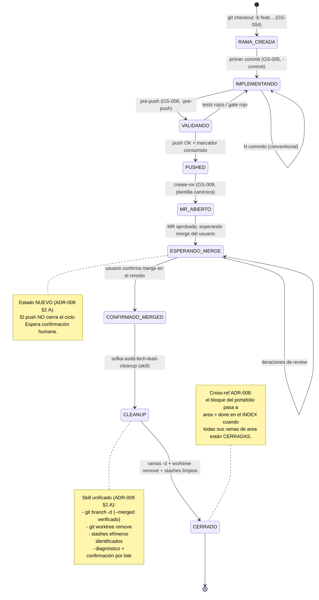
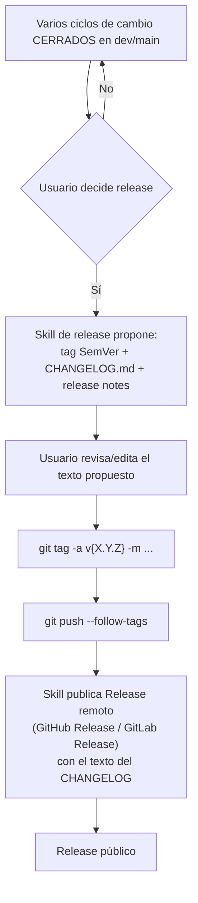

# ADR-009 — Higiene del ciclo de vida git: cleanup ejecutable, consolidación de commits/PR, y greenfield de tags/releases/issues

> **Ubicación canónica.** Este ADR vive en `docs/adoption/` junto a los demás ADRs consumer-facing distribuidos por el CLI (ADR-002, ADR-004, ADR-006, ADR-007, ADR-008). Ver la nota de distribución en ADR-004 para el porqué de esta ruta.

- **Estado:** Propuesta
- **Fecha:** 2026-07-09
- **Deciders:** _(pendiente — requiere aprobación explícita del maintainer del template)_
- **Autor:** sofka-asdd-solution-architect
- **Skill activo:** tradeoff-analysis (fase Diseñar)
- **Hermano de:** ADR-008 (ciclo dual autoría↔implementación). Este ADR aterriza la higiene git; ADR-008 aterrizó el estado semántico del bloque. Comparten filosofía: **git es la fuente de verdad; el estado se reconcilia contra git, no contra state files**.
- **Relacionados:** GS-001 a GS-010 en `.claude/rules/sofka-asdd-git-safety.md`, ORC-011 en `.claude/references/rules/sofka-asdd-orchestration-worktree.md`, skills `sofka-asdd-tech-lead-gitflow`, `-pre-push`, `-create-mr`, `-commit`, `-delivery-report`, `-sdd-traceability`, ADR-007 (threat model de git guards), ADR-008 §9 (resume reconciliado).
- **Ship en:** MINOR — agrega piezas (skill de cleanup, convenciones de tags/releases/issues, estado `esperando-merge`) sin romper las reglas GS existentes. Extiende, no reemplaza.

---

## 1. Contexto

### 1.1 Los dos dolores reales

Andrés reporta dos dolores concretos que golpean todos los ciclos:

- **(D-A) Huérfanos por doquier.** Tras implementar y hacer merge, quedan sin limpiar: ramas locales que ya fueron mergeadas (`git branch --merged` las lista para siempre), worktrees de developer que el orquestador olvida remover, y stashes efímeros generados por skills/agentes. GS-010 y ORC-011-E describen **qué** hay que limpiar, pero el template **no envía** un skill ejecutable que lo haga — el orquestador teclea `git branch -d`/`git worktree remove` a mano "si se acuerda". El `git-hygiene` que Andrés usa hoy es **global suyo**, no viaja con el template → los consumidores no lo heredan.
- **(D-B) Estructura variable a discreción del agente.** Commits, PRs, issues, tags y releases no tienen convención uniforme. Commits y PRs están **mayormente** cubiertos (GS-005 conventional commits + `sofka-asdd-tech-lead-create-mr`), pero hay inconsistencia de doc (el CLAUDE.md dice "el usuario crea PRs" cuando el skill sí los crea). Tags, releases, changelogs e issues son **greenfield puro** — no existen en el template ni existen en Humana.

### 1.2 Prior art verificado

**Humana (`humanatech-sofkaai-convenios`) — qué resuelve elegante y qué NO resuelve:**

- **Sí resuelve:** el push **no cierra el ciclo**. Tras `git push`, el trabajo queda en estado `esperando-merge` hasta que el **usuario** confirma explícitamente que el MR fue mergeado a `develop`. Solo esa confirmación dispara `/branch-cleanup` (skill invocable, gatillado por evento humano, **nunca automático**). El cleanup deja de ser "acción olvidable" y se convierte en **acción formalizada del ciclo**. Complementos: `/delivery-report` (obligatorio pre-push), `/pre-push`, `/sdd-resume` (nuestro equivalente = `/sofka-asdd:resume` reconciliado en ADR-008 §9).
- **No resuelve:** issues, tags, releases y changelogs **también están ausentes en Humana**. Nada que importar en (D-B, pieza greenfield); es diseño desde cero.

**Cobertura y gaps del template actual:**

| Ítem | Regla / Skill | Estado |
|---|---|---|
| Naming de ramas | GS-004 | ✓ Cubierto |
| Una rama por ciclo de cambio | GS-006 | ✓ Cubierto |
| Sincronización con base (merge, no rebase) | GS-007 | ✓ Cubierto |
| Guards de rama protegida / historia inmutable | GS-001, GS-002, ADR-007 | ✓ Cubierto |
| Conventional commits | GS-005 + coauthorship-guard | ✓ Cubierto |
| Cleanup post-merge (ramas) | GS-010 | ✗ Describe, **no ejecuta** |
| Cleanup post-merge (worktrees) | ORC-011-E | ✗ Describe, **no ejecuta** |
| Cleanup post-merge (stashes) | — | ✗ No existe |
| Gate pre-push | GS-008 + `sofka-asdd-tech-lead-pre-push` | ✓ Cubierto |
| Creación de MR/PR | `sofka-asdd-tech-lead-create-mr` + GS-009 | ✓ Cubierto (con inconsistencia doc) |
| Estado `esperando-merge → cerrado` | — | ✗ No existe |
| Tags / versionado | — | ✗ Greenfield |
| Releases / release notes | — | ✗ Greenfield |
| Changelog | — | ✗ Greenfield |
| Estructura de issues | — | ✗ Greenfield |

### 1.3 Filosofía compartida con ADR-008

Este ADR y ADR-008 comparten un mismo principio: **git es la fuente de verdad; el estado se reconcilia contra git, no contra state files paralelos**. ADR-008 lo aterriza en el ciclo de implementación (INDEX portable + resume reconciliado); ADR-009 lo aterriza en la higiene del ciclo git (estado del ciclo derivado de git + confirmación humana). El estado `esperando-merge → cerrado` que este ADR define **se engancha** con el lifecycle del portafolio del ADR-008: mientras un bloque tenga áreas en `esperando-merge`, el resume-reconciler las clasifica 🔄 con nota de "pendiente merge"; el cleanup solo puede ejecutarse cuando la confirmación humana pasa el estado a `cerrado`.

---

## 2. Decisión

Adoptar **tres piezas complementarias** de higiene del ciclo git, todas construidas sobre las reglas GS existentes (las extienden, nunca las contradicen):

### 2.A Cleanup ejecutable dirigido por confirmación humana

Portar el patrón Humana adaptado al template: introducir el estado explícito **`esperando-merge`** en el ciclo de cambio, cerrado por **confirmación humana** que dispara un **skill ejecutable** `sofka-asdd-tech-lead-branch-cleanup` (nombre propuesto — refina tech-lead) que **unifica** en un único invocable la limpieza de ramas (GS-010), worktrees (ORC-011-E) y stashes efímeros. El skill viaja **enviado con el template** — no depende del global de Andrés.

**Reglas invariantes del skill:**
- Verificación segura: solo borra ramas que aparecen en `git branch -r --merged origin/{base}`. Nunca `-D`. Los worktrees se comparan contra `git worktree list --porcelain` y se remueven con `git worktree remove` (nunca `--force` salvo confirmación adicional del usuario). Los stashes se identifican por naming/timestamp declarado por skills anteriores; nunca se toca un stash con mensaje humano.
- **Diagnóstico + confirmación por lote**: antes de cualquier `-d` / `remove`, el skill imprime en chat el inventario a limpiar (ramas, worktrees, stashes) con severidad (`safe` / `necesita revisión`), y espera **una confirmación humana explícita** por lote (no por elemento — evita fricción; agrupa por categoría). Fallback: modo "dry-run" listo por default, `--execute` explícito para borrar.
- **Auditoría en chat**: cada borrado efectivo se anuncia con el comando ejecutado y su exit code. Nada silencioso.
- **Idempotente**: correr el skill dos veces seguidas no rompe nada — segunda corrida reporta "nada por limpiar".

### 2.B Consolidación de commits y PR

Endurecer y hacer consistente lo que **ya funciona** (GS-005 + `create-mr`), sin re-inventar:

- **Resolver la inconsistencia de doc del `CLAUDE.md`** (dice "el usuario crea PRs" cuando el skill `sofka-asdd-tech-lead-create-mr` sí los crea). Actualizar el `CLAUDE.md` para reflejar que el skill los propone y el usuario los aprueba/publica.
- **Plantilla MR/PR Sofka canónica** distribuida con el template (formato uniforme: título con conventional commits, secciones: What/Why/How/Testing/Risk/Rollback, link a ADR/spec, checklist de gates). El skill `create-mr` la usa como fuente única — no re-genera "estilo libre".
- **Conventional commits ya cubierto por GS-005 + `-commit`**. Este ADR no lo re-diseña. Solo agrega que el mensaje del **merge commit** (cuando aplica ORC-011-D `--no-ff`) siga el formato `merge({area}): {feature} — {sha7}` para trazabilidad rápida en `git log --oneline`.

### 2.C Convenciones greenfield para tags, releases, changelogs e issues

Diseño desde cero, coherente con la filosofía "git es fuente de verdad":

- **Versionado semántico** (SemVer 2.0.0) en tags anotados: `v{MAJOR}.{MINOR}.{PATCH}[-{prerelease}]`. Se firma con `git tag -a` (anotado, mensaje del release, autor, fecha). Nunca lightweight tags. La bump policy sigue conventional commits: `feat!` o `BREAKING CHANGE` → MAJOR, `feat` → MINOR, `fix`/`perf` → PATCH.
- **Changelog derivado**: `CHANGELOG.md` en la raíz, generado automáticamente a partir de conventional commits entre dos tags (formato Keep a Changelog). El template envía un generador (invocable por skill) que produce el diff del changelog y lo abre al usuario para revisión antes del commit del tag.
- **Release notes**: la release remota (GitHub Release / GitLab Release) se crea a partir de la sección del `CHANGELOG.md` correspondiente a ese tag. Ningún texto duplicado — un solo lugar de verdad.
- **Issues con estructura mínima**: template en `.github/ISSUE_TEMPLATE/` (o `.gitlab/issue_templates/` según remoto — el template envía ambos, el consumidor conserva el que aplica) con tres tipos: `bug`, `feature`, `task`. Frontmatter uniforme: `type`, `severity` (P0-P3), `component`, `linked-spec` (path al `docs/specs/*` si aplica). La creación de issues **no es automática** — es explícita del usuario o de skills específicos (`sofka-asdd-tech-lead-new-bug` para bugs).

---

## 3. Matriz de trade-offs y recomendaciones

### Decisión (A) — ¿Cómo formalizar el cleanup ejecutable?

| Criterio | Peso | Alt-A1: cleanup automático post-merge (hook remoto o CI) | Alt-A2: skill invocable + estado `esperando-merge` + confirmación humana (patrón Humana) | Alt-A3: mantener status quo (GS-010 + ORC-011-E como doc, ejecución "cuando se acuerde") |
|---|---|---|---|---|
| Elimina huérfanos efectivamente | 30% | 5 — automático | 4 — requiere confirmación pero es formal | 1 — es el problema actual |
| Preserva safety (nunca `-D`, nunca worktree fantasma) | 25% | 2 — automático puede borrar mal si la política falla | 5 — humano confirma; skill exige `--merged` | 3 |
| Portable con el template (no depende del global de Andrés) | 20% | 4 — depende de CI del cliente | 5 — skill viaja con el template | 1 — sigue en global |
| Coherencia con "git = fuente de verdad + humano confirma" (ADR-008) | 15% | 2 — automatiza sin humano | 5 — humano cierra el ciclo | 3 |
| Costo de implementación | 10% | 3 — hook remoto complejo, específico por proveedor | 4 — un skill + estado en INDEX | 5 — nada |
| **Total ponderado** | | **3.35** | **4.60** | **2.20** |

**Recomendación (A): Alt-A2 — skill invocable con confirmación humana.** El estado `esperando-merge → cerrado` formaliza el momento del cleanup como acción del ciclo, no como "acordarse". El skill se envía con el template (portable). Mantiene safety (nunca `-D` automático) y encaja con la filosofía del ADR-008 (humano confirma; git es la verdad). Rechazo Alt-A1 porque automatizar el borrado post-merge sin ojo humano ha sido causa histórica de pérdidas en múltiples equipos (recordar el precedente del rebase en GS-007). Rechazo Alt-A3 porque es exactamente el status quo que produjo el problema.

### Decisión (B) — ¿Cómo consolidar commits/PR sin re-inventar?

| Criterio | Peso | Alt-B1: no tocar nada (todo está "mayormente bien") | Alt-B2: plantilla MR canónica + corrección de doc CLAUDE.md + merge-commit format |
|---|---|---|---|
| Elimina la inconsistencia de doc detectada | 40% | 1 — la inconsistencia queda | 5 — se corrige |
| Uniformidad de PRs entre proyectos consumidores | 30% | 2 — cada consumidor improvisa | 5 — plantilla única distribuida |
| Trazabilidad rápida en `git log` | 15% | 3 | 5 — merge-commit format formal |
| Costo | 15% | 5 — nada | 4 — 1 doc + 1 template + 1 línea de convención |
| **Total ponderado** | | **2.20** | **4.85** |

**Recomendación (B): Alt-B2 — consolidación mínima quirúrgica.** No re-inventar GS-005 ni `-commit` (funcionan). Solo (i) corregir la inconsistencia de doc en `CLAUDE.md`, (ii) enviar plantilla MR canónica como fuente única para `create-mr`, (iii) formalizar el mensaje del merge-commit `--no-ff`. Cambio de bajo costo, alto retorno.

### Decisión (C) — Nivel de automatización de tags/releases/changelog

| Criterio | Peso | Alt-C1: manual puro (usuario teclea todo) | Alt-C2: semi-automático (skill propone tag+changelog+release notes; usuario aprueba y publica) | Alt-C3: automático (CI genera tag + release al mergear a `main`/`master`) |
|---|---|---|---|---|
| Consistencia entre releases | 30% | 2 — depende del disciplina | 5 — plantilla + generador | 5 |
| Control del usuario sobre el momento del release | 25% | 5 | 4 — usuario aprueba | 1 — el merge dispara el release |
| Coherencia con "humano confirma" (Alt-A2, ADR-008) | 20% | 5 | 5 | 2 |
| Costo de implementación | 15% | 5 — nada | 3 — 1 generador + template | 2 — pipeline CI por consumidor |
| Portabilidad (no depende del proveedor git) | 10% | 5 | 5 — todo local + push del tag | 2 — depende de GitHub Actions / GitLab CI del cliente |
| **Total ponderado** | | **3.85** | **4.55** | **2.65** |

**Recomendación (C): Alt-C2 — semi-automático, humano dispara.** Coherente con Alt-A2 y con la filosofía del ADR-008: el skill genera y propone (changelog derivado de conventional commits entre dos tags, release notes derivadas del changelog), pero el usuario **decide cuándo** hacer el release y **aprueba** el texto antes del push del tag. No dependemos del proveedor git (todo se genera local; solo se pushea el tag). Alt-C3 es coherente con equipos maduros con CI robusto, pero rompe el principio de "humano confirma" y añade dependencia de proveedor.

### Decisión (D) — Estructura de issues (bug/feature/task)

| Criterio | Peso | Alt-D1: sin templates (issues libres) | Alt-D2: templates mínimos uniformes (bug/feature/task) enviados con el template ASDD |
|---|---|---|---|
| Trazabilidad a specs/ADRs vía `linked-spec` | 40% | 1 — cero trazabilidad | 5 — frontmatter uniforme |
| Onboarding de nuevos devs (saben qué llenar) | 25% | 2 | 5 |
| No sobre-diseñar (start simple) | 20% | 5 — nada | 4 — 3 templates, no más |
| Cross-remote (GitHub + GitLab) | 15% | 5 — no aplica | 5 — el template envía ambos formatos |
| **Total ponderado** | | **2.40** | **4.75** |

**Recomendación (D): Alt-D2 — tres templates mínimos.** Bug, feature, task. Sin más — evitar el zoo de tipos que ningún equipo mantiene. Frontmatter uniforme con `type`, `severity`, `component`, `linked-spec`. Los archivos van bajo `.github/ISSUE_TEMPLATE/` **y** `.gitlab/issue_templates/`; el consumidor conserva el que aplica en `sofka-asdd-init` o en su primer PR.

---

## 4. Diagrama del ciclo de cambio (estados y transiciones)



### 4.1 Integración con el ciclo de tag/release (paralelo)



---

## 5. Impacto (componentes a tocar en la implementación futura)

Este ADR **no implementa** — enumera:

| Componente | Cambio |
|---|---|
| `.claude/skills/sofka-asdd-tech-lead-cleanup/SKILL.md` (**nuevo**) | Skill unificado de cleanup — ramas + worktrees + stashes. Nombre resuelto por tech-lead en §10.2 (renombrado de `-branch-cleanup` a `-cleanup` porque unifica tres dominios; "branch-" mentiría). |
| `.claude/rules/sofka-asdd-git-safety.md` (GS-010) | Extender: el cleanup **debe** invocar el skill unificado (no `git branch -d` a mano). Introducir el estado `esperando-merge`. |
| **`.claude/references/rules/sofka-asdd-orchestration-worktree.md` (ORC-011-E) — CAMBIO DE CONTRATO** | **El orquestador deja de teclear `git worktree remove`/`git branch -d` inline y pasa a INVOCAR `sofka-asdd-tech-lead-cleanup`.** Esto **modifica el contrato** de ORC-011-E, no solo lo redirige. La regla de orquestación cambia de "el orquestador ejecuta la limpieza" a "el orquestador delega la limpieza al skill". Requiere confirmación del owner de la regla ORC-011 antes de implementar (ver §8 Riesgos). |
| `.claude/rules/sofka-asdd-git-safety.md` (GS-010) — refactor de gitflow | El Paso 6 de `sofka-asdd-tech-lead-gitflow` deja de ejecutar `git branch -d` inline y pasa a **delegar** al skill nuevo `-cleanup` (§10.1 tech-lead). |
| `CLAUDE.md` del template | Corregir la inconsistencia sobre creación de PRs (skill los propone, usuario aprueba/publica). Documentar el estado `esperando-merge → cerrado`. |
| `.claude/skills/sofka-asdd-tech-lead-create-mr` | Alinear con la plantilla MR canónica: **externalizar el `mr_template` inline actual a `reference/mr-template-sofka.md`** (ver siguiente fila) y consumirla desde ahí. |
| `.claude/skills/sofka-asdd-tech-lead-create-mr/reference/mr-template-sofka.md` (**nuevo**) | Plantilla MR canónica única. **Ubicación resuelta por tech-lead en §10.4**: vive en `reference/` del skill que la consume (un solo consumidor = co-ubicación). NO en `.claude/templates/`. |
| `.claude/rules/sofka-asdd-git-safety.md` (GS-005) | Agregar la convención del merge-commit `merge({area}): {feature} — {sha7}` para `--no-ff` de ORC-011-D. Es convención de **regla**, no del skill `commit` (§10.10 tech-lead). |
| `.claude/skills/sofka-asdd-tech-lead-release-manager/SKILL.md` (**nuevo**) | Skill nuevo para tags/releases/changelog semi-automático. Un solo skill (no partido en tag/changelog/release-notes — §10.9 tech-lead). Genera y propone; usuario aprueba. |
| `.claude/skills/sofka-asdd-tech-lead-delivery-report` | Extensión mínima: gana un **hint read-only** del próximo tag propuesto (§10.3 tech-lead). No ejecuta release. |
| `CHANGELOG.md` (raíz del template consumidor) | Template inicial mínimo (formato Keep a Changelog); poblado incrementalmente por el skill del release. |
| `.github/ISSUE_TEMPLATE/*.yml` (GitHub Issue Forms) y `.gitlab/issue_templates/*.md` (GitLab Markdown) (**nuevos**) | Tres templates: `bug`, `feature`, `task`. Formato distinto por remoto (§10.6 tech-lead): GitHub → Issue Forms YAML; GitLab → Markdown description templates. **Verificar en implementación** que GitLab efectivamente no soporta YAML forms antes de shippear (ver §8 Riesgos). |
| ADR-008 (addendum) | Cross-ref: el estado `esperando-merge` de este ADR se refleja en el checklist del resume-reconciler (§9.3 de ADR-008) — un área con rama en `esperando-merge` se pinta 🔄 con nota "pendiente merge" hasta que pase a `cerrado`. |

---

## 6. Ownership e integración de skills — **PROPUESTA INICIAL** (refina tech-lead)

Andrés fijó que la definición final de ownership, naming exacto e integración con los 13 skills git existentes es competencia del **`sofka-asdd-tech-lead`** (dueño natural de skills operativos de git). Este ADR propone la estructura; tech-lead la valida y refina antes de implementar.

### 6.1 Propuesta de mapeo skill → agente

| Skill nuevo (propuesto) | Agente propuesto | Rol | Punto a validar por tech-lead |
|---|---|---|---|
| `sofka-asdd-tech-lead-cleanup` (nombre resuelto en §10.2, era `-branch-cleanup`) | `sofka-asdd-tech-lead` | Cleanup unificado ramas + worktrees + stashes (§2.A) | (i) Nombre exacto; (ii) ¿es un skill nuevo o extensión de `gitflow`?; (iii) integración con `gitflow` (¿el paso 6 de gitflow lo invoca?); (iv) ~~integración con `pre-push` en `--dry-run`~~ — **descartada en §10.3** (pre-push queda enfocado en build/tests); (v) qué se envía con el template en `sofka-asdd-init`. |
| `sofka-asdd-tech-lead-release-manager` | `sofka-asdd-tech-lead` | Tags SemVer + CHANGELOG + release notes semi-automático (§2.C) | (i) Nombre exacto; (ii) ¿un solo skill o partido en `tag`, `changelog`, `release-notes`?; (iii) integración con `delivery-report` (hint read-only del próximo tag); (iv) ~~bloquear commits no-conventional al detectar release inminente~~ — **descartada en §10.9** (scope creep; `commit` ya enforza vía GS-005); (v) plantilla del CHANGELOG. |
| Plantilla MR canónica | Consumida por `sofka-asdd-tech-lead-create-mr` (existente) | Fuente única de estructura de MR (§2.B) | (i) Ubicación en el template (`.claude/templates/` vs `.claude/skills/sofka-asdd-tech-lead-create-mr/reference/`); (ii) ¿es una plantilla dura o un skeleton editable?; (iii) qué secciones son obligatorias vs opcionales. |
| Issue templates (`.github/`, `.gitlab/`) | Sin skill dueño — assets estáticos | Estructura mínima uniforme (§2.C, decisión D) | (i) Confirmar los 3 tipos (bug/feature/task) o justificar agregar/quitar; (ii) frontmatter final (¿`linked-spec` obligatorio o opcional?); (iii) ¿el skill `sofka-asdd-tech-lead-new-bug` genera un archivo desde el template o abre issue remoto directo?; (iv) para GitHub Issues Forms (YAML) vs Markdown legacy — decidir. |

### 6.2 Restricciones que el tech-lead debe respetar al refinar

- **No duplicar** funcionalidad de los 13 skills git existentes (`gitflow`, `pre-push`, `create-mr`, `commit`, `delivery-report`, `sdd-traceability`, `impl-quality-gate`, `integration-validator`, `code-review`, `quality-gate`, `refactoring-plan`, `new-bug`, `artifact-audit`). Si algún skill nuevo se solapa >50% con uno existente → extender, no crear.
- **Respetar naming `sofka-asdd-tech-lead-*`** para skills de tech-lead.
- **No contradecir GS-001 a GS-010, ADR-007 ni ORC-011.** Este ADR **extiende** GS-010 y ORC-011-E; no los reemplaza. Los guards (branch, pre-push, pre-PR) siguen operando idénticos.
- **Portabilidad**: cualquier skill nuevo debe funcionar sin depender del `git-hygiene` global de Andrés. El template consumidor no puede requerir configuración manual del developer para que el cleanup funcione.
- **Idempotencia**: los skills nuevos deben ser idempotentes (correr dos veces = mismo resultado que una).

### 6.3 Alternativa a considerar (a validar por tech-lead)

**¿Extender `sofka-asdd-tech-lead-gitflow` en vez de crear `-branch-cleanup`?** `gitflow` ya cubre el flujo completo del ciclo (crear rama → implementar → PR → merge → cleanup). Podría ser más coherente que el cleanup viva **dentro** de `gitflow` como su Paso 6/7 formal, con un modo `gitflow --cleanup` invocable stand-alone. Trade-off: mantiene la coherencia del skill de flujo completo, pero acopla dos responsabilidades (flujo + cleanup) que podrían evolucionar por separado. Decisión: **tech-lead resuelve**.

Similar para `release-manager`: podría vivir dentro de `sofka-asdd-tech-lead-delivery-report` como un modo `delivery-report --release` que además de reportar entrega, propone el tag/changelog/release. Trade-off similar. **Tech-lead resuelve**.

> **Cierre de §6 → ver §10 "Resolución operativa (Tech Lead)"**, donde el tech-lead resuelve las 7 preguntas abiertas con postura de dueño de los 13 skills git.

---

## 7. Cross-ref con ADR-008 (hermano)

Este ADR y ADR-008 se refuerzan mutuamente:

| Aspecto | ADR-008 (ciclo autoría↔implementación) | ADR-009 (higiene git) |
|---|---|---|
| Fuente de verdad | INDEX portable + git | git (branches, worktrees, tags) |
| Estado se reconcilia contra | `git log`, `git diff`, `git status` (§9) | `git branch --merged`, `git worktree list`, `git tag --list` |
| Rol del humano | Aprueba specs (Gate DOR); dispara resume | Aprueba merge (`esperando-merge → cerrado`); dispara cleanup y release |
| Rol de state files | Ninguno vinculante (`.asdd-run.json` degradado) | Ninguno — todo se lee de git |
| Puntos de contacto | El resume-reconciler (§9 ADR-008) lee el estado del ciclo git y refleja `esperando-merge` como 🔄 pendiente-merge en su checklist. El bloque del portafolio no cierra hasta que todas sus áreas están CERRADAS (ADR-009). | El cleanup no toca ramas cuyo bloque en el portafolio siga con áreas `in_progress`/`blocked` en el INDEX. |

**Filosofía compartida:** "git es la fuente de verdad. Los state files son conveniencias efímeras. El humano cierra los ciclos." Ambos ADRs materializan este principio en distintos ejes.

---

## 8. Consecuencias

### Positivas

- **Elimina huérfanos por diseño** — el cleanup ejecutable y el estado `esperando-merge → cerrado` convierten la limpieza en acción formalizada del ciclo, no en algo "por hacer".
- **Portabilidad total** — todo lo que necesita el consumidor viaja con el template. Se elimina la dependencia del `git-hygiene` global de Andrés.
- **Uniformidad de MRs** — la plantilla canónica hace que todo consumidor produzca PRs con la misma forma; onboarding cross-proyecto trivial.
- **Trazabilidad de releases** — tags SemVer + CHANGELOG derivado + release notes derivadas = una sola fuente, cero divergencia.
- **Coherencia con ADR-008** — refuerza el principio "git es la verdad; humano cierra ciclos" y engancha limpiamente con el resume-reconciler y el portafolio.
- **Sin romper GS existentes** — extiende, no reemplaza. Cero regresiones de safety.

### Negativas / costos

- Introduce dos skills nuevos (`cleanup` y `release-manager`) — superficie adicional de mantenimiento.
- **Cambia el contrato de ORC-011-E** — el orquestador deja de ejecutar `git worktree remove`/`git branch -d` inline y pasa a invocar `sofka-asdd-tech-lead-cleanup`. No es solo un skill nuevo: **toca la regla de orquestación**. Requiere confirmación explícita del owner de ORC-011 antes de implementar (ver §8 Riesgos).
- El estado `esperando-merge` agrega un momento explícito en el ciclo que el equipo chico puede percibir como fricción (aunque §1.4 del ADR-008 aplica igual: la fricción se activa solo cuando hace falta — un dev que hace todo local puede saltar el cleanup si no hay ramas remotas mergeadas).
- Los issue templates son assets estáticos que el consumidor debe adoptar; si no los usa, se convierten en ruido en el repo.
- **Verificación pendiente**: la disponibilidad de Issue Forms YAML en GitLab (§10.6) no fue confirmada contra la doc vigente. Si el claim resulta falso, ajustar el diseño en implementación (fallback: usar Markdown para GitLab, ya contemplado).

### Riesgos

| Riesgo | Prob. | Impacto | Mitigación |
|---|---|---|---|
| El skill de cleanup borra algo que no debía | Baja | Alto | Solo `-d` (nunca `-D`); solo `--merged` verificado; diagnóstico + confirmación humana por lote; modo dry-run por default |
| El estado `esperando-merge` se olvida y las ramas se acumulan | Media | Medio | El resume-reconciler (ADR-008 §9) las pinta 🔄 con nota — quedan visibles cada vez que el dev abre el proyecto |
| Divergencia entre CHANGELOG generado y CHANGELOG editado a mano | Baja | Medio | El skill de release solo edita entre marcadores autogenerados; ediciones manuales fuera de esos marcadores se preservan |
| Los issue templates se abandonan | Media | Bajo | Frontmatter mínimo; si el equipo los edita, siguen funcionando; si los borra, cero impacto sobre el resto |
| Duplicación con skills existentes al implementar (cleanup vs gitflow) | Media | Medio | Restricción explícita §6.2 resuelta por tech-lead en §10.1: `gitflow` Paso 6 **delega** en `-cleanup`, no duplica |
| **GitLab NO soporta Issue Forms en YAML** — claim de plataforma sin verificar contra doc vigente (§10.6) | Media | Bajo | **VERIFICACIÓN OBLIGATORIA en implementación** antes de shippear los issue templates. Si GitLab sí soporta un formato estructurado, alinear ambos formatos; si no, mantener Markdown para GitLab (fallback ya diseñado). |
| **Cambio de contrato de ORC-011-E** — el orquestador pasaría de "ejecutar limpieza inline" a "invocar `-cleanup`" (§10.3, §5) | Media | Medio | **Requiere confirmación explícita del owner de la regla ORC-011** antes de implementar. No es solo un skill nuevo — toca la regla de orquestación de worktrees. El fallback (ORC-011-E ejecuta inline como hoy) mantiene safety si el owner rechaza el cambio, pero pierde la unificación con ramas+stashes. |

### Preguntas abiertas (para el tech-lead)

> **Estado actualizado**: las 7 preguntas fueron resueltas por el tech-lead en **§10 "Resolución operativa"**. Se conservan aquí para trazabilidad. Los 6 puntos que requieren revisión del arquitecto quedan listados en §10.11.

| # | Pregunta | Estado | Resolución |
|---|---|---|---|
| P1 | ¿Cleanup skill nuevo o modo de `gitflow`? | ✅ Resuelta en §10.1 | Skill NUEVO; `gitflow` Paso 6 **delega** al skill (evita duplicar). |
| P2 | ¿`release-manager` skill nuevo o modo de `delivery-report`? | ✅ Resuelta en §10.1 | Skill NUEVO; `delivery-report` solo gana hint read-only del próximo tag. |
| P3 | Nombres exactos finales. | ✅ Resuelta en §10.2 | `sofka-asdd-tech-lead-cleanup` (renombrado desde `-branch-cleanup`, requiere revisión del arquitecto por naming); `sofka-asdd-tech-lead-release-manager` confirmado. |
| P4 | Ubicación de la plantilla MR canónica. | ✅ Resuelta en §10.4 | `.claude/skills/sofka-asdd-tech-lead-create-mr/reference/mr-template-sofka.md` (co-ubicada con su único consumidor); requiere revisión del arquitecto por cambio de ruta respecto a §5 original. |
| P5 | `linked-spec` ¿obligatorio u opcional? | ✅ Resuelta en §10.5 | OPCIONAL; recomendado para `type: feature`. Respeta CORE-001 sin sobre-restringir. |
| P6 | Issue Forms YAML vs Markdown legacy. | ✅ Resuelta en §10.6 | Per-remoto: GitHub → YAML Forms, GitLab → Markdown. Riesgo abierto: verificar en implementación disponibilidad de forms YAML en GitLab. |
| P7 | Qué se envía con el template en `sofka-asdd-init`. | ✅ Resuelta en §10.7 | Mensaje one-time definido literalmente en §10.7. |

---

## 9. Resumen de recomendaciones

- **(A)** Skill invocable de cleanup + estado `esperando-merge → cerrado` disparado por confirmación humana, enviado con el template. Portable, safety-preserving, coherente con ADR-008. **(4.60 vs 3.35/2.20)**
- **(B)** Plantilla MR canónica + corrección de doc `CLAUDE.md` + merge-commit format `merge({area}): {feature} — {sha7}`. Consolidación quirúrgica, sin re-inventar GS-005/`-commit`. **(4.85 vs 2.20)**
- **(C)** Semi-automático para tags/releases/changelog: skill propone (SemVer + CHANGELOG derivado + release notes derivadas), usuario aprueba y publica. Portable (no depende de CI del proveedor). **(4.55 vs 3.85/2.65)**
- **(D)** Tres templates de issues (bug/feature/task) con frontmatter uniforme; se envían para GitHub y GitLab; el consumidor conserva el que aplica. **(4.75 vs 2.40)**

---

## 10. Resolución operativa (Tech Lead) — cierre de §6

- **Estado:** Propuesta (sin cambios — este ADR sigue en Propuesta hasta la aprobación del maintainer).
- **Autor de esta sección:** sofka-asdd-tech-lead (skill activo: refactoring-plan / criterio de dueño de los 13 skills git).
- **Alcance:** resuelve las 7 preguntas abiertas de §6 y §8. No reescribe las secciones del arquitecto (§1-§9); solo las cierra. Cuando una decisión se aparta de la propuesta inicial del arquitecto, se marca con **`⚠ REQUIERE REVISIÓN DEL ARQUITECTO`**.

### 10.0 Método — cómo medí el solape

Inspeccioné el contenido real de los 13 skills `sofka-asdd-tech-lead-*` (foco en `gitflow`, `delivery-report`, `create-mr`, `commit`, `pre-push`). Resultado del solape contra las piezas propuestas:

| Pieza propuesta | Skill existente más cercano | Solape medido | Regla §6.2 (>50% → extender) |
|---|---|---|---|
| Cleanup unificado (ramas + worktrees + stashes) | `gitflow` Paso 6 (solo ramas, `git branch -d --merged`) | Ramas: ~100% con Paso 6; worktrees: 0% (viven en ORC-011-E, responsabilidad del orquestador); stashes: 0% (no existe) | Solape **global < 50%** — worktrees y stashes son capacidad **nueva** → **skill nuevo** que absorbe el Paso 6 de gitflow para no duplicar |
| Release manager (tags SemVer + CHANGELOG + release notes) | `delivery-report` (per-ciclo/PR, inmutable, veredicto de gates) | Granularidad distinta: delivery-report = 1 PR; release = N ciclos mergeados → 1 versión. Solape **< 20%** | **Skill nuevo** — no es modo de delivery-report |
| Plantilla MR canónica | `create-mr` (ya tiene `mr_template` inline) | 100% del propósito ya vive en create-mr | **Extender create-mr** — externalizar el template inline a `reference/`, no crear skill |
| Issue templates | `new-bug` (escribe `docs/specs/bug-*.md`) | Assets estáticos; `new-bug` genera reporte local, no issue remoto | **Assets estáticos** sin skill dueño; `new-bug` sin cambios |

### 10.1 Pregunta 1 — ¿Skills nuevos o extensiones?

**Cleanup → SKILL NUEVO** (no modo de `gitflow`). Razón: `gitflow` se invoca al **abrir** el ciclo (crear rama, sync, naming) y su Paso 6 solo cubre ramas. El cleanup unificado se invoca al **cerrar** el ciclo (post-merge confirmado por humano) y suma dos dominios que hoy no viven en ningún skill: **worktrees** (hoy ORC-011-E, tecleado por el orquestador) y **stashes** (inexistente). Trigger distinto, fase distinta, dominios distintos → skill separado. Para NO duplicar: el **Paso 6 de `gitflow` se refactoriza para DELEGAR** al skill nuevo (deja de ejecutar `git branch -d` inline y lo invoca). Así el solape de ramas se resuelve por delegación, no por duplicación.

**Release manager → SKILL NUEVO** (no modo `delivery-report --release`). Razón: choque de granularidad. `delivery-report` es **per-ciclo** (un PR, inmutable, "se genera una sola vez por ciclo"). Una release agrega **N ciclos ya mergeados** en una versión. Meter release-management dentro de delivery-report rompería su contrato de inmutabilidad per-PR y confundiría la cadencia. Se mantiene separado; `delivery-report` solo gana un **hint read-only** del próximo tag propuesto (ver 10.3).

### 10.2 Pregunta 2 — Nombres exactos y agentes dueños (lista FINAL)

| Skill | Estado | Owner | Nota de naming |
|---|---|---|---|
| `sofka-asdd-tech-lead-cleanup` | **NUEVO** | `sofka-asdd-tech-lead` | **⚠ REQUIERE REVISIÓN DEL ARQUITECTO** — renombro el `sofka-asdd-tech-lead-branch-cleanup` propuesto a **`-cleanup`** porque el skill unifica ramas + worktrees + stashes; "branch-" mentiría sobre su alcance. Impacto: actualizar el diagrama §4 (nodo `CLEANUP`) y la tabla §5. |
| `sofka-asdd-tech-lead-release-manager` | **NUEVO** | `sofka-asdd-tech-lead` | Nombre confirmado tal cual §6.1. Un solo skill (no partido en tag/changelog/release-notes — ver 10.1 y 10.9). |
| `sofka-asdd-tech-lead-gitflow` | **EXTENDIDO** | `sofka-asdd-tech-lead` | Paso 6 delega al skill `-cleanup`. |
| `sofka-asdd-tech-lead-create-mr` | **EXTENDIDO** | `sofka-asdd-tech-lead` | Consume la plantilla MR desde `reference/` (ver 10.4). |
| `sofka-asdd-tech-lead-delivery-report` | **EXTENDIDO** | `sofka-asdd-tech-lead` | Gana hint read-only del próximo tag (no ejecuta release). |
| `sofka-asdd-tech-lead-commit` | **SIN CAMBIO de skill** | `sofka-asdd-tech-lead` | El formato de merge-commit `merge({area}): {feature} — {sha7}` es una convención de **regla** (GS-005 + ORC-011-D), no del skill. Ver 10.10. |

Todos los owners son `sofka-asdd-tech-lead` (dueño natural de skills git). Los issue templates NO tienen skill dueño (assets estáticos).

### 10.3 Pregunta 3 — Integración sin duplicar (mapa de enganche)

| Pieza nueva | Absorbe / lee | Engancha con | Qué NO hace (para no duplicar) |
|---|---|---|---|
| `-cleanup` | Lógica de ramas del **Paso 6 de gitflow** (GS-010) + lógica de worktrees de **ORC-011-E** + stashes (nuevo) | `gitflow` Paso 6 lo **invoca**; **ORC-011-E** cambia de "el orquestador teclea `git worktree remove`" a "el orquestador **invoca `-cleanup`**"; el estado `esperando-merge → cerrado` lo dispara | No re-crea naming/sync/creación de rama (eso es gitflow Pasos 0-5). No valida build/tests (eso es pre-push). |
| `-release-manager` | Conventional commits (GS-005) entre dos tags; CHANGELOG; consume la señal de que los ciclos están **APROBADO** en `delivery-report` | `delivery-report` (input read-only); escribe `CHANGELOG.md` + `git tag -a` + Release remoto | No re-evalúa gates per-PR (eso es delivery-report). No commitea el trabajo (eso es commit). **No bloquea commits** (ver 10.9). |
| Plantilla MR | — | `create-mr` la lee como fuente única (reemplaza su `mr_template` inline) | No crea el MR (eso sigue en create-mr + GS-009). |
| Issue templates | — | `new-bug` puede materializar un `bug.md` desde el template (ver 10.6) | No abren issue remoto automáticamente. |

**`pre-push` NO llama a `-cleanup`.** Rechazo la sub-pregunta §6.1(iv) de meter un `--dry-run` de cleanup dentro de pre-push: pre-push valida build/tests + marcador GS-008 y debe quedar enfocado; el aviso de futuros huérfanos ya lo cubre el resume-reconciler del ADR-008 (§9, pinta 🔄). Añadir cleanup a pre-push acopla dos responsabilidades sin ganancia real. **⚠ REQUIERE REVISIÓN DEL ARQUITECTO** (aparta de §6.1 punto iv de branch-cleanup).

### 10.4 Pregunta 4 — Ubicación de la plantilla MR + secciones

**Ubicación: `.claude/skills/sofka-asdd-tech-lead-create-mr/reference/mr-template-sofka.md`** — NO `.claude/templates/`. Razón: la consume **un solo** skill (`create-mr`); co-ubicarla en su `reference/` la mantiene versionada con su único consumidor y evita un directorio `templates/` de propósito difuso. `.claude/templates/` se justificaría solo si ≥2 skills/agentes la consumieran. **⚠ REQUIERE REVISIÓN DEL ARQUITECTO** — la tabla §5 lista tentativamente `.claude/templates/mr-template-sofka.md`; actualizar a la ruta `reference/`.

**Tipo: skeleton editable**, no plantilla dura — el consumidor puede ajustar secciones opcionales a su realidad.

**Secciones OBLIGATORIAS** (heredadas del `mr_template` que create-mr ya usa y funciona):
- Título conventional-commit `{tipo}({scope}): {desc} (#WI)`
- `## ¿Qué resuelve?`
- `## Cambios incluidos`
- `## Cómo probar`
- `## Checklist` (incluye "sin atribución de IA")

**Secciones OPCIONALES** (se incluyen según contexto, no se fuerzan):
- `## Riesgo / Rollback` — obligatoria solo si `delivery-report` marcó riesgo de regresión `medium`/`high`.
- `## Link a ADR / spec` — solo cuando existe spec-per-área o ADR asociado.

### 10.5 Pregunta 5 — `linked-spec` ¿obligatorio u opcional?

**OPCIONAL** (fuertemente recomendado para `type: feature`). Razón: no todo trabajo tiene spec — bugfixes, chores y cambios de config no la tienen, y forzar `linked-spec` produciría enlaces falsos o fricción para el consumidor que NO usa spec-per-área en todo. Matices:
- `feature` → recomendado apuntar a `docs/specs/*-funcional.md` o al INDEX.
- `bug` → puede apuntar al reporte `docs/specs/bug-*.md` (output de `new-bug`).
- `task`/chore → puede quedar vacío.

Esto respeta CORE-001 sin sobre-restringir: CORE-001 exige spec para **código de feature**, no para todo issue. El campo queda declarado en el frontmatter con valor vacío permitido.

### 10.6 Pregunta 6 — Issue Forms (YAML) vs Markdown + cross-remote

No es un "o esto o aquello" global — **es per-remoto**, porque las plataformas difieren:

- **GitHub → Issue Forms (YAML)**: `.github/ISSUE_TEMPLATE/{bug,feature,task}.yml` + `config.yml`. Campos estructurados y validados (mejor UX y trazabilidad que Markdown legacy).
- **GitLab → Markdown description templates**: `.gitlab/issue_templates/{bug,feature,task}.md`. GitLab **no** tiene un equivalente a los YAML Issue Forms de GitHub; usa plantillas de descripción en Markdown. **⚠ VERIFICAR EN IMPLEMENTACIÓN** contra la doc vigente de GitLab antes de shippear (claim de disponibilidad de plataforma).

**Regla de equivalencia semántica cross-remote**: ambos formatos exponen los **mismos campos** (`type`, `severity` P0-P3, `component`, `linked-spec`) para que la trazabilidad sea uniforme sin importar el remoto. El template **envía ambos**; el consumidor conserva el que aplica en `sofka-asdd-init` (o borra el otro — costo cero, son assets pequeños).

### 10.7 Pregunta 7 — Mensaje al consumidor en `sofka-asdd-init`

Mensaje one-time visible al inicializar (portable, sin dependencia del `git-hygiene` global de Andrés):

```
Higiene del ciclo git (ADR-009) — piezas incluidas en este template:

  • sofka-asdd-tech-lead-cleanup — limpia ramas mergeadas + worktrees + stashes
    al cerrar el ciclo. Se dispara tras confirmar TÚ el merge del MR.
    Dry-run por default; requiere --execute para borrar. Nunca usa -D.
  • sofka-asdd-tech-lead-release-manager — propone tag SemVer + CHANGELOG +
    release notes desde tus conventional commits. TÚ apruebas y publicas.
  • Plantilla MR canónica — la usa create-mr al abrir tu MR/PR.
  • Issue templates — bug/feature/task (GitHub Forms + GitLab Markdown).
    Conservá el que corresponda a tu remoto.

Nada es automático: el humano cierra los ciclos (cleanup) y decide los releases.
```

### 10.8 Cumplimiento de las 4 restricciones absolutas (§6.2)

| Restricción | Cumplimiento |
|---|---|
| No duplicar >50% → extender | `gitflow` Paso 6 **delega** en `-cleanup` (no duplica); `delivery-report` no hace release; plantilla MR **externaliza** el inline de create-mr (no crea skill). |
| Naming `sofka-asdd-tech-lead-*` | Ambos skills nuevos lo cumplen. |
| No contradecir GS-001..010, ADR-007, ORC-011 | `-cleanup` solo `git branch -d` (nunca `-D`), solo `--merged` verificado, worktrees sin `--force` salvo confirmación extra, dry-run default. **Extiende** GS-010 y ORC-011-E; no toca los guards. |
| Portabilidad + idempotencia | Todo viaja con el template. `-cleanup` idempotente (2ª corrida = "nada por limpiar"); `-release-manager` idempotente (edita solo entre marcadores autogenerados del CHANGELOG). |

### 10.9 Decisión sobre partición y acoplamiento de `-release-manager`

**Un solo skill, no partido** en `tag`/`changelog`/`release-notes`. Razón: son pasos **encadenados y derivados** de un único flujo aprobado por humano (release notes ⟵ CHANGELOG ⟵ conventional commits ⟵ rango entre tags). Partirlos fragmentaría una sola aprobación humana y agregaría handoffs. Se modela como pasos internos de un skill (igual que `pre-push` tiene pasos internos), no como skills separados.

**Rechazo la sub-pregunta §6.1(iv)**: que `-release-manager` "bloquee commits no-conventional al detectar release inminente". Es scope creep — `commit` ya enforza conventional commits vía GS-005, y el guard de coauthorship ya bloquea atribución. Acoplar `commit` a la inminencia de un release invertiría la dependencia. **⚠ REQUIERE REVISIÓN DEL ARQUITECTO** (aparta de §6.1 punto iv de release-manager).

### 10.10 Formato del merge-commit (§2.B) — es regla, no skill

La convención `merge({area}): {feature} — {sha7}` para el `--no-ff` de ORC-011-D vive en **GS-005** (`sofka-asdd-git-safety.md`) y la aplica el **orquestador** en ORC-011-D, no un skill de tech-lead. `commit` no requiere cambios: no ejecuta el merge de worktrees (eso es del orquestador). El skill `commit` solo referencia la convención por si el usuario hace un merge manual.

### 10.11 Puntos que requieren ida y vuelta con el arquitecto (resumen)

1. **Rename `-branch-cleanup` → `-cleanup`** (10.2): actualizar diagrama §4 y tabla §5.
2. **Ubicación plantilla MR** en `reference/` de create-mr, no `.claude/templates/` (10.4): actualizar tabla §5.
3. **`pre-push` NO invoca `-cleanup` en dry-run** (10.3): aparta de §6.1(iv) de branch-cleanup.
4. **`-release-manager` NO bloquea commits** (10.9): aparta de §6.1(iv) de release-manager.
5. **GitLab Issue Forms**: confirmar en implementación que GitLab no soporta YAML forms (10.6).
6. **ORC-011-E** cambia de contrato: el orquestador **invoca `-cleanup`** en vez de teclear `git worktree remove` (10.3) — toca regla de orquestación, confirmar con el owner de esa regla.
