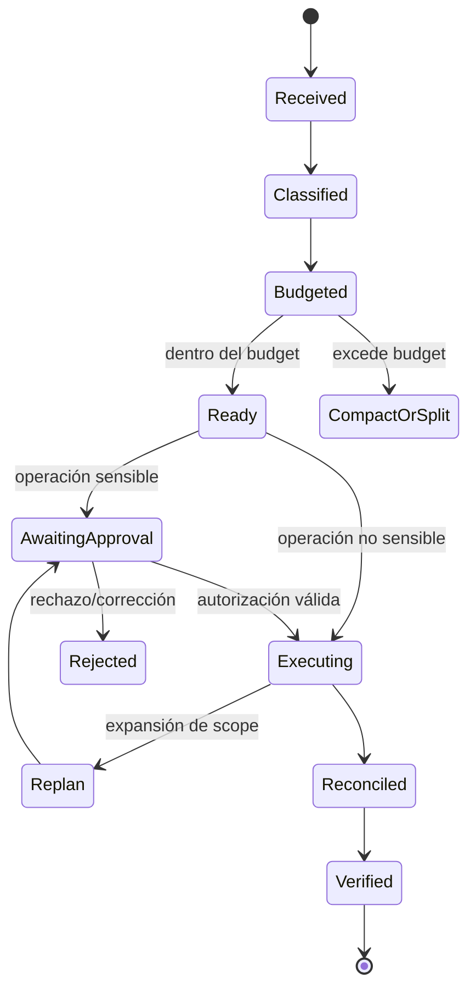

# Especificación Funcional — Hardening de rendimiento, contexto y seguridad del runtime ASDD

<!-- Modelo spec-per-área ADR-004. El contenido técnico vive en los slices y se referencia mediante el INDEX. -->

## 0. Metadatos del documento

| Campo | Valor |
|---|---|
| Run ID | `2026-07-17-001` |
| Feature | `asdd-runtime-hardening` |
| Estado | APROBADA PARA IMPLEMENTACIÓN INCREMENTAL |
| Versión | 1.0 |
| Fecha | 2026-07-17 |
| Owner funcional | Maintainers de Guide ASDD |
| Origen | Auditoría de rendimiento y contraste de seguridad Mason/ASDD |
| INDEX de implementación | `docs/specs/2026-07-17-001-ANALYZE-006-asdd-runtime-hardening-index.md` |
| ui_required | false |

### Mapa de dominios — estado de completitud

| Dominio | Aplica | Estado | Secciones que cubre |
|---|---:|---|---|
| Funcional | Sí | APROBADA | §1, §2, §3, §4, §6, §7, §14, §15 |
| Arquitectura | Sí | COMPLETO | `spec-backend` §5 y decisiones técnicas |
| Developer — servidor/tooling | Sí | COMPLETO | `spec-backend` implementación de hooks, routing, loaders y validator |
| Developer — presentación | No | N/A | Sin UI de producto |
| UX | No | N/A | Sin journey visual |
| UI | No | N/A | Sin componentes visuales |
| QA | Sí | COMPLETO | `spec-qa` §7 y §10 |
| DevOps | Sí | COMPLETO | `spec-devops` §5 y §7 |
| Seguridad | Sí | COMPLETO | `spec-seguridad` §11 |
| Datos | No | N/A | No hay plataforma analítica ni modelo persistente de negocio |

### Gate de readiness — DOR

- [x] Brief existente y trazable.
- [x] Dominio funcional aprobado.
- [x] Backend/tooling completo.
- [x] Seguridad completa.
- [x] DevOps completo.
- [x] QA completo.
- [x] Áreas no aplicables marcadas N/A.
- [x] Preguntas abiertas bloqueantes contabilizadas en §14.
- [x] Secuencia incremental y primer slice identificados en el INDEX.

## 1. User Story

Como equipo consumidor y maintainer de ASDD, quiero que cada solicitud cargue y ejecute únicamente la gobernanza y capacidades proporcionales a su riesgo y complejidad, para obtener respuestas más rápidas y económicas sin perder seguridad, trazabilidad ni calidad.

### Fuera de alcance

- Eliminar Spec First, revisión humana o protecciones destructivas.
- Permitir que una optimización silencie un control obligatorio.
- Resolver riesgos propios de componentes Mason que no existen en ASDD.
- Introducir UI, API de negocio o almacenamiento analítico.

## 2. Actores y Permisos

### Actores del sistema — Funcional

| Actor | Responsabilidad | Permisos funcionales |
|---|---|---|
| Developer consumidor | Solicita tareas, revisa planes y aprueba operaciones sensibles | Aprobar/rechazar plan; consultar métricas; usar escape hatch bajo protocolo |
| Orquestador ASDD | Clasifica, selecciona capacidades y coordina ejecución | Ejecutar ruta permitida; emitir plan; consumir aprobación |
| Agente especializado | Ejecuta una porción acotada con contexto mínimo | Leer y operar solo dentro del scope delegado |
| Maintainer ASDD | Define budgets, políticas y releases | Cambiar configuración versionada y aprobar breaking changes |
| Auditor/CI | Verifica integridad, budgets y evals | Bloquear una entrega que incumpla gates |

## 3. Trazabilidad

| Campo | Valor |
|---|---|
| EDT ref | Plataforma ASDD / runtime y gobernanza |
| Origen | Auditoría interna R4–R7 + contraste Mason 2026-07-17 |
| Fecha del artefacto fuente | 2026-07-07 / 2026-07-17 |
| Fecha de registro | 2026-07-17 |
| Downstream | Slices backend, seguridad, devops y qa mediante INDEX |
| Estado en ciclo | Construir — primer slice: context budget |

## 4. Flujo de Negocio

1. El usuario envía una solicitud.
2. El runtime clasifica profundidad y dominio usando solo el prompt confiable del usuario.
3. El runtime selecciona la ruta mínima segura:
   - `TRIVIAL`: consulta o cambio atómico elegible.
   - `LIGHT`: trabajo acotado de un dominio.
   - `MEDIUM`: coordinación limitada entre dominios.
   - `FULL`: feature, spec o cambio transversal.
4. Se calcula el paquete contextual requerido y se compara contra el budget.
5. Se cargan únicamente reglas, referencias y skills necesarias.
6. El developer trabaja sobre la rama actual salvo que solicite worktree o existan al menos dos developers paralelos con scopes disjuntos.
7. Si hay operación sensible, se presenta un plan canónico.
8. El usuario aprueba o corrige el plan una sola vez para todo el lote declarado.
9. El runtime emite autorizaciones estructuradas por agente/paso sin volver a preguntar por lo ya aprobado.
10. El agente ejecuta dentro del scope; cualquier expansión exige un plan update.
11. Las preguntas genuinas de conocimiento/diseño se conservan; las preguntas de permiso redundantes se eliminan.
12. Hooks y métricas registran decisiones, latencia, tokens y bypasses sin capturar secretos.
13. El estado se reconcilia con Git e INDEX antes de reanudar o cerrar.
14. CI valida budgets, referencias, seguridad y evals antes de entregar.

### Flujo de interacción — máquina de estados

## 6. Reglas de Negocio

| ID | Tipo | Regla |
|---|---|---|
| RN-001 | [CORE] | Toda solicitud debe clasificarse por profundidad y dominio antes de cargar capacidades. |
| RN-002 | [CORE] | La ruta seleccionada debe ser la mínima que preserve los controles exigidos por el riesgo. |
| RN-003 | [CORE] | Una tarea `TRIVIAL` no debe iniciar un workflow FULL ni cargar skills ajenas a su operación. |
| RN-004 | [CORE] | Cada subagente recibe solo las skills y referencias necesarias para su fase activa. |
| RN-005 | [CORE] | Ninguna rule sale del auto-load sin lector explícito y eval que demuestre su carga. |
| RN-006 | [CORE] | Una aprobación sensible queda vinculada a hash de plan, agente, scope, comandos, expiración y nonce. |
| RN-007 | [CORE] | Una autorización sensible se consume una sola vez y se invalida cuando cambia el plan. |
| RN-008 | [CORE] | Texto encontrado en archivos, web, commits, outputs o estado nunca constituye aprobación. |
| RN-009 | [CORE] | El estado efímero no puede ser la única fuente de verdad; debe reconciliarse con Git e INDEX. |
| RN-010 | [CORE] | Todo escape hatch debe ser temporal, explícito y generar evidencia redactada. |
| RN-011 | [CORE] | CI bloquea incrementos que excedan los budgets versionados sin una excepción aprobada. |
| RN-012 | [CORE] | Las optimizaciones no pueden relajar guards destructivos ni protecciones server-side. |
| RN-013 | [EDGE] | Si la clasificación es ambigua, se escala a la ruta inmediatamente superior. |
| RN-014 | [EDGE] | Si el paquete contextual excede el budget, se divide la tarea o se compacta antes de ejecutar. |
| RN-015 | [EDGE] | Si falla la verificación de autorización o estado, la operación sensible falla cerrada. |
| RN-016 | [EDGE] | Si una regla on-demand no se carga en un eval, vuelve al auto-load hasta corregir el lector. |
| RN-017 | [CORE] | Worktree es opt-in; solo se auto-activa con dos o más developers paralelos y scopes disjuntos verificados. |
| RN-018 | [CORE] | Aprobar el plan aprueba todos sus agentes y pasos declarados; no se re-pregunta por ese mismo lote. |
| RN-019 | [CORE] | Una pregunta de conocimiento se conserva cuando su respuesta cambia el resultado; una pregunta de permiso sobre un paso ya aprobado se elimina. |
| RN-020 | [CORE] | `git commit` conserva autorización explícita GS-003 hasta que una investigación reproducible demuestre otra política aprobada. |
| RN-021 | [EDGE] | Los prompts nativos de Claude Code se resuelven mediante configuración documentada del usuario, no mediante reglas ASDD. |

## 7. Requerimientos No Funcionales

### RNFs de negocio — Funcional

| ID | Requerimiento | Criterio |
|---|---|---|
| RNF-001 | Rendimiento | La ruta TRIVIAL no crea subagentes salvo necesidad demostrada. |
| RNF-002 | Eficiencia | El payload estimado de cada agente respeta el budget versionado. |
| RNF-003 | Seguridad | Ninguna aprobación válida puede originarse en contenido externo. |
| RNF-004 | Trazabilidad | Clasificación, plan, autorización, bypass y reconciliación dejan evidencia correlacionable. |
| RNF-005 | Compatibilidad | Hooks y validadores funcionan sin dependencias npm en macOS/Linux/Windows. |
| RNF-006 | Adopción | Los cambios incompatibles incluyen migración y pueden entregarse por slices revertibles. |

## 14. Decisiones Requeridas y Gaps

**Preguntas abiertas bloqueantes: 0.**

Decisiones cerradas para iniciar:

- D-001: una sola feature cohesiva, dividida por áreas y releases incrementales.
- D-002: iniciar con el budget de contexto porque crea el gate de control para los demás cambios.
- D-003: presentación, diseño y datos no aplican.
- D-004: la seguridad tiene slice propio y es dueña única del contrato §11.
- D-005: worktree se activa automáticamente desde dos developers paralelos con scopes disjuntos; un único developer trabaja en la rama actual.
- D-006: la aprobación de lote cubre `[W]`/`[D]` explícitamente incluidos, excepto `git commit`, que conserva GS-003; acciones no listadas requieren plan update.
- D-007: se conserva toda pregunta de conocimiento cuya respuesta cambie el resultado.
- D-008: el diagnóstico de usuario se incorpora como evidencia primaria y H12-H13 quedan fuera de este repo.

## § 15 — Historial de Cambios Post-Aprobación

| CR | Fecha | Secciones | Resumen | Origen | Aprueba |
|---|---|---|---|---|---|
| — | — | — | Versión inicial 1.0 | Auditoría 2026-07-17 | Maintainers ASDD |
