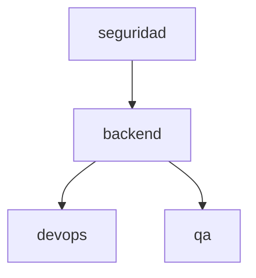

# INDEX — Hardening de rendimiento, contexto y seguridad del runtime ASDD

## Identidad

| Campo | Valor |
|---|---|
| Run ID | `2026-07-17-001` |
| Feature | `asdd-runtime-hardening` |
| Spec funcional | `2026-07-17-001-ANALYZE-001-asdd-runtime-hardening-funcional.md` |
| Estado global | `complete` |
| Fase | `complete` |
| Próximo slice | `—` |

## Specs por área

| Área | Aplica | Estado | Spec | Depende de | Primer entregable |
|---|---:|---|---|---|---|
| seguridad | Sí | pending | `...-003-...-seguridad.md` | — | S1 autorización estructurada |
| backend | Sí | in_progress | `...-002-...-backend.md` | seguridad para slices sensibles | B3/S1 aprobación de lote |
| devops | Sí | pending | `...-004-...-devops.md` | backend | Gate CI y métricas |
| qa | Sí | pending | `...-005-...-qa.md` | backend | Tests/evals por slice |
| frontend | No | n/a | — | — | — |
| diseno | No | n/a | — | — | — |
| data | No | n/a | — | — | — |

## Grafo de dependencias contraído

## Plan de implementación incremental

| Orden | Slice | Área principal | Estado |
|---:|---|---|---|
| 1 | B2 — Worktree opt-in para developers | backend + qa | done |
| 2 | DOC-1 — Permisos nativos de Claude Code | documentación | done |
| 3 | B3/S1 — Aprobación de lote vinculada al plan | seguridad + backend + qa | done |
| 4 | B4 — Routing TRIVIAL/LIGHT/MEDIUM/FULL | backend + qa | done |
| 5 | B1 — Context budget y check del validator | backend + devops + qa | done |
| 6 | B5 — Eliminar inyección duplicada y cachear contexto | backend + qa | done |
| 7 | B6 — Carga de skills bajo demanda y split de agentes | backend + qa | done |
| 8 | B7 — Reducción de rules always-on y consolidación ORC | backend + qa | done |
| 9 | B8 — Dispatcher de hooks por evento | backend + qa | done |
| 10 | S2/B9 — Integridad, reconciliación de estado y escape hatches | seguridad + backend + qa | done |
| 11 | B10 — Handoff por path, discovery cache invalidable y materialización sin reintentos | backend + seguridad + qa | done |
| 12 | D1 — Métricas, baselines y gates de regresión | devops + qa | done |
| 13 | SPIKE-1 — Reproducir posible bypass GS-003 | seguridad + qa | done |
| 14 | Cierre — Verificación integral | backend + seguridad + qa + devops | done |

## Historial de estado

| Timestamp | Actor | Transición | Evidencia |
|---|---|---|---|
| 2026-07-17 | Orquestador | feature creada → analyze complete | Brief + set spec-per-área con DOR verde |
| 2026-07-17 | Orquestador | backend pending → in_progress | Inicio del slice B1 context budget |
| 2026-07-17 | Orquestador | repriorización por feedback de usuario | P0 worktree + aprobación de lote pasan antes del budget |
| 2026-07-17 | Orquestador | B2 in_progress → done | Frontmatter, ORC-011, build command/rule y check `worktree-opt-in-contract`; validator 24 OK/0 error |
| 2026-07-17 | Orquestador | DOC-1 in_progress → done | `.claude/docs/adoption/permisos-nativos-claude-code.md` |
| 2026-07-17 | Orquestador | análisis comparativo SPDD incorporado | Patrones selectivos de `fix/spdd-optimization` incorporados en ADR-012/013/014 y slice B10; sin merge masivo |
| 2026-07-17 | Orquestador | B3/S1 in_progress → done | Challenge canónico, SHA-256, autorizaciones por agente de uso único, expiración fail-closed y exclusión GS-003; 9 tests verdes |
| 2026-07-17 | Orquestador | B4 in_progress → done | Router determinista versionado TRIVIAL/LIGHT/MEDIUM/FULL, escalamiento de baja confianza de un nivel y dominio sensible fail-safe; 8 escenarios verdes |
| 2026-07-17 | Orquestador | B1 in_progress → done | Política versionada, 109 payloads medidos, expiración de excepciones y gate `context-budget`; 2 excepciones ATF vigentes, 0 excesos sin justificar |
| 2026-07-17 | Orquestador | B5 in_progress → done | SessionStart reducido de 955 a 352 palabras fuente y ~119 palabras emitidas; se eliminó la carga estática duplicada, por lo que no se requiere caché para ese bloque |
| 2026-07-17 | Orquestador | B6 in_progress → done | ATF Web/API pasan de catálogos eager a núcleo mínimo + resolución de `SKILL.md` por ruta; budget queda sin excepciones vigentes |
| 2026-07-17 | Orquestador | B7 in_progress → done | 10 reglas especializadas migradas a referencias on-demand; rules always-on bajan de 26/21.010 a 16/14.701 palabras; resolver validado |
| 2026-07-17 | Orquestador | B8 in_progress → done | SessionStart consolida estado Git, routing, modelo, TDD y freshness en un dispatcher; hooks SessionStart bajan de 6 a 2 y hooks registrados de 20 a 16 |
| 2026-07-17 | Orquestador | S2/B9 in_progress → done | Reconciler compara INDEX, estado y procedencia Git; sincronizó slices B1–B8 y el validator bloquea drift de completitud o metadata ausente |
| 2026-07-17 | Orquestador | B10 in_progress → done | Runtime de discovery cache valida commit/scope/policy/fingerprint de fuentes; materializador limita roots, usa escritura atómica y rechaza placeholders; test verde |
| 2026-07-17 | Orquestador | D1 in_progress → done | Baseline versionado y gate de métricas para contexto always-on, hooks SessionStart, hooks registrados y agente+skills más grande |
| 2026-07-17 | Orquestador | SPIKE-1 confirmed → remediated | Guard existente permitía commit en rama no protegida sin evidencia GS-003; challenge separado por comando/rama con uso único bloquea bypass y replay |
| 2026-07-17 | Orquestador | run in_progress → complete | 11 suites runtime verdes; validator 26 OK/2 warnings preexistentes/0 errores; estado, INDEX y Git reconciliados |

## Reglas de actualización

- Solo el orquestador actualiza este INDEX.
- Cada transición debe enlazar tests, commit o artefacto verificable.
- Una divergencia entre INDEX y Git cambia el área a `blocked` hasta reconciliar.
