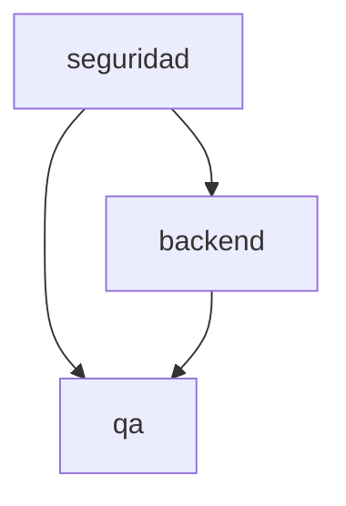

# INDEX — Remediación de binding de autorizaciones de plan

## Identidad

| Campo | Valor |
|---|---|
| Run ID | `2026-07-17-002` |
| Feature | `plan-authorization-binding` |
| Estado global | complete |
| Fase | complete |
| Próximo slice | — |

## Specs por área

| Área | Aplica | Estado | Spec | Depende de |
|---|---:|---|---|---|
| seguridad | Sí | complete | `...-004-...-seguridad.md` | — |
| backend | Sí | complete | `...-003-...-backend.md` | seguridad |
| qa | Sí | complete | `...-005-...-qa.md` | backend + seguridad |
| funcional | Sí | complete | `...-002-...-funcional.md` | — |
| frontend, diseno, devops, data | No | n/a | — | — |

## Grafo de dependencias

## Plan incremental

| Orden | Slice | Área | Estado |
|---:|---|---|---|
| 1 | S1/B1 — ADR y contrato de enforcement para launch/operación | seguridad + backend | done |
| 2 | B2 — librería, plan-gate y hook de operaciones | backend | done |
| 3 | B3 — regresiones unitarias y de hooks | qa | done |
| 4 | B4 — validator, suites y E2E manual | backend + qa | done |

## Evidencia de apertura

- E2E de 2026-07-17: el orquestador declaró válido un challenge pese a que los
  archivos reales diferían del scope presentado y lanzó un backend agent que
  intentó editar fuera del alcance.
- Código actual: `consumeAuthorization(agent)` y `plan-gate.mjs` comparan solo
  identidad de agente, aunque persisten metadata de plan.

## Historial de estado

| Timestamp | Actor | Transición | Evidencia |
|---|---|---|---|
| 2026-07-17 | Orquestador | specify/analyze iniciado | Brief y set spec-per-área creados tras evidencia E2E. |
| 2026-07-17 | Orquestador | S1/B1 diseñado | ADR-015 separa autorización de lanzamiento y de operaciones. |
| 2026-07-17 | Orquestador | B2/B3 implementados | Lote con scope/comandos vinculantes, hook de operaciones y 26 regresiones verdes. |
| 2026-07-17 | Orquestador | B4 corregido, E2E pendiente | El primer adversarial consumió el challenge correctamente, pero el modelo intentó `approve/status` redundantes y obtuvo prompts nativos. El hook ahora informa el consumo y el guard deniega ese control-plane; falta repetir la E2E. |
| 2026-07-17 | Usuario + Orquestador | B4 E2E PASS | En la copia de prueba a `5914783`, tras `ok` no hubo CLI de control redundante; el agente backend recibió deny `scope-mismatch` al editar fuera de scope y el archivo permaneció intacto. |
| 2026-07-17 | Orquestador | V1 falso positivo corregido | Una solicitud LIGHT que solo pedía aprobación de plan activaba FULL de seguridad. El detector separa ahora la ceremonia de plan de los cambios reales de control de acceso; falta E2E. |
| 2026-07-17 | Orquestador | V2 backend genérico corregido | Un test de command-binding recibió routing de solution architect por la palabra aislada `backend`. La señal se restringió a indicadores concretos de arquitectura; falta E2E. |
| 2026-07-17 | Orquestador | V3 carga bajo demanda implementada | Los agentes developer-backend y developer-frontend ya no precargan 11 skills; resuelven solo la capacidad requerida. Sus payloads eager quedaron en 833 y 778 palabras, y la baseline del mayor agente quedó en 12k; falta medición E2E. |
| 2026-07-17 | Orquestador | V4 enforcement implementado | ADR-016 exige capability declarada, loader que entrega su `SKILL.md` y bloqueo de operaciones protegidas hasta una carga coincidente; regresiones verdes, falta E2E. |
| 2026-07-17 | Orquestador | V4a alias canonizado | `build-validator` y otros aliases no ambiguos se normalizan al identificador completo permitido antes de hash/issue; evita un intento fallido previo al plan. |
| 2026-07-17 | Orquestador + E2E autónomo | V4 E2E PASS | En sesión CLI persistente se aprobó el plan canónico, el backend cargó `asdd-developer-build-validator`, recibió su `SKILL.md` y ejecutó `node .claude/scripts/validate-template.mjs`: 26 OK, 2 warnings conocidos, 0 errores. |
| 2026-07-17 | Orquestador + E2E autónomo | V4 adversariales PASS | El loader de `asdd-developer-bug-fix` con capability declarada build-validator recibió `capability-mismatch`; tras cargar la capability correcta, `validate-template.mjs --silent` recibió `command-mismatch`, ambos antes de ejecución. |
| 2026-07-17 | Orquestador | run in_progress → complete | Scope mismatch, command mismatch, capability mismatch y happy path tienen evidencia E2E; métricas de subagente observadas y validator local verde. |

## Reglas de actualización

- El INDEX es la fuente de verdad de slices del run 002.
- Un mismatch de scope/comando no puede marcarse resuelto solo con tests de
  librería; requiere una prueba de hook y E2E manual controlado.
