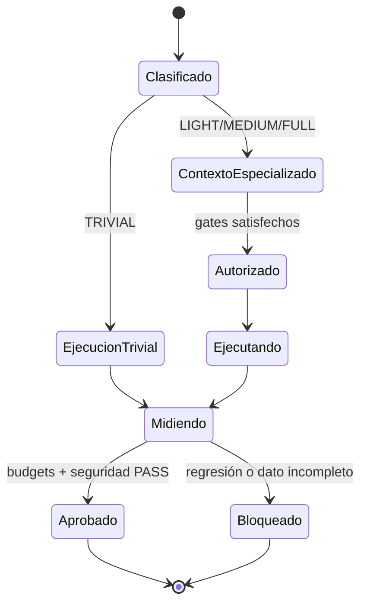

# Especificación funcional — ASDD Runtime Efficiency v2

## 0. Metadatos del documento

| Campo | Valor |
|---|---|
| Run ID | `2026-07-18-001` |
| Feature | `runtime-efficiency-v2` |
| Estado | APROBADA PARA DISEÑO |
| Versión | 1.0 |
| Fecha | 2026-07-18 |
| Brief origen | `2026-07-18-001-SPECIFY-002-brief-runtime-efficiency-v2.md` |
| INDEX | `2026-07-18-001-ANALYZE-007-runtime-efficiency-v2-index.md` |
| ui_required | false |

### Mapa de dominios — completitud

| Dominio | Aplica | Estado | Secciones |
|---|---:|---|---|
| Funcional | Sí | APROBADA | §1–§7, §10, §14 |
| Backend/tooling | Sí | COMPLETO | spec-backend |
| Seguridad | Sí | COMPLETO | spec-seguridad |
| QA | Sí | COMPLETO | spec-qa |
| Frontend, UX/UI, Datos, DevOps | No | N/A | — |

### Gate DOR

- [x] Brief aprobado y evidencia trazable.
- [x] Funcional, backend, seguridad y QA redactados.
- [x] Áreas no aplicables marcadas N/A.
- [x] Targets provisionales separados de gates definitivos.
- [x] Sin preguntas abiertas bloqueantes.
- [x] Set spec-per-área revisado por el usuario.

## 1. User Story

Como usuario y maintainer de ASDD, quiero que cada request cargue y ejecute solo
el contexto, modelo, skills, agentes y guards necesarios, para obtener respuestas
más rápidas y sesiones más eficientes sin perder seguridad ni trazabilidad.

## 2. Actores y permisos

| Actor | Responsabilidad | Límite |
|---|---|---|
| Usuario | Define intención y aprueba planes cuando aplican | No debe repetir aprobaciones ya cubiertas por el lote vigente. |
| Orquestador | Clasifica, delega y sintetiza | TRIVIAL no abre subagente; otras rutas respetan presupuesto y autorización. |
| Subagente | Ejecuta un scope y capability concretos | No precarga capabilities ajenas ni excede turnos/concurrencia. |
| Runtime de hooks | Aplica guards y recopila métricas | Optimiza fast paths sin relajar decisiones deny/ask. |
| Maintainer | Ajusta políticas y thresholds | Todo cambio de budget queda versionado, medido y validado. |

## 3. Flujo de negocio

1. El runtime recibe un request y determina su ruta y riesgo.
2. Para TRIVIAL, responde con lectura local acotada y cero subagentes.
3. Para otras rutas, selecciona únicamente agentes y capabilities justificadas.
4. El contexto inicial contiene solo contratos globales indispensables.
5. Rules, skills y phase specs especializados se cargan al alcanzar su punto de
   uso verificable.
6. Cada tool call pasa por un dispatcher único que ejecuta los guards aplicables
   en orden determinista y reutiliza contexto local seguro.
7. Las métricas registran contexto efectivo, procesos, latencia y fan-out sin
   persistir contenido sensible.
8. Los gates comparan el resultado con thresholds versionados.
9. Una regresión de rendimiento, routing o seguridad bloquea el cierre del slice.

## 4. Reglas de negocio

| ID | Tipo | Regla |
|---|---|---|
| RN-001 | CORE | La métrica de contexto debe contar frontmatter YAML válido tanto inline como en bloque. |
| RN-002 | CORE | Un gate no puede declarar mejora usando una métrica que omite componentes conocidos. |
| RN-003 | CORE | TRIVIAL usa cero subagentes y no exige plan salvo política de mayor precedencia. |
| RN-004 | CORE | Cada agente carga como máximo una capability inicial; capacidades adicionales requieren dependencia explícita. |
| RN-005 | CORE | Una rule movida fuera del auto-load conserva lector verificable y prueba anti-orfandad. |
| RN-006 | CORE | Un evento PreToolUse inicia como máximo un proceso de enforcement ASDD; hooks de telemetría, plugins y terceros quedan fuera del conteo y se preservan. |
| RN-007 | CORE | La consolidación ejecuta todos los guards ASDD aplicables, conserva effects y razones de máxima precedencia, y mantiene semántica `deny > defer > ask > allow`; hooks externos siguen en paralelo. |
| RN-008 | CORE | El núcleo ORC extenso solo se inyecta cuando el estado o la señal lo requiere; el turno normal recibe una señal compacta o ninguna. |
| RN-009 | CORE | El modelo se selecciona por complejidad/riesgo, no por un default global de máxima capacidad. |
| RN-010 | CORE | Cada ruta tiene límites de subagentes, concurrencia, turnos y reintentos. |
| RN-011 | EDGE | Si no puede medirse un componente —por ejemplo tool schemas— se declara como no medido; nunca se asume cero. |
| RN-012 | CORE | La reconciliación de INDEX se omite antes de que Analyze produzca uno válido y es obligatoria desde el cierre de Analyze. |
| RN-013 | CORE | Una optimización que reduce precisión, seguridad o trazabilidad se rechaza aunque cumpla el budget. |

## 5. Requisitos no funcionales

- **Rendimiento:** objetivos iniciales definidos en el baseline v2; thresholds
  definitivos después de SPIKE-1.
- **Seguridad:** cero regresiones en guards, autorización y aislamiento.
- **Compatibilidad:** macOS, Linux y Windows, Node estándar y sin red para tests
  estructurales.
- **Observabilidad:** mediciones reproducibles con fuente, commit y método.
- **Mantenibilidad:** contracts compactos; detalle accesible por referencias
  explícitas.

## 6. Estados funcionales



## 7. RNFs de negocio

| Categoría | Expectativa |
|---|---|
| Capacidad | Una sesión cotidiana no debe consumir contexto especializado no usado. |
| Disponibilidad | Fast paths locales continúan funcionando sin MCP o red. |
| Tiempo de respuesta | El framework reduce overhead mecánico medido sin prometer la latencia del proveedor LLM. |
| Seguridad | Credenciales y datos sensibles no se incorporan a métricas, caches ni logs. |
| Trazabilidad | Cada baseline identifica run, commit, método y limitaciones. |

## 10. Criterios de aceptación base

```gherkin
Scenario: Una consulta trivial evita orquestación innecesaria
  Given un request local de solo lectura y scope acotado
  When el router lo clasifica como TRIVIAL
  Then se usan cero subagentes
  And no se emite challenge de plan

Scenario: El presupuesto cuenta skills inline
  Given un agente con skills declaradas como YAML inline
  When se calcula agent_with_skills
  Then cada SKILL.md resoluble contribuye al total
  And el total coincide con una declaración equivalente en bloque

Scenario: Un fast path ejecuta un solo proceso del framework
  Given una operación Bash local permitida
  When PreToolUse evalúa la operación
  Then se inicia un solo dispatcher ASDD
  And los hooks independientes de collector y terceros siguen ejecutándose
  And el resultado conserva la semántica de los guards existentes

Scenario: Una regla especializada no queda huérfana
  Given una rule retirada del auto-load
  When se ejecuta la ruta que depende de ella
  Then un lector explícito carga el contrato antes de actuar
  And la validación detecta si desaparece ese lector

Scenario: Specify no requiere un INDEX futuro
  Given un run activo en fase Specify
  And Analyze aún no produjo INDEX
  When se ejecuta validate-template
  Then asdd-run-reconciliation se omite con una razón explícita
```

## 14. Decisiones requeridas y gaps

**0 preguntas abiertas bloqueantes.**

- D-001: los targets del baseline v2 son provisionales hasta SPIKE-1.
- D-002: schemas de tools/MCP se reportan como no medidos hasta contar con
  telemetría estable.
- D-003: perfiles opcionales de addons/MCP pertenecen a una iniciativa separada.
- D-004: los ADRs se crean o enmiendan solo después de validar alternativas en
  Design.

## 15. Historial de cambios post-aprobación

| CR | Versión resultante | Fecha | Secciones / specs afectadas | Resumen | Origen | Aprobado por |
|---|---|---|---|---|---|---|
| — | — | — | — | Sin cambios post-aprobación | — | — |
