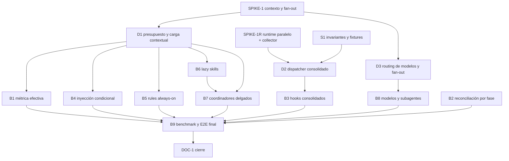

# INDEX — ASDD Runtime Efficiency v2

## Identidad

| Campo | Valor |
|---|---|
| Run ID | `2026-07-18-001` |
| Feature | `runtime-efficiency-v2` |
| Estado global | complete |
| Fase | document |
| Próximo slice | — (iniciativa cerrada; release sujeto a gates externos) |

## Specs por área

| Área | Aplica | Estado | Spec | Depende de |
|---|---:|---|---|---|
| funcional | Sí | approved | `...-003-...-funcional.md` | — |
| seguridad | Sí | approved | `...-005-...-seguridad.md` | — |
| backend | Sí | approved | `...-004-...-backend.md` | seguridad |
| qa | Sí | approved | `...-006-...-qa.md` | backend + seguridad |
| frontend, diseno, devops, data | No | n/a | — | — |

## Grafo de dependencias

## Plan incremental

| Orden | Slice | Área | Estado |
|---:|---|---|---|
| 1 | SPIKE-1 — contexto y fan-out; latencia secuencial invalidada | backend + qa | corrected_by_SPIKE-1R |
| 1R | SPIKE-1R — baseline paralelo, compatibilidad collector y prototipo | backend + qa + arquitectura | done |
| 2 | S1 — invariantes, fixtures adversariales y contrato diferencial | seguridad + qa | done |
| 3 | D1 — presupuesto efectivo + enmienda de ADR-005 para carga condicional | arquitectura | done |
| 4 | D2 — arquitectura del dispatcher consolidado y precedencia de guards | arquitectura + seguridad | done |
| 5 | D3 — política coste-riesgo de modelos, fan-out y turnos | arquitectura | done |
| 6 | B1 — parser YAML y gate de contexto efectivo | backend + qa | done |
| 7 | B2 — reconciliación consciente de fase, corrige H-09 | backend + qa | done |
| 8 | B3 — dispatcher único para Bash/Write/Edit | backend + seguridad + qa | done |
| 9 | B4 — routing e inyección ORC condicional | backend + qa | done |
| 10 | B5 — reducción segura de rules always-on | backend + seguridad + qa | done |
| 11 | B6 — lazy skills generalizadas | backend + seguridad + qa | done |
| 12 | B7 — coordinadores ATF Web y BA delgados + tools mínimas | backend + seguridad + qa | done |
| 13 | B8 — default de orquestador y presupuestos de subagentes | backend + qa | done |
| 14 | B9 — benchmark integral, evals y E2E de consumidor | backend + seguridad + qa | done |
| 15 | DOC-1 — baseline final, documentación y cierre | documentación | done |

## Criterios de entrada a Design

- [x] Evidencia y baseline trazables.
- [x] Dominios aplicables delimitados.
- [x] Seguridad y QA definidos por contrato.
- [x] H-09 incorporado sin workaround inválido.
- [x] Targets marcados provisionales.
- [x] Usuario aprueba el set spec-per-área.

## Decisiones previstas, no anticipadas

| Tema | Tratamiento |
|---|---|
| Carga condicional | Enmienda 2 propuesta en `docs/adoption/ADR-005-conditional-rule-loading.md` |
| Contexto efectivo | `docs/architecture/decisions/ADR-017-presupuesto-efectivo-y-carga-contextual.md` |
| Dispatcher | `docs/architecture/decisions/ADR-018-dispatcher-consolidado-de-hooks.md` |
| Model routing | `docs/architecture/decisions/ADR-019-routing-de-modelos-y-presupuesto-de-subagentes.md` |
| Parser/reconciliación/tests | Bugfix/spec; sin ADR |
| Perfiles de addons/MCP | Iniciativa separada |

## Evidencia de apertura

- Auditoría: `docs/tech/2026-07-18-001-SPECIFY-001-runtime-performance-audit.md`.
- Baseline: `docs/baselines/asdd-runtime-baseline-v2.json`.
- Brief aprobado: `2026-07-18-001-SPECIFY-002-brief-runtime-efficiency-v2.md`.
- H-09 reproducido: `validate-template` exige `build.index_ref` durante
  Specify, antes de que exista INDEX.
- SPIKE-1 original, parcialmente invalidado: `docs/tech/2026-07-18-001-DESIGN-008-runtime-efficiency-spike-benchmark.md`.
- SPIKE-1R: `docs/tech/2026-07-18-001-DESIGN-009-runtime-efficiency-spike-1r.md`.
- Baseline paralelo: `docs/baselines/2026-07-18-001-spike-1r-parallel-hooks.json`.
- Resultado del prototipo: `docs/baselines/2026-07-18-001-spike-1r-dispatcher-prototype.json`.

## Reglas de ejecución

- Un slice no pasa a done sin tests focalizados, validate, métrica y rollback.
- Cada cambio usa commit aislado y deja worktree limpio.
- Un target solo se endurece después de un spike con el modelo real de ejecución; nunca se relaja sin evidencia.
- Las pruebas de seguridad son diferenciales para dispatcher y loading.
- B5/B6/B7 requieren lector explícito y E2E anti-orfandad.
- B9 es obligatorio antes de DOC-1.

## Historial de estado

| Timestamp | Actor | Transición | Evidencia |
|---|---|---|---|
| 2026-07-18 | Usuario + Orquestador | Specify aprobado | Usuario autorizó continuar después de auditoría, baseline y brief. |
| 2026-07-18 | Orquestador | Analyze iniciado | Specs funcional, backend, seguridad, QA e INDEX redactados para revisión. |
| 2026-07-18 | Usuario + Orquestador | Analyze aprobado → Design iniciado | Set spec-per-área aprobado; SPIKE-1 precede decisiones D1-D3. |
| 2026-07-18 | Orquestador | SPIKE-1 DONE | 30 muestras tras warm-up; p95 Bash 132 ms y Edit 143 ms; thresholds confirmados. |
| 2026-07-18 | Orquestador | D1–D3 en revisión | ADR-017, ADR-018, ADR-019 y Enmienda 2 de ADR-005 propuestos. |
| 2026-07-18 | Usuario + Orquestador | ADR-018 vuelve a SPIKE/Design | Baseline secuencial invalidado; D2 quedó bloqueado hasta prototipo/compatibilidad collector. |
| 2026-07-18 | Orquestador | SPIKE-1R DONE → D2 in_review | Prototipo: p95 sin regresión, CPU -83/-85 %, diferencial 7/7 y collector 2/2. |
| 2026-07-18 | Usuario + Orquestador | D1–D3 aprobados → Build iniciado | ADR-017/018/019 y Enmienda 2 de ADR-005 aceptados; próximo slice S1. |
| 2026-07-18 | Orquestador | S1 done → B1 siguiente | Threat model, oracle 5/5, corpus diferencial 11/11, collector 2/2 y rollback cerrados; S1-COR-001 bloquea quoting evasivo. |
| 2026-07-18 | Orquestador | B1 done → B2 siguiente | Parser YAML compartido, referencias rotas fail-integrity, fórmula por capas y 22 deudas visibles en warning; baseline B1 publicado. |
| 2026-07-18 | Orquestador | B2 done → B3 siguiente | Matriz 14/14: skip temprano explícito, INDEX obligatorio post-Analyze, paths/integridad, provenance y SPIKE-1R corregidos; H-09 cerrado. |
| 2026-07-18 | Orquestador | B3 done → B4 siguiente | Dispatcher productivo 12 módulos, diferencial 11/11, DFX-001 2/2, collector 2/2; p95 -16,59/-19,86 % y CPU -85,56/-87,30 %. |
| 2026-07-18 | Orquestador | B4 done → B5 siguiente | Prompt normal 145→0 palabras; señales especializadas sin núcleo repetido, recuperación/SessionStart anti-orfandad y routing Data↔Software conservado. |
| 2026-07-18 | Orquestador | B5 done → B6 siguiente | Always-on 16.973→5.822 palabras; nueve readers 9/9, hashes/marcadores, missing-reference fail-closed, rollback aislado y gate de 8.000 promovido a error. |
| 2026-07-18 | Orquestador | B6 done → B7 siguiente | Seis agentes 78.927→9.885 palabras iniciales; primary+dependency 6/6, 54 eager→0, mismatch fail-closed y warnings 21→12. |
| 2026-07-18 | Orquestador | B7 done → B8 siguiente | Cores ATF+BA 18.179→1.074 palabras; payload inicial 19.385→2.280, rutas 10/10, `tools: all` eliminado, missing-phase fail-closed y warnings 12→9. |
| 2026-07-18 | Orquestador | B8 done → B9 siguiente | Default Opus→Sonnet; suma `maxTurns` 1.450→1.050, cap 120→50, fan-out/turns/retries bloqueantes, high-risk→Opus y launch ligado a marcador exacto. |
| 2026-07-18 | Orquestador | B9 done → DOC-1 siguiente | Gates locales 6/6, consumidor 16/16 y eval real Opus/Sonnet 4/4 cada uno; always-on -65,46 %, prompt normal 0, un proceso ASDD y p95 fast-path -36,69/-39,52 %. Timing nativo macOS/Windows queda como gate de release. |
| 2026-07-18 | Orquestador | DOC-1 done → iniciativa complete | Baseline final, guía de adopción, changelog Unreleased, manifest reconciliado y consumidor CLI desde distribution[] cerrados. Release conserva timing nativo macOS/Windows y 9 warnings staged explícitos. |
