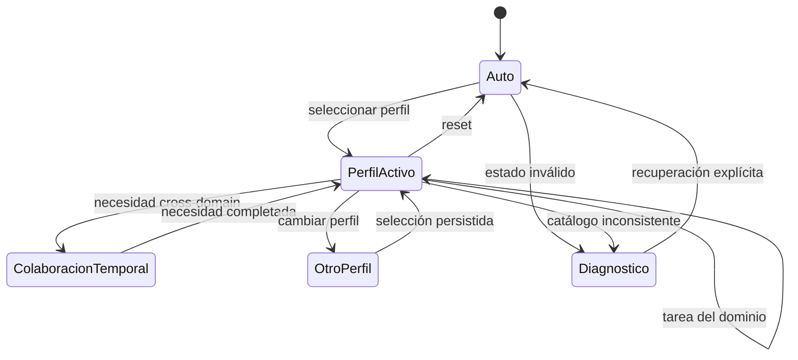

# Especificación funcional — Perfiles profesionales de enfoque ASDD

## 0. Metadatos del documento

| Campo | Valor |
|---|---|
| Run ID | `2026-07-25-001` |
| Feature | `professional-role-profiles` |
| Estado | BORRADOR PARA AUDITORÍA Y REVISIÓN |
| Versión | 0.1 |
| Fecha | 2026-07-25 |
| Brief origen | `2026-07-25-001-SPECIFY-001-brief-professional-role-profiles.md` |
| INDEX | `2026-07-25-001-ANALYZE-006-professional-role-profiles-index.md` |
| ui_required | false |

### Mapa de dominios — completitud

| Dominio de implementación | Aplica | Estado | Evidencia |
|---|---:|---|---|
| Funcional | Sí | EN PROGRESO | este documento |
| Backend/runtime | Sí | EN PROGRESO | spec-backend |
| Seguridad | Sí | EN PROGRESO | spec-seguridad |
| QA | Sí | EN PROGRESO | spec-qa |
| Frontend | No inicialmente | N/A | no se decide UI visual |
| UX/UI | No inicialmente | N/A | Experience/Design es perfil profesional, no capa UI |
| DevOps técnico | No inicialmente | N/A | Platform/DevOps es perfil; no se cambia pipeline |
| Data técnico | No inicialmente | N/A | Data es perfil; no se construye plataforma de datos |

> Las cuatro áreas profesionales citadas como N/A técnico siguen siendo parte
> obligatoria de la auditoría y de los journeys funcionales.

### Gate de salida de Analyze / entrada a Design

- [x] Brief y primer paso definidos.
- [ ] Auditoría estructural read-only completada.
- [ ] Taxonomía de dominios validada por representantes.
- [ ] Perfiles definitivos y capacidades transversales aprobados.
- [ ] Spec funcional, backend, seguridad y QA sin preguntas bloqueantes.
- [ ] Targets de relevancia/contexto basados en baseline.
- [x] INDEX y dependencias iniciales aprobados en G0 por el usuario.

## 1. User Story

Como trabajador que utiliza el template ASDD desde una disciplina profesional
principal, quiero activar un perfil de enfoque que priorice el lenguaje,
journeys, agentes y skills relevantes para mi trabajo, para aprovechar el
potencial del template sin cargar contexto ajeno ni perder acceso puntual a
capacidades de otras áreas.

**Métrica de éxito provisional:** en una matriz curada de tareas típicas, entre
80 % y 90 % de los prompts debe priorizar una capacidad del perfil correcto sin
reducir la tasa de éxito de escenarios cross-domain ni introducir regresiones
de seguridad. El valor definitivo se fija después del baseline.

### Fuera de alcance

| ID | Exclusión | Razón |
|---|---|---|
| FAS-001 | Templates independientes por área | fragmentaría políticas y produciría drift |
| FAS-002 | Copias de agentes o skills por perfil | el perfil referencia un catálogo único |
| FAS-003 | Perfil como lista de permisos | autorización y perfil son contratos distintos |
| FAS-004 | Interfaz gráfica del selector | no existe evidencia de necesidad |
| FAS-005 | Rediseño de procesos internos de Data, ATF o DevOps | se mejora descubrimiento/enfoque, no su lógica de dominio |
| FAS-006 | Decidir perfiles finales sin inventario | la taxonomía provisional no es evidencia suficiente |

## 2. Actores y permisos

| Actor | Responsabilidad | Límite |
|---|---|---|
| Trabajador | selecciona, consulta o restablece su foco | no puede usar el perfil para ampliar autoridad |
| Maintainer | define catálogo, perfiles y políticas de compatibilidad | no impone una preferencia local a todos los usuarios |
| Router ASDD | combina perfil, intención, complejidad y riesgo | la intención explícita y seguridad tienen mayor precedencia |
| Resolver de capacidades | localiza agentes/skills aplicables | no carga catálogos completos ni referencias no instaladas |
| Subagente | ejecuta la capability autorizada | no hereda capacidades solo por pertenecer al perfil |
| Representante de área | valida cobertura, journeys y lenguaje | no aprueba por sí solo cambios en el núcleo universal |
| Auditor | revisa trazabilidad, contexto y decisiones | no ejecuta ni carga agentes/skills durante el inventario |

## 3. Trazabilidad

| Campo | Valor |
|---|---|
| Origen | solicitud del usuario para una experiencia ASDD relevante por rol |
| Fecha del artefacto fuente | 2026-07-25 |
| Registro | brief del run `2026-07-25-001` |
| Downstream | specs por área, auditoría, ADRs, slices Build y verificación |
| Estado en ciclo | En análisis |

## 4. Flujos funcionales

### 4.1 Activar un perfil

1. El trabajador solicita consultar o seleccionar un perfil.
2. El runtime valida que el identificador exista en el catálogo versionado.
3. Muestra nombre, propósito, capacidades preferidas y política cross-domain.
4. El trabajador confirma la selección cuando el mecanismo elegido lo requiera.
5. El runtime persiste la preferencia en estado local no versionado.
6. La sesión muestra una tarjeta compacta con el perfil activo.
7. Si el perfil es inválido o no está instalado, conserva el estado anterior y
   entrega un diagnóstico sin fallback silencioso.

### 4.2 Resolver una tarea dentro del perfil

1. El runtime recibe el prompt.
2. Clasifica intención, dominio, complejidad y riesgo.
3. Usa el perfil como señal de prioridad.
4. Selecciona el mínimo de agentes/capabilities suficientes.
5. Carga bajo demanda únicamente el contenido necesario.
6. Ejecuta los controles normales de autorización.
7. Reporta de forma compacta el perfil y cualquier colaboración adicional.

### 4.3 Resolver una necesidad cross-domain

1. Una tarea requiere una capacidad que no pertenece al dominio principal.
2. El router identifica la evidencia concreta que justifica incorporarla.
3. Informa qué área adicional se usará y por qué.
4. Autoriza/carga la capability con los controles normales.
5. Mantiene intacto el perfil persistido.
6. Finalizada la necesidad, la capacidad adicional no se reinserta, propaga ni
   persiste en tareas posteriores salvo nueva evidencia.

Cuando el runtime necesite aislamiento real, la colaboración ocurre en un
subagente o frontera de tarea separada. No se promete eliminar tokens que ya
entraron en una ventana LLM.

### 4.4 Modo automático y reset

1. El trabajador selecciona `auto` o restablece su preferencia.
2. El runtime elimina únicamente el estado local del perfil.
3. El router conserva el comportamiento compatible basado en intención.
4. No modifica archivos versionados ni preferencias de otros usuarios.

## 5. Requisitos funcionales

| ID | Requisito |
|---|---|
| RF-001 | Debe existir un catálogo único de capacidades con evidencia de origen. |
| RF-002 | Cada capacidad debe declarar dominio principal o `unclassified`. |
| RF-003 | Un perfil debe resolverse por metadatos y no por copias de artefactos. |
| RF-004 | El trabajador puede consultar, seleccionar, cambiar y restablecer el perfil. |
| RF-005 | Debe existir un modo `auto` compatible con usuarios que no elijan perfil. |
| RF-006 | El perfil activo debe ser visible sin inyectar el catálogo completo. |
| RF-007 | El router debe considerar el perfil como preferencia ponderada. |
| RF-008 | La intención explícita puede activar temporalmente otro dominio. |
| RF-009 | Una colaboración cross-domain debe explicar área y motivo. |
| RF-010 | La colaboración temporal no cambia el perfil persistido. |
| RF-011 | Catálogo, perfiles y mappings deben validarse mecánicamente. |
| RF-012 | Los perfiles definitivos deben tener journeys y documentación propios. |
| RF-013 | Las capacidades ambiguas permanecen `unclassified` hasta decisión. |
| RF-014 | Debe poder medirse cobertura y costo contextual por perfil. |

## 6. Reglas de negocio

| ID | Tipo | Regla |
|---|---|---|
| RN-001 | CORE | Existe un único núcleo ASDD común para todos los perfiles. |
| RN-002 | CORE | Un perfil cambia prioridades y experiencia, no permisos. |
| RN-003 | CORE | Agentes y skills no se duplican para materializar perfiles. |
| RN-004 | CORE | El perfil activo es una preferencia local del trabajador. |
| RN-005 | CORE | La intención explícita, riesgo y controles de seguridad prevalecen sobre el perfil. |
| RN-006 | CORE | El arranque carga núcleo compacto + tarjeta, no el catálogo especializado. |
| RN-007 | CORE | Una capability se carga únicamente cuando la tarea la necesita y la autorización lo permite. |
| RN-008 | CORE | Cross-domain no cambia silenciosamente el perfil persistido. |
| RN-009 | CORE | Una clasificación ambigua no se fuerza para alcanzar cobertura aparente. |
| RN-010 | CORE | Security permanece transversal aunque exista un perfil seleccionable de Security. |
| RN-011 | EDGE | Perfil ausente o corrupto degrada a `auto` solo con diagnóstico explícito y sin ampliar autoridad. |
| RN-012 | EDGE | Si dos perfiles tienen igual afinidad, el router usa intención/evidencia y no orden alfabético. |
| RN-013 | EDGE | Un perfil instalado que referencia una capacidad ausente falla validación antes de distribuirse. |
| RN-014 | EDGE | Cambiar de perfil durante una autorización activa no altera el lote aprobado. |

## 7. Requerimientos no funcionales

- **Contexto:** no crear nuevas skills eager; tarjeta inicial objetivo ≤500
  palabras hasta medir baseline.
- **Rendimiento:** selección y resolución local sin red y sin escanear todo el
  repositorio por prompt.
- **Compatibilidad:** el modo `auto` preserva comportamiento previo.
- **Seguridad:** cero ampliación de agentes, scopes, commands o capabilities.
- **Privacidad:** la preferencia local no registra prompts ni datos laborales.
- **Mantenibilidad:** catálogo declarativo, versionado y validado.
- **Observabilidad:** métricas agregadas por perfil sin persistir contenido.
- **Accesibilidad cognitiva:** el trabajador ve primero vocabulario y journeys
  reconocibles para su área.

## 8. Estados funcionales



## 9. Journeys mínimos a validar

| Perfil | Journey primario | Crossover mínimo |
|---|---|---|
| Management/Functional | discovery → alcance → backlog → aceptación | factibilidad con Software |
| Data | análisis → calidad → modelado/pipeline | dashboard con Software/Design |
| QA/ATF | estrategia → casos → ejecución → evidencia → sign-off | corrección con Software |
| Software | analizar → diseñar → construir → validar → documentar | datos/infra/QA puntual |
| Platform/DevOps | diseñar infraestructura → entregar → observar → operar | contrato con Software/Security |
| Experience/Design (provisional) | investigar → diseñar → validar → handoff | implementación con Software |

La auditoría puede cambiar nombres y composición. Experience/Design no se
convierte en perfil definitivo hasta resolver si la sexta área organizacional
es Experience/Design, Security u otra. Cualquier perfil finalmente aprobado
debe demostrar foco propio y crossover.

## 10. Criterios de aceptación

```gherkin
Scenario: Un usuario Data recibe foco Data
  Given el perfil activo data
  When solicita analizar calidad de un dataset
  Then el router prioriza capacidades Data
  And no carga frontend, DevOps o ATF sin evidencia

Scenario: Data incorpora una capacidad de Software puntualmente
  Given el perfil activo data
  When solicita construir un dashboard
  Then el router explica la colaboración con Software o Design
  And mantiene data como perfil persistido

Scenario: Management no recibe ruido técnico
  Given el perfil activo management-functional
  When solicita estructurar una iniciativa
  Then la respuesta prioriza problema, stakeholders, alcance y aceptación
  And no invoca arquitectura o desarrollo sin señal concreta

Scenario: El perfil no amplía una autorización
  Given un lote autorizado para agente, scope, commands y capability exactos
  And el trabajador cambia de perfil
  When una operación no coincide con el lote
  Then el runtime la bloquea con el mismo reason code que sin perfiles

Scenario: El modo auto conserva compatibilidad
  Given ningún perfil seleccionado
  When llega una tarea existente de la suite consumidora
  Then routing, guards y resultado permanecen compatibles

Scenario: Una capacidad ambigua no se fuerza
  Given un artefacto sin evidencia suficiente de dominio principal
  When se ejecuta la auditoría
  Then queda marcado unclassified
  And aparece como decisión pendiente
```

## 11. Decisiones y preguntas abiertas

| ID | Pregunta | Cómo se resuelve | Bloquea |
|---|---|---|---:|
| D-001 | ¿Experience/Design o Security es el sexto perfil organizacional? | auditoría + representantes | Design |
| D-002 | ¿Security será también perfil seleccionable? | política organizacional + threat model | Design |
| D-003 | ¿Cuál es el mecanismo y path local de persistencia? | alternativas en Design | Build |
| D-004 | ¿Cuáles nombres/comandos serán públicos? | prueba de usabilidad | Build |
| D-005 | ¿Qué peso aporta el perfil al router? | benchmark de routing | Build |
| D-006 | ¿Cuáles thresholds de relevancia y contexto son realistas? | baseline de auditoría | Design |
| D-007 | ¿Qué capacidades son realmente transversales? | inventario completo | Analyze |

## 12. Change control

Después de la aprobación del set de specs:

- cualquier perfil nuevo, cambio de dominio o ampliación de slices requiere CR;
- el INDEX debe actualizar dependencias y pruebas antes de implementar;
- no se reinterpreta una ambigüedad como aprobación implícita;
- el usuario aprueba cambios que alteren alcance, taxonomía o seguridad.

## 13. Historial

| Versión | Fecha | Cambio |
|---|---|---|
| 0.1 | 2026-07-25 | Borrador derivado del brief; pendiente de auditoría read-only |
