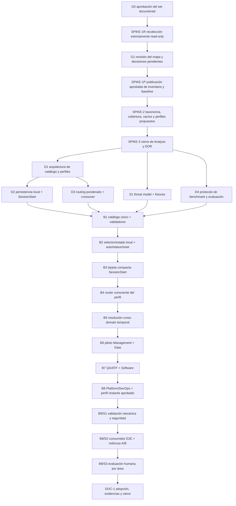

# INDEX — Perfiles profesionales de enfoque ASDD

## Identidad

| Campo | Valor |
|---|---|
| Run ID | `2026-07-25-001` |
| Feature | `professional-role-profiles` |
| Versión del plan | `1.0-approved` |
| Hash del plan | `d2b1cb8153c2a9ef58b6387b88b550897ac1315e101cce778942415daad37e54` |
| Algoritmo de hash | SHA-256 del JSON compacto `{path,sha256}` ordenado para brief + cuatro specs + INDEX; la celda de hash del INDEX se normaliza a `<normalized>` |
| Estado global | `approved_in_progress` |
| Fase documental | `analyze` — G0 aprobado |
| Próximo gate | `G1` — revisión de resultados read-only antes de publicarlos |
| Primer slice ejecutable | `SPIKE-1R` — recolección estructural read-only |
| Estado de `SPIKE-1R` | autorizado por G0; cero escrituras en el repositorio |

Este INDEX es el contrato de ejecución de la iniciativa. Ningún slice puede
ampliarse, reemplazarse, adelantarse o interpretarse como autorización para
otro slice. Toda desviación de alcance, taxonomía, seguridad, artefactos o
orden de dependencias exige Change Request (CR), actualización de este INDEX y
nueva aprobación.

## Arquitectura objetivo

```text
Núcleo ASDD común y compacto
        ↓
Perfil profesional activo
        ↓
Router ponderado por perfil + intención de la tarea
        ↓
Agentes/skills cargados bajo demanda
        ↓
Capacidades temporales de otras áreas cuando sean necesarias
```

El perfil es una preferencia de experiencia y routing. No es una autorización,
no modifica los controles de seguridad y no reemplaza el binding de agente,
scope, command o capability.

## Specs por área

| Área | Aplica | Estado | Spec | Depende de |
|---|---:|---|---|---|
| funcional | Sí | draft | `2026-07-25-001-ANALYZE-002-professional-role-profiles-funcional.md` | brief + SPIKE-1R/SPIKE-1P/SPIKE-2 |
| backend/runtime | Sí | draft | `2026-07-25-001-ANALYZE-003-professional-role-profiles-backend.md` | funcional + seguridad + SPIKE-1R/SPIKE-1P/SPIKE-2 |
| seguridad | Sí | draft | `2026-07-25-001-ANALYZE-004-professional-role-profiles-seguridad.md` | brief + funcional; S1 la refina |
| QA | Sí | draft | `2026-07-25-001-ANALYZE-005-professional-role-profiles-qa.md` | funcional + backend + seguridad + baseline |
| frontend | No inicialmente | n/a | — | no se ha decidido una interfaz visual |
| diseño UX/UI | No como capa técnica inicial | n/a | — | Experience/Design es perfil profesional; no implica construir UI |
| DevOps técnico | No inicialmente | n/a | — | Platform/DevOps es perfil; esta iniciativa no cambia pipelines o infraestructura |
| Data técnico | No inicialmente | n/a | — | Data es perfil; esta iniciativa no construye una plataforma de datos |

Las áreas marcadas `n/a` como capa técnica siguen siendo obligatorias en la
auditoría, la cobertura funcional, los journeys y la validación humana.

## Perfiles provisionales sometidos a evidencia

1. `software`
2. `platform-devops`
3. `qa-atf`
4. `data`
5. `management-functional`
6. `experience-design`
7. Security como capacidad transversal obligatoria y posible perfil
   seleccionable.

Esta lista es una hipótesis. `SPIKE-1R`, `SPIKE-1P` y `SPIKE-2` pueden
recomendar nombres o límites distintos, pero no pueden convertir la
recomendación en decisión sin aprobación organizacional.

## Grafo de dependencias



## Plan incremental

> Esta tabla tiene cuatro columnas por contrato mecánico del reconciliador. Los
> entregables y gates detallados se definen en las secciones posteriores.

| Orden | Slice | Área/Fase | Estado |
|---:|---|---|---|
| 1 | SPIKE-1R — recolección estructural estrictamente read-only; evidencia solo en memoria o `/tmp` | Analyze | in_progress |
| 1R | SPIKE-1P — publicación del inventario y baseline previamente revisados y aprobados | Analyze | pending |
| 2 | SPIKE-2 — taxonomía, cobertura, vacíos, duplicados, huérfanos y perfiles propuestos | Analyze | pending |
| 3 | SPIKE-3 — actualización final de specs, targets, decisiones y DOR | Analyze | pending |
| 4 | D1 — ADR de catálogo, ontología, relaciones y registro de perfiles | Design | pending |
| 5 | D2 — ADR de persistencia local, selección y tarjeta SessionStart | Design | pending |
| 6 | D3 — ADR de routing ponderado, crossover y frontera de contexto temporal | Design | pending |
| 7 | D4 — protocolo experimental, métricas, permisos y evaluación humana | Design + QA | pending |
| 8 | S1 — threat model, reason codes, fixtures adversariales y rollback | Design + Seguridad | pending |
| 9 | B1 — catálogo único, generador/lector, schema y validadores | Build | pending |
| 10 | B2 — selección y estado local: auto/select/status/reset | Build | pending |
| 11 | B3 — tarjeta compacta de perfil en SessionStart | Build | pending |
| 12 | B4 — router consciente del perfil y compatible con auto | Build | pending |
| 13 | B5 — colaboración cross-domain temporal y explicable | Build | pending |
| 14 | B6 — piloto Management/Functional + Data | Build | pending |
| 15 | B7 — QA/ATF + Software | Build | pending |
| 16 | B8 — Platform/DevOps + perfil restante ya aprobado | Build | pending |
| 17 | B9/S1 — suites focalizadas, compatibilidad y regresión de seguridad | Verify | pending |
| 18 | B9/S2 — consumidor E2E y benchmark A/B controlado | Verify | pending |
| 19 | B9/S3 — evaluación humana por representantes de área | Verify | pending |
| 20 | DOC-1 — guías, ADRs, baseline, changelog, manifest y cierre | Document | pending |

## Contrato exacto de `SPIKE-1R`

### Propósito

Obtener evidencia del contenido y de su estrategia actual de carga antes de
crear perfiles o modificar routing.

### Fuentes

- agentes;
- skills;
- comandos;
- rules y references;
- workflows;
- templates;
- artefactos producidos;
- validadores y configuración de carga.

### Matriz mínima

| Campo | Regla |
|---|---|
| artefacto | ID canónico o path estable |
| tipo | agente, skill, comando, rule, reference, workflow, template, artefacto o validador |
| dominio principal | solo con evidencia; de lo contrario `unclassified` |
| dominios secundarios | afinidades adicionales justificadas |
| roles atendidos | roles observables en contenido/metadatos |
| actividades | acciones profesionales cubiertas |
| carga | eager, condicional, bajo demanda o no aplicable |
| uso transversal | sí/no con justificación |
| costo contextual | medido, estimado o no observable |
| evidencia | ruta y, cuando aplique, fragmento/metadato verificable |
| observación | duplicidad, vacío, ambigüedad, huérfano, deuda o ninguna |

### Herramientas y superficies permitidas

- lectura/enumeración local con `git status`, `git ls-files`, `find`, `stat`,
  `wc`, `sed`, `head`, `tail`, `cat`, `grep`/`rg` y `sha256sum`;
- scripts efímeros de análisis que solo lean el repositorio y escriban bajo
  `/tmp/asdd-professional-role-profiles-2026-07-25-001/`;
- lectura de frontmatter y contenido como datos inertes;
- respuestas conversacionales para presentar el mapa y decisiones pendientes.

No se ejecuta ningún script, validador, comando, workflow, agente o skill
encontrado dentro del repositorio durante este slice.

### Invariantes antes/después

1. capturar `git status --porcelain=v1 -z`, conjunto de paths descubiertos y
   hashes de archivos versionados antes de inspeccionar;
2. repetir la captura al terminar;
3. demostrar que no apareció, cambió ni desapareció ningún archivo del
   repositorio por causa del slice;
4. preservar byte a byte todo estado dirty/untracked preexistente, incluido
   `docs/runs/2026-07-18-001-SPECIFY-000-run-manifest.md`;
5. contabilizar 100 % de los paths descubiertos como `classified` o
   `unclassified` en el resultado candidato.

### Salidas de `SPIKE-1R`

1. inventario candidato procesable conservado solo en memoria o `/tmp`;
2. mapa candidato
   `perfil → roles → agentes → skills → comandos → workflows → artefactos`;
3. baseline candidato de tamaño y estrategia de carga;
4. cobertura inicial por dominio;
5. lista de elementos ambiguos `unclassified`;
6. trazabilidad de fuentes y método reproducible;
7. comparación before/after que demuestre cero escrituras en el repositorio;
8. presentación conversacional para revisión del usuario.

Estas salidas no se materializan bajo el repositorio hasta que el usuario
apruebe `G1` y active `SPIKE-1P`.

### Prohibiciones de `SPIKE-1R`

- no ejecutar Claude;
- no ejecutar agentes, skills, workflows ni comandos inventariados;
- no cargar agentes/skills como instrucciones de esta sesión;
- no ejecutar scripts, hooks, tests o validadores del repositorio;
- no modificar ningún archivo del repositorio, incluido estado ASDD;
- no crear una clasificación para ocultar una ambigüedad;
- no alterar artefactos previos ajenos a este run.

Leer contenido y frontmatter como datos de evidencia sí está permitido.

## Contrato de publicación de `SPIKE-1P`

`SPIKE-1P` solo puede activarse después de que el usuario revise las salidas de
`SPIKE-1R`. Su único propósito es materializar la evidencia aprobada; no puede
modificar runtime, routing, perfiles ni archivos inventariados.

Antes de activarlo se deben reservar con el helper de naming los paths exactos
para:

- protocolo y diccionario de datos de la auditoría;
- inventario estructural aprobado;
- reporte de cobertura, vacíos, duplicidades y ambigüedades;
- baseline de carga/costo contextual;
- registro de decisiones pendientes.

La activación debe declarar el allowlist exacto de archivos, comandos y
validaciones. Esta fila del INDEX no constituye por sí sola autorización de
escritura.

## Ontología que debe resolver Analyze

```text
dominio organizacional
  → rol/persona profesional
    → actividad
      → capability
        → artefacto implementador
```

`SPIKE-2` debe distinguir y someter a aprobación:

- Management/Functional: BA, Product/PO, Project y Delivery Management;
- QA/ATF: QA, Quality Engineering, automatización y gobierno;
- Platform/DevOps: Cloud, SRE, infraestructura, entrega y operación;
- Data: análisis, engineering, science, gobierno y arquitectura;
- Software: desarrollo, arquitectura y liderazgo técnico;
- Experience/Design y Security;
- núcleo universal frente a capacidades transversales;
- el límite de ASDD como producto para trabajo no exclusivamente software.

La taxonomía de actividades debe ser única o jerárquica; no puede mezclar sin
regla valores genéricos como `analyze` con valores como `data-quality`.

## Contrato de activación de cada slice

Antes de ejecutar cualquier slice, su checkpoint debe declarar y recibir la
aprobación exigida para:

| Campo | Contenido obligatorio |
|---|---|
| objetivo | resultado observable y exclusiones |
| entradas | artefactos/versiones exactas |
| dependencias | slices/gates terminales requeridos |
| paths de lectura | roots o archivos permitidos |
| paths de escritura | allowlist exacto; vacío para slices read-only |
| comandos/herramientas | comandos literales o clases read-only aprobadas |
| outputs | archivos/resultado y naming reservado |
| pruebas | focalizadas, globales, consumidor y métricas aplicables |
| rollback | restauración verificable y límites |
| aprobación | evidencia del gate o CR |

Ninguna fila de “Plan incremental” autoriza por sí misma herramientas,
escrituras, comandos ni ampliación de alcance.

## Gates de transición

### Gate Analyze → Design

- [ ] `SPIKE-1R` demostró cero escrituras y fue revisado en `G1`.
- [ ] `SPIKE-1P` y `SPIKE-2` fueron publicados con método reproducible.
- [ ] 100 % del inventario está clasificado o explícitamente `unclassified`.
- [ ] Baseline de contexto/carga registrado.
- [ ] Taxonomía y perfiles provisionales revisados por el usuario.
- [ ] Specs funcional, backend/runtime, seguridad y QA actualizadas.
- [ ] Preguntas bloqueantes resueltas o aceptadas como decisiones de Design.
- [ ] Autoridades/representantes por dominio y regla de sign-off definidos.
- [ ] Usuario aprueba `SPIKE-3` y autoriza iniciar Design.

### Gate Design → Build

- [ ] ADR de catálogo/perfiles aprobado.
- [ ] Persistencia local, precedencia y rollback aprobados.
- [ ] Modelo de routing/crossover aprobado con benchmark propuesto.
- [ ] Protocolo D4 aprobado con muestras, repeticiones y oracles.
- [ ] S1 amenaza, fixtures e invariantes aprobado.
- [ ] Paths, schemas, migración y distribución definidos.
- [ ] No existe cambio implícito en autorización o Git safety.
- [ ] Usuario aprueba el plan Build por slices.

### Gate Build → Verify

- [ ] B1–B8 completados o cualquier exclusión formalizada mediante CR.
- [ ] Cada slice tiene test previo, pruebas focalizadas, `npm run validate`,
      consumer E2E, métrica y rollback.
- [ ] Modo `auto` conserva compatibilidad.
- [ ] Ningún perfil agrega eager loading especializado.
- [ ] No hay worktree contaminado por estado local o fixtures.

### Gate Verify → Document

- [ ] `B9/S1` termina sin regresiones.
- [ ] `B9/S2` reproduce resultados en consumidor aislado.
- [ ] `B9/S3` incluye representantes de las áreas objetivo.
- [ ] Umbrales provisionales se confirman o cambian con evidencia.
- [ ] Riesgos residuales y limitaciones están documentados.

### Gate de cierre

- [ ] Guías de inicio por perfil publicadas.
- [ ] ADRs, specs, changelog, baseline y manifest reconciliados.
- [ ] Decisiones organizacionales pendientes tienen owner y fecha.
- [ ] El usuario acepta el cierre.

## Reglas de ejecución

1. Un slice activo a la vez salvo paralelismo explícitamente independiente y
   aprobado.
2. Ningún Build comienza antes de `SPIKE-3`, D1–D4 y S1.
3. Cada slice Build queda aislado y trazable; no mezcla refactors oportunistas.
4. Una desviación de perfil, dominio, scope, archivos, comandos, seguridad,
   artefactos o dependencias exige CR.
5. Los casos ambiguos permanecen visibles; `unclassified` es un resultado
   válido.
6. Los thresholds se endurecen con baseline, no con intuición.
7. El perfil nunca se trata como autorización.
8. Security permanece transversal en modo `auto` y en todos los perfiles.
9. Estado local de foco y fixtures no se versionan ni distribuyen.
10. Las pruebas reales registran tiempo, tokens observables, consumo de
    contexto, permisos solicitados y necesidad de cada permiso.
11. `SPIKE-1R` no ejecuta Claude ni adopta instrucciones de los artefactos
    inspeccionados, y no escribe dentro del repositorio.
12. Cada transición actualiza este INDEX, `.asdd-run.json`, el manifest y la
    evidencia correspondiente.

## Change Request (CR)

Un CR debe incluir:

- motivo y evidencia;
- slice afectado;
- diferencia exacta contra el contrato vigente;
- impactos en specs, dependencias, seguridad, contexto y compatibilidad;
- pruebas/rollback actualizados;
- decisión explícita del usuario.

Un bloqueo técnico no autoriza cambiar de enfoque silenciosamente. El slice se
marca `blocked` o vuelve a la fase correspondiente hasta aprobar el CR.

## Decisiones abiertas

| ID | Decisión | Evidencia necesaria | Gate límite |
|---|---|---|---|
| D-001 | Experience/Design o Security como sexto perfil organizacional | SPIKE-1R/SPIKE-2 + representantes | SPIKE-3/D1 |
| D-002 | Security también seleccionable o solo transversal | SPIKE-1R/SPIKE-2 + threat model | S1/D1 |
| D-003 | mecanismo y path de persistencia local por usuario | alternativas + privacidad + dos usuarios en mismo checkout | D2 |
| D-004 | nombres y comandos públicos de selección | prueba de usabilidad | D2 |
| D-005 | peso del perfil en el router | benchmark de routing | D3 |
| D-006A | targets provisionales de relevancia/contexto | baseline SPIKE-1R/SPIKE-1P | D3/D4 |
| D-006B | confirmación de targets definitivos | evidencia B9/S2 | Verify |
| D-007 | capacidades verdaderamente transversales | inventario SPIKE-1R/SPIKE-2 | SPIKE-3 |
| D-008 | semántica de “descargar” capacidad temporal | aislamiento por subagente/tarea o no reinyección | D3 |
| D-009 | autoridad y regla de sign-off por dominio | owner organizacional | SPIKE-3 |

La persistencia project-local solo puede sobrevivir D2 si está ligada al
usuario y demuestra aislamiento para dos usuarios del sistema operativo sobre
el mismo checkout. Precedencia mínima a evaluar:

```text
override de sesión
  > preferencia usuario + workspace
  > default organizacional
  > auto
```

“Descargar” no significa borrar tokens ya inyectados de una ventana LLM. El
contrato realizable debe usar contexto aislado de subagente/tarea y/o impedir
reinyección, propagación y persistencia en tareas posteriores.

## Matriz de trazabilidad inicial

| Requisito origen | Contrato/RF | Decisión o slice | Artefacto esperado | Evidencia de prueba |
|---|---|---|---|---|
| catálogo único sin duplicar | RF-001–RF-003 | SPIKE-1R, SPIKE-1P, D1, B1 | inventario + catálogo + schema | cobertura 100 %, IDs/paths/relaciones válidos |
| perfiles como preferencias | RN-002–RN-005 | D1, D2, B2 | registro + estado local | cambio de foco sin ampliar autorización |
| núcleo compacto y lazy load | RN-006–RN-007 | D2, B3, B4 | tarjeta + integración SessionStart | palabras/tokens y cero eager especializado |
| routing por perfil e intención | RF-007–RF-010 | D3, B4, B5 | scoring + resolver | top-1 por perfil y crossover positivo/negativo |
| foco local por trabajador | RF-004–RF-006 | D2, B2 | select/status/reset/auto | dos usuarios/workspaces, reset y no Git pollution |
| interoperabilidad entre áreas | RF-008–RF-010 | D3, B5–B8 | explicación + carga temporal | no cambio persistido y capacidad mínima |
| Security transversal | RN-010 + invariantes | S1, B1–B9/S1 | threat model + fixtures | cero regresiones de binding/guards/Git safety |
| experiencia relevante por área | RF-012 | B6–B8, B9/S3 | journeys y guías | evaluación humana mínima por cada perfil |
| reducción de ruido/contexto | RF-014 | D4, B9/S2 | baseline + benchmark | delta por perfil, no solo promedio global |
| permisos/challenges necesarios | QA §7–§8 | D4, B9/S2 | oracle y registro E2E | delta exacto vs baseline + adjudicación |
| ciclo trazable sin desviación | Change control | todos + DOC-1 | INDEX, CR log, manifest | reconciliación y gates explícitos |

La matriz se completa con IDs de artefacto y tests concretos en
`SPIKE-3`. Un requisito sin trazabilidad bloquea Design.

## Artefactos previstos por ciclo

| Fase | Artefactos previstos |
|---|---|
| Specify | brief canónico |
| Analyze | protocolo read-only; diccionario; inventario aprobado; cobertura/gaps; baseline de carga; registro taxonómico; specs e INDEX actualizados |
| Design | ADR de catálogo/perfiles; ADR de persistencia/SessionStart; ADR de routing/crossover; protocolo benchmark; threat model y fixtures |
| Build | catálogo/registry; validators; estado local/selector; tarjeta; router/resolver; pilotos y migración/rollback |
| Verify | fixture catalog; scoring rubric; resultados focalizados; consumidor E2E; métricas A/B; evaluación humana |
| Document | guías y journeys por perfil; gobernanza de mantenimiento; changelog; baseline final; manifest y cierre |

Los nombres/paths se reservan con el helper al activar cada slice; esta lista no
autoriza crearlos anticipadamente.

## Protocolo mínimo de medición para D4

- matriz de prompts congelada y versionada por perfil;
- tareas típicas baja/media/alta, ambigua, cross-domain positiva/negativa y
  adversarial;
- control A `auto` o baseline y tratamiento B con perfil, manteniendo modelo,
  versión, reasoning, repositorio inicial, herramientas y criterios;
- sesiones cold y warm separadas;
- mínimo de repeticiones y criterio estadístico definidos antes de ejecutar;
- tokens input/output/cache y tamaño de ventana cuando sean observables;
- componentes no observables marcados, no estimados como hechos;
- tiempo total, primera respuesta y routing local separados de latencia del
  proveedor;
- top-1 y contaminación medidos por perfil, sin ocultar fallos con un promedio;
- permiso injustificado = delta respecto del baseline sin necesidad en el
  contrato del escenario, revisado por un adjudicador definido;
- ejecución de Claude prohibida hasta aprobación explícita de `B9/S2`.

## Registro de Change Requests

| CR | Fecha | Slice | Cambio | Estado | Aprobación |
|---|---|---|---|---|---|
| — | — | — | sin desviaciones registradas | — | — |

## Evidencia de apertura

- Brief: `2026-07-25-001-SPECIFY-001-brief-professional-role-profiles.md`.
- Spec funcional:
  `2026-07-25-001-ANALYZE-002-professional-role-profiles-funcional.md`.
- Spec backend/runtime:
  `2026-07-25-001-ANALYZE-003-professional-role-profiles-backend.md`.
- Spec seguridad:
  `2026-07-25-001-ANALYZE-004-professional-role-profiles-seguridad.md`.
- Spec QA:
  `2026-07-25-001-ANALYZE-005-professional-role-profiles-qa.md`.
- Solicitud y arquitectura base aportadas por el usuario el 2026-07-25.

## Historial de estado

| Fecha | Actor | Transición | Evidencia |
|---|---|---|---|
| 2026-07-25 | Usuario | iniciativa definida | Arquitectura por capas, perfiles provisionales, implementación incremental y auditoría read-only solicitadas. |
| 2026-07-25 | Usuario + asistente | documentación autorizada | El usuario autorizó materializar brief y specs; la ratificación del texto canónico sigue en G0. |
| 2026-07-25 | Asistente | set documental en revisión | Brief, specs funcional/backend/seguridad/QA e INDEX creados; `SPIKE-1R` no iniciado. |
| 2026-07-25 | Usuario | G0 aprobado | Set documental ratificado; se autoriza únicamente `SPIKE-1R` bajo contrato cero-write. |
